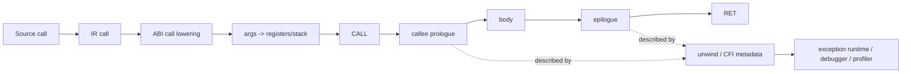

# Calling Conventions, Stack Frames, Prologue/Epilogue & Unwind Metadata

## Neden önemli?
Compiler zinciri source→IR→machine code'da bitmez. Ayrı derlenmiş fonksiyonların güvenli biçimde konuşabilmesi için ABI üzerinde anlaşması gerekir: argument/return locations, caller/callee-saved registers, stack alignment ve unwind representation. Bu konu compiler internals, native debugging, profiler doğruluğu, FFI ve JIT production failure'larını tek mental modelde birleştirir.

## Mental model

**Ayrım:** ISA instruction/register dünyasıdır; ABI binary parçalarının birlikte çalışma sözleşmesidir; compiler backend IR'yi ISA+ABI kısıtları altında machine code'a indirger.

## İçeride ne oluyor?
1. Frontend function signature'ı IR type/call'a dönüştürür.
2. Backend target calling convention'a göre argument ve return value için physical locations seçer.
3. Register allocation sonrası live values ve callee-saved kullanımı frame layout'u belirler.
4. Prologue gerekiyorsa stack pointer'ı ayarlar, alignment sağlar ve preserved registers'ı saklar.
5. Caller-saved register'da call sonrasında gereken live value varsa caller onu korur; callee-saved register'ı kullanan callee eski değeri restore eder.
6. Leaf function veya optimize edilmiş function stack frame/frame pointer ihtiyacını azaltabilir.
7. Epilogue frame'i çözer, preserved state'i geri yükler ve return eder.
8. DWARF CFI veya platform-specific unwind metadata runtime/debugger/profiler'ın caller state'ini yeniden kurmasına yardım eder.

## Neden unwind metadata ayrı düşünülmeli?
Normal return instruction yürütülürken callee kendi epilogue'unu çalıştırır. Exception veya stack walking durumunda ise runtime/tooling arbitrary program counter'dan caller frame'e ulaşmak zorunda kalabilir. Bu yüzden machine instructions ile onları nasıl geri çözeceğini tarif eden metadata ayrı correctness yüzeyidir.

Frame pointer tutmak stack walking'i bazı profiler/tooling senaryolarında kolaylaştırabilir; omission ise bir general-purpose register'ı serbest bırakabilir. Trade-off target, optimizer ve observability stack'ine göre değerlendirilmelidir.

## Yüksek getirili mülakat soruları
1. ABI ile ISA arasındaki fark nedir?
2. Caller-saved ve callee-saved register neden iki sınıfa ayrılır?
3. Stack frame her function için zorunlu mudur?
4. Frame pointer omission ne kazandırır, debugging/unwinding'i nasıl etkiler?
5. Stack alignment neden ABI'nin parçasıdır?
6. Senior: tail call optimization stack-frame/calling-convention açısından hangi şartları ister?
7. Senior: exception stack unwinding normal `return` zincirinden nasıl farklıdır?
8. Staff: JIT/native FFI boundary'sinde calling-convention mismatch nasıl crash veya corruption üretir?

## Beklenen cevap seviyesi
- **Junior:** stack, return address, argument passing ve prologue/epilogue sezgisini anlatır.
- **Mid:** caller/callee-saved, alignment, leaf function ve frame-pointer trade-off'unu açıklar.
- **Senior:** register allocation→frame lowering→unwind metadata zincirini ve tail-call/exception etkilerini bağlar.
- **Staff:** FFI/JIT, profiler/debugger, async stack walking ve platform ABI compatibility risklerini tartışır.

## Kısa alıştırma
Altı integer argüman alan, başka bir function çağıran ve local array kullanan küçük C/C++ function yaz. `clang -O0 -S` ve `clang -O2 -S` çıktısını karşılaştır: stack adjustment, saved registers, frame pointer ve call-site farklarını işaretle. Sonra `readelf --debug-dump=frames` veya platform eşdeğeriyle unwind bilgisini incele.

## Proje fikri
`abi-frame-lab`: aynı C API'yi C, Rust veya küçük bir JIT stub'ından çağır. Generated assembly ve unwind sections için rapor üret. Yanlış calling-convention/stack-alignment örneğini yalnız izole test binary'sinde göster; sanitizer/debugger ile failure'ı teşhis et.

## Failure modes / trade-off / production
ABI mismatch silent register corruption veya crash üretebilir. Stack alignment ihlali bazı vector instructions/callees'de patlayabilir. Eksik/yanlış unwind metadata exception handling, profiler stack'leri veya crash symbolication'ı bozabilir. Frame pointer observability'yi kolaylaştırabilir fakat register pressure/cost yaratabilir. Native/JIT production sistemlerinde ABI versioning, symbol visibility, FFI boundary tests, crash unwinding ve profiler doğruluğu release kriteri olmalıdır.

## Production bağlantısı
- Crash dump/symbolication pipeline'ında unwind success-rate ölç.
- JIT/FFI rollout'unda target triple, ABI ve compiler flags'i artifact metadata'sına bağla.
- Cross-language boundary'ler için ABI contract tests çalıştır.
- Optimizer/frame-pointer değişikliğini profiler fidelity ve CPU cost ile canary et.
- Native dependency/toolchain upgrade'lerinde stack traces ve exception paths'i regression suite'e ekle.

## Kaynaklar
- LLVM Language Reference — Calling Conventions: https://llvm.org/docs/LangRef.html#calling-conventions
- LLVM Target-Independent Code Generator: https://llvm.org/docs/CodeGenerator.html
- LLVM AArch64 prologue/epilogue source documentation: https://llvm.org/docs/doxygen/AArch64PrologueEpilogue_8h_source.html
- System V AMD64 ABI project: https://gitlab.com/x86-psABIs/x86-64-ABI
