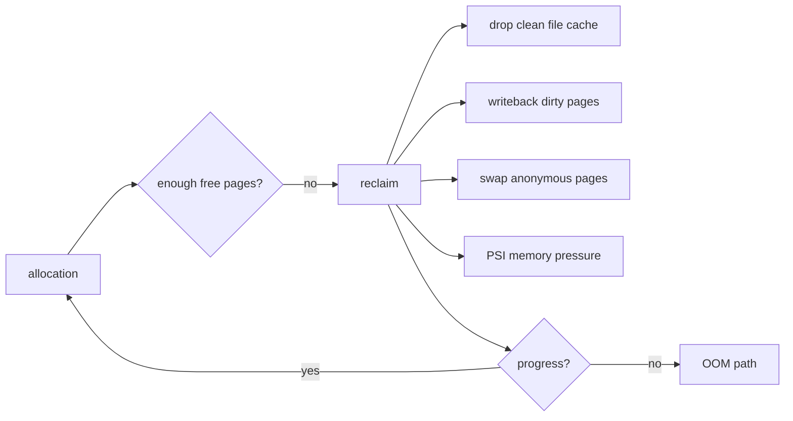

# Linux Memory Reclaim, PSI, cgroup v2 & OOM

## Neden önemli?
Linux memory problemi yalnız `free RAM` veya RSS problemi değildir. Production'da kritik soru, yeni allocation geldiğinde kernel'in reclaim ile ne kadar hızlı ilerleyebildiği ve bu işin workload latency'sini ne kadar stall ettiğidir.

## Mental model

RAM'i doluluk yüzdesi olan depo değil, devreden çalışma seti olarak düşün. Reclaim raf açma operasyonu; PSI raf doluluğunu değil task'ların kaynak beklerken kaybettiği zamanı ölçer.

## Reclaim zinciri
File-backed clean page yeniden okunabildiği için ucuz reclaim adayıdır. Dirty page writeback gerektirir. Anonymous memory'in file backing'i yoktur; swap mevcut ve policy uygunsa swap'e taşınabilir. Direct reclaim allocation yapan thread'i beklettiğinden p95/p99 latency'yi yükseltebilir; background reclaim baskıyı önceden azaltmaya çalışır.

Multi-Gen LRU güncel Linux'ta page-reclaim seçimlerini generation/working-set davranışıyla iyileştirmeyi amaçlar. Yine de kapasite ve workload semantics'i ortadan kaldırmaz.

## cgroup v2 memory kontrolü
- `memory.low`: best-effort protection.
- `memory.min`: hard protection; aşırı kullanım başka workload'larda baskıyı büyütebilir.
- `memory.high`: hard OOM sınırı olmadan reclaim/throttling baskısı uygulamak için önemli kontrol noktası.
- `memory.max`: hard usage limit; kullanım azaltılamazsa cgroup OOM kill tetiklenebilir.
- `memory.reclaim`: hedef cgroup'da proactive reclaim istemeye yarar.

## PSI
`/proc/pressure/{cpu,memory,io}` ve cgroup pressure dosyaları stall süresini gösterir. `some`, en az bazı task'ların ilgili kaynakta beklediği süreyi; `full`, tüm non-idle task'ların aynı anda stall olduğu ağır durumu görünür kılar. Bu yüzden RSS sabitken bile memory PSI artışı tail-latency problemini açıklayabilir.

## Mülakat soruları
1. Neden düşük free RAM tek başına alarm değildir?
2. File-backed ve anonymous memory reclaim açısından nasıl ayrılır?
3. Direct reclaim p99'u nasıl bozar?
4. `memory.high` ve `memory.max` farkı nedir?
5. RSS normalken PSI neden yüksek olabilir?
6. Staff: noisy-neighbor memory isolation'ını nasıl tasarlarsın?
7. Principal: fleet-wide memory defaults, protection ve headroom politikasını nasıl yönetirsin?

## Beklenen cevap derinliği
- **Mid:** page cache, anonymous pages, reclaim, swap ve OOM.
- **Senior:** direct/background reclaim, dirty writeback, cgroup v2 ve PSI.
- **Staff:** isolation, pressure alerting, capacity headroom ve latency correlation.
- **Principal:** fleet policy, blast radius, cost/headroom ve safe defaults.

## Kısa alıştırma
8 GiB limitli bir workload'da RSS 6 GiB iken p99 yükseliyor ve `memory.pressure some` artıyor. `memory.current`, `memory.events`, PSI, page faults, swap I/O ve app latency'yi birlikte inceleyerek olası reclaim zincirini çıkar.

## Proje fikri
`memory-pressure-lab`: cgroup v2 altında anon/file-cache workload üret; `memory.high`/`memory.max` değiştirerek PSI, reclaim, faults ve request latency ölç.

## Failure modes / trade-off / production
Yalnız RSS alarmı stall'ları kaçırır; yalnız OOM saymak çok geçtir. Aşırı protection diğer workload'ları aç bırakabilir. Swap capacity sağlar ama tail latency maliyeti yaratabilir. PSI, working set/RSS, faults, reclaim, swap I/O, OOM ve app p95/p99 birlikte izlenmelidir.

## Kaynaklar
- Linux kernel — PSI: https://docs.kernel.org/accounting/psi.html
- Linux kernel — cgroup v2: https://docs.kernel.org/admin-guide/cgroup-v2.html
- Linux kernel — Multi-Gen LRU: https://docs.kernel.org/admin-guide/mm/multigen_lru.html
