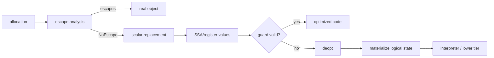

# Escape Analysis, Scalar Replacement & Deoptimization

## Neden önemli?
JIT runtime performansında allocation sayısı yalnız GC'nin problemi değildir. Derleyici, nesne kimliği program tarafından gözlemlenmiyorsa allocation'ı ortadan kaldırabilir. Escape analysis bu kararın temel analizlerinden biridir; scalar replacement ise nesneyi ayrı scalar değerlere ayrıştırarak fiziksel allocation ihtiyacını kaldırabilir.

## Mental model

Escape analysis “bu kutunun kimliğini dışarıdan biri görebilir mi?” sorusudur. Kimlik gözlemlenmiyorsa kutu hiç yaratılmadan alan değerleri taşınabilir. Deoptimization ise optimize state'ten dil/runtime state'ine geri dönüş sözleşmesidir.

## İçeride ne oluyor?
- HotSpot terminolojisinde `NoEscape`, `ArgEscape`, `GlobalEscape` gibi escape durumları vardır.
- Scalar replacement stack allocation ile eş anlamlı değildir. HotSpot scalar-replaceable allocation'ı tamamen elimine edebilir; genel olarak “heap nesnesini stack'e taşımak” şeklinde düşünmek yanlıştır.
- Inlining çağrı sınırlarını görünür yaptığı için escape analizini güçlendirebilir; polymorphism ve conservative aliasing fırsatları azaltabilir.
- Non-escaping object üzerindeki bazı lock'lar elide edilebilir.
- Speculative optimized code guard kaybederse deopt gerekir. Scalar-replaced object fiziksel olarak yoksa runtime debug/deopt metadata'dan logical object'i materialize edebilmelidir.
- EA optimization'dır, semantic contract değildir; uygulama doğruluğu JIT'in allocation'ı kaldırmasına bağlı olmamalıdır.

## Mülakat soruları
1. Escape analysis neyi belirlemeye çalışır?
2. Scalar replacement ile stack allocation farkı nedir?
3. Object identity neden allocation elimination'ı engelleyebilir?
4. Inlining EA sonucunu nasıl değiştirebilir?
5. Lock elision ile escape analysis arasındaki ilişki nedir?
6. Scalar-replaced object deoptimization sırasında nasıl geri oluşturulur?
7. Allocation rate azalınca GC ve latency nasıl etkilenebilir?
8. Staff/Principal: runtime upgrade'inde EA/JIT regression'larını nasıl gate edersin?

## Seviyeye göre cevap derinliği
- **Mid:** escape/no-escape, allocation elimination, scalar replacement.
- **Senior:** inlining, aliasing, lock elision, speculation ve deopt.
- **Staff:** allocation/GC/JIT/deopt telemetry ve benchmark doğruluğu.
- **Principal:** fleet rollout, workload diversity, regression budget ve cost/performance standardı.

## Kısa alıştırma
Hot loop'ta oluşturulan iki alanlı value object yalnız alan toplamı için kullanılıyor. Bir sürüm nesneyi dışarı döndürsün, diğer sürüm yalnız toplamı döndürsün. Hangisinde allocation elimination daha olası? Identity, reflection veya global store eklenince sonucu yeniden değerlendir.

## Proje fikri
`escape-lab`: JMH ile escaping/non-escaping value-object varyantları ölç. Allocation rate, GC, CPU, JIT compilation ve deoptimization sinyallerini p95/p99 ile korele et.

## Failure modes / trade-off / production
- Dead-code elimination microbenchmark'ı anlamsızlaştırabilir.
- “JIT stack allocate eder” gibi implementation-detail varsayımları portability'yi bozar.
- Polymorphic call sites ve inlining sınırları EA fırsatını azaltabilir.
- Deopt storm tail latency yaratabilir.
- Production'da allocation rate, GC, JIT/deopt, CPU ve latency birlikte izlenmelidir.

## Kaynaklar
- Oracle Java 24 — HotSpot VM Performance Enhancements: https://docs.oracle.com/en/java/javase/24/vm/java-hotspot-virtual-machine-performance-enhancements.html
- OpenJDK — HotSpot Escape Analysis and Scalar Replacement Status: https://cr.openjdk.org/~cslucas/escape-analysis/EscapeAnalysis.html
