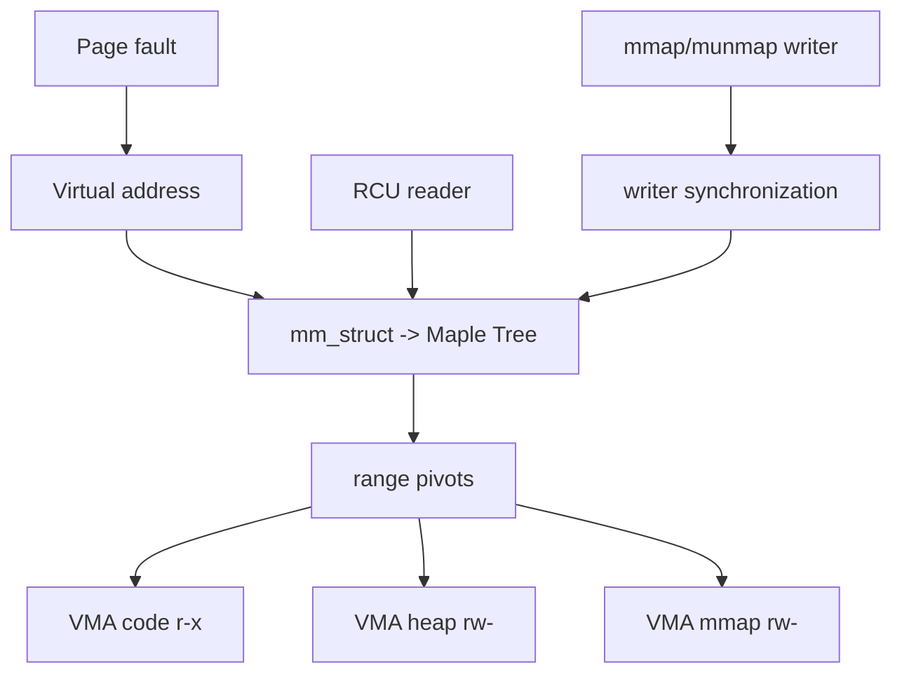

# Linux Maple Tree, VMA Range Indexing & RCU Reads

**Seviye:** Mid → Principal  
**Alan:** Foundations / Algorithms / Linux VM

## Konu anlatımı
Bir process'in virtual address space'i, permission/backing özellikleri aynı contiguous aralıklar olan VMA'larla (`vm_area_struct`) modellenir. Güncel Linux'ta bir `mm_struct` içindeki VMA'lar range-oriented **Maple Tree** içinde indexlenir. Page fault, `mmap`, `munmap` ve `mprotect` yolları belirli bir virtual address'i kapsayan VMA'yı veya uygun gap'i hızlı bulmak zorundadır.

Maple Tree high-fanout B-tree ailesi yaklaşımıyla ordered range lookup/iteration, cache locality ve RCU read-side kullanımını hedefler. Kritik ayrım: page table, virtual address'in physical mapping'ini taşır; VMA index ise adresin geçerli olup olmadığını, permissions ve backing policy'sini açıklar.

## Mental model

## İçeride ne oluyor?
1. VMA'lar non-overlapping virtual ranges'tir.
2. High fanout pointer chasing ve cache miss sayısını azaltmaya yardım eder.
3. Lookup/iteration read-mostly workload'da RCU ile ölçeklenebilir; mutation ayrıca synchronization ister.
4. `mprotect`/`munmap` bir VMA'yı split edebilir; adjacent compatible VMA'lar merge edilebilir.
5. Allocation-tree varyantı boş range/gap aramasını destekler.
6. Node preallocation, allocation'ın zor/uygunsuz olduğu critical mutation path'lerinde önemlidir.
7. RCU object lifetime ve writer coordination problemlerini ortadan kaldırmaz.

## Yüksek getirili mülakat soruları
- VMA ile page-table entry arasındaki fark nedir?
- Neden linked list yerine high-fanout range tree?
- `mprotect` neden VMA split yaratabilir?
- RCU lookup hangi contention'ı azaltır; neyi çözmez?
- Senior: page-fault hot path'inde cache locality neden önemlidir?
- Staff: read-mostly metadata indexinde lifetime safety nasıl korunur?
- Principal: Maple Tree ile database B+Tree workload/invariant farkları nelerdir?

## Beklenen cevap derinliği
- **Mid:** VMA/PTE ayrımı, range lookup ve high fanout.
- **Senior:** split/merge, cache locality, RCU reader ve writer synchronization.
- **Staff:** lifetime, lock ordering ve allocation-under-lock riskleri.
- **Principal:** workload distribution, read/write ratio, NUMA/cache ve correctness invariants üzerinden veri-yapısı seçimi.

## Kısa alıştırma
`[0x1000,0x5000) r-x`, `[0x8000,0xc000) rw-`, `[0x10000,0x18000) rw-` mapping'lerini çiz. Son range içindeki `[0x12000,0x14000)` bölümünü read-only yaptığında oluşabilecek VMA split'lerini göster.

## Proje fikri
`vma-map-lab`: C programında `mmap`, `mprotect`, `munmap` uygula; her adımdan sonra `/proc/self/maps` al. Split/merge davranışını gözlemle ve `perf` ile fault latency ölç.

## Failure modes / trade-off / production
VMA lookup'ı page-table walk ile karıştırmak yanlış mental modeldir. RCU freed-object safety'yi otomatik çözmez. Çok parçalı mapping metadata/update maliyetini artırabilir. Production'da mapping count, major/minor faults, mmap-lock contention ve fragmentation birlikte izlenir.

## Kaynaklar
- Linux Kernel — Maple Tree: https://docs.kernel.org/core-api/maple_tree.html
- Linux Kernel — Process Addresses / VMA locking: https://docs.kernel.org/mm/process_addrs.html
- Linux source — Maple Tree: https://github.com/torvalds/linux/blob/master/lib/maple_tree.c
