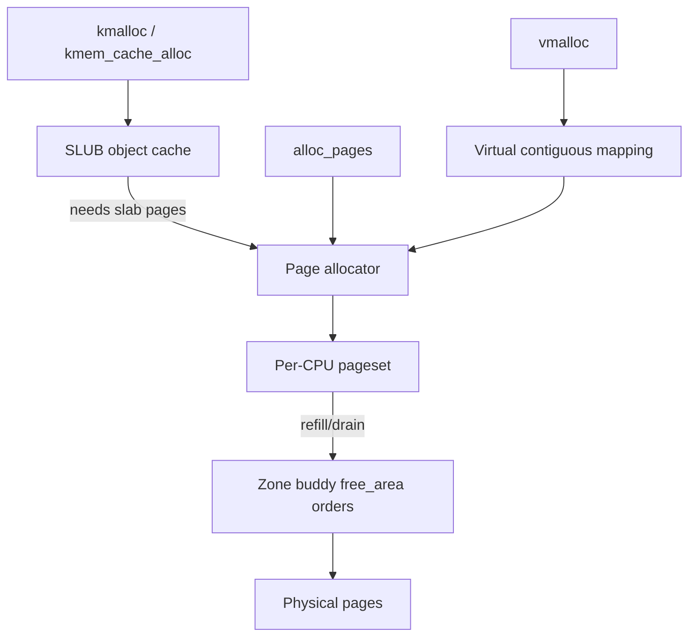

# Linux Buddy Allocator, Per-CPU Pagesets & SLUB

**Seviye:** Junior → Staff  
**Alan:** Foundations / SRE / Linux Memory

## Konu anlatımı
Linux memory allocation tek allocator değildir. Physical page seviyesinde zone free memory'si **buddy allocator** ile power-of-two order'larda yönetilir; sık page allocation/free için per-CPU pagesets global contention'ı azaltır. Küçük kernel object'leri için SLUB/slab katmanı page'leri object slot'larına böler.

Temel ayrım: **buddy page sağlar; SLUB page'in üstünde object sağlar**. `vmalloc` ise virtually contiguous fakat physical olarak contiguous olması gerekmeyen mapping kurar.

## Mental model

## İçeride ne oluyor?
1. Buddy free memory'yi `2^order` page bloklarında tutar.
2. Büyük blok split edilir; free sırasında buddy uygunsa merge edilir.
3. External fragmentation toplam free memory yeterliyken high-order contiguous allocation'ı bozabilir.
4. Per-CPU pagesets order-0 hot path'i CPU-local tutar; refill/drain batching global contention'ı azaltır.
5. SLUB aynı boyut/tip object'ler için cache/slab oluşturur.
6. `kmalloc` ile `vmalloc` physical contiguity ve TLB/page-table maliyeti bakımından farklıdır.
7. GFP flags allocation context, reclaim ve sleep kısıtlarını ifade eder.
8. NUMA locality bozulursa remote memory latency/bandwidth maliyeti oluşabilir.

## Yüksek getirili mülakat soruları
- Buddy neden power-of-two bloklar kullanır?
- Internal ve external fragmentation farkı nedir?
- `kmalloc` vs `vmalloc`?
- SLUB neden buddy'nin yerine geçmez?
- Per-CPU pageset contention'ı nasıl azaltır?
- Senior: free RAM varken high-order allocation neden fail olabilir?
- Staff: NUMA + fragmentation + allocator contention kaynaklı p99 spike nasıl teşhis edilir?

## Beklenen cevap derinliği
- **Junior:** page/object allocator ayrımı ve split/merge.
- **Mid:** kmalloc/vmalloc, fragmentation, SLUB cache.
- **Senior:** PCP batching, GFP context, high-order failure, NUMA locality.
- **Staff:** allocator telemetry, reclaim/compaction, contention ve tail latency.

## Kısa alıştırma
16 page'lik free bloktan 1, 1, 4 ve 2 page allocate et. Buddy split'lerini çiz. İlk iki 1-page blok free olduğunda merge koşullarını göster; toplam free page ile en büyük contiguous free block'u ayrı takip et.

## Proje fikri
`allocator-pressure-lab`: farklı allocation/free pattern'leri üret; `/proc/buddyinfo`, `/proc/slabinfo`, `vmstat` ve tracepoint'lerle order dağılımı, slab kullanımı ve latency'yi izle. Fragmentation sonrası high-order allocation davranışını karşılaştır.

## Failure modes / trade-off / production
Free-memory yüzdesi tek başına health göstergesi değildir. High-order fragmentation, reclaim/compaction stall, remote NUMA allocation ve slab growth p99'u bozabilir. Per-CPU caches contention'ı azaltırken geçici memory imbalance yaratabilir. Production'da buddy order distribution, slab growth, reclaim/compaction, allocation stalls, OOM ve NUMA locality birlikte incelenir.

## Kaynaklar
- Linux Kernel — Physical Memory: https://docs.kernel.org/mm/physical_memory.html
- Linux Kernel — Memory Allocation Guide: https://docs.kernel.org/core-api/memory-allocation.html
- Linux Kernel — kmem tracepoints: https://docs.kernel.org/trace/events-kmem.html
- Linux Kernel — SLUB users guide: https://docs.kernel.org/mm/slub.html
