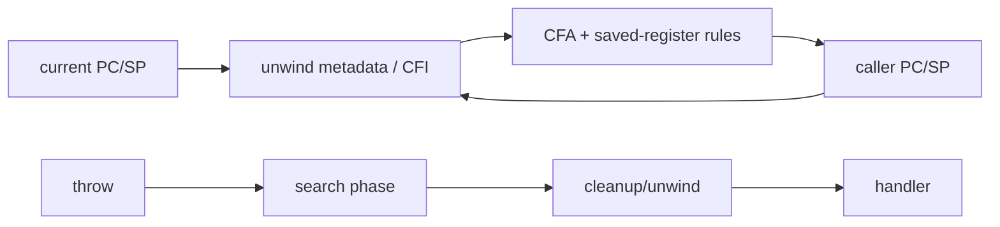

# Stack Unwinding, DWARF CFI & Exception ABI

## Mental model
Stack unwinding, mevcut instruction noktasından caller state'ini yeniden kurma protokolüdür. Exception ABI ise compiler'ın ürettiği metadata ile runtime unwinder'ın aynı dili konuşmasını sağlar.

## Temel mekanizma
Compiler prologue/epilogue ve register-save kararlarına uygun unwind metadata üretir. DWARF Call Frame Information, Canonical Frame Address ve register recovery kurallarıyla caller state'inin nasıl reconstruct edileceğini tarif eder. Linker bu bilgiyi executable/shared object'e taşır; unwinder instruction pointer'a göre doğru kaydı bulur.

C++ exception handling'de runtime uygun handler'ı bulur ve stack'i açarken cleanup/destructor'ları çalıştırır. ABI bu sürecin compiler, runtime library ve linker arasında uyumlu olmasını sağlar. “Zero-cost exceptions”, throw'un ücretsiz olduğu anlamına gelmez; maliyetin normal control-flow'daki explicit check'lerden metadata ve exceptional path'e kaydırılmasıdır.

Frame pointer ile unwind metadata aynı şey değildir. Frame pointer profiling/debugging'i kolaylaştırabilir; optimize edilmiş kodda ise ABI unwind tables, inlining, tail calls ve platform convention'ları önemlidir. JIT runtime ürettiği native code için gerekli unwind/stack metadata'yı runtime'a kaydetmelidir.

## Mülakat soruları
- Stack trace için runtime hangi bilgilere ihtiyaç duyar?
- Frame pointer ile unwind metadata farkı nedir?
- Zero-cost exception neyi ifade eder?
- Inlining ve tail-call optimization stack trace'i nasıl etkiler?
- Neden exception ABI compiler/runtime sözleşmesidir?
- Mixed native/JIT stack'te crash unwinding nasıl tasarlanır?

## Seviyeye göre derinlik
- **Mid:** call stack, saved registers, caller reconstruction.
- **Senior:** CFI/CFA, exception search/cleanup ve optimization etkileri.
- **Staff:** JIT registration, async profiling, stripped symbols ve crash pipeline.
- **Principal:** fleet-wide frame-pointer/build policy, debuginfo retention, symbol server ve MTTR.

## Mini alıştırma
Üç frame'li call chain çiz. SP, return address ve iki callee-saved register için caller reconstruction kurallarını yaz; frame pointer kaldırıldığında unwind metadata'nın rolünü açıkla.

## Proje
`unwind-lab`: C/C++ programını debug/release ve frame-pointer açık/kapalı derle. `readelf --debug-dump=frames`, debugger backtrace ve profiler çıktısını karşılaştır; binary size ve trace kalitesini raporla.

## Failure modes / trade-off / production
Eksik unwind metadata crash stack'ini kesebilir. Optimization source frame ile physical frame'i birebir bırakmayabilir. Symbol stripping deployment boyutunu azaltırken ayrı debug-symbol saklama zinciri gerektirir. Production release pipeline build-id, symbol server, debuginfo retention ve profiler/crash-reporter doğruluğunu birlikte yönetmelidir.

## Kaynaklar
- GCC Internals: https://gcc.gnu.org/onlinedocs/gccint/
- Itanium C++ ABI — Exception Handling: https://itanium-cxx-abi.github.io/cxx-abi/abi-eh.html
- DWARF Standard: https://dwarfstd.org/
