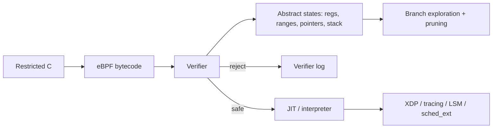

# eBPF Verifier, Abstract State & Safe Kernel Extensibility

## Konu anlatımı
Kernel hook'larında çalışan eBPF bytecode'u yükleme öncesinde verifier tarafından analiz edilir. Verifier register türleri/değer aralıkları, pointer provenance, stack erişimleri, helper/kfunc contracts ve control-flow hakkında safety koşullarını kanıtlamaya çalışır. Mental model: **runtime antivirüsü değil, abstract interpreter + proof gate**.

## Mental model

## İçeride ne oluyor?
Register state scalar/context-pointer/map-value-pointer gibi type/provenance bilgisi taşır. Bounds check scalar range'i daraltıp sonraki memory access'i kanıtlanabilir hale getirir. Branch'ler abstract state'i böler; pruning exploration patlamasını azaltır. Helper/kfunc çağrıları argument/lifetime contract'larına tabidir. Loop/iterator güvenliği termination ve state-envelope reasoning gerektirir. Verification runtime correctness garantisi değildir: race, yanlış policy, contention veya pahalı hot-path hâlâ mümkündür.

## Yüksek getirili mülakat soruları
1. Verifier runtime sandbox'tan nasıl farklıdır?
2. Pointer provenance neden numeric bounds'tan fazlasını gerektirir?
3. Branch sayısı verification complexity'sini neden büyütür?
4. Bounded loop ile verifier-friendly loop aynı şey midir?
5. Senior: state pruning safety'yi bozmadan nasıl çalışabilir?
6. Staff: kabul edilmiş BPF programında hangi production failure mode'lar kalır?
7. Principal: verifier+JIT modelini kernel module/userspace sandbox ile karşılaştır.

## Beklenen cevap derinliği
- **Mid:** load-time verification, register/pointer state ve JIT zinciri.
- **Senior:** range/provenance, branch-state explosion, helper contracts ve loops.
- **Staff:** verifier complexity, observability, concurrency ve rollback.
- **Principal:** kernel extensibility'nin trust boundary, blast radius ve governance'ı.

## Kısa alıştırma
`data`/`data_end` packet pointer'larıyla Ethernet header erişimini düşün. Bounds check olmadan neden reject edilmesi gerektiğini, `if (hdr + sizeof(*hdr) > data_end) return XDP_DROP;` sonrasında verifier'ın hangi range bilgisini kullanabileceğini açıkla.

## Proje fikri
`verifier-lab`: güvenli map counter, eksik bounds-check packet parser ve branch-heavy üç libbpf programını yükle; verifier log, load time ve JIT durumunu karşılaştır.

## Failure modes / trade-off / production
Kernel/BTF/helper farkları portability sorunu; karmaşık CFG verification latency; map growth ve hook latency runtime riski yaratır. Verifier log, load latency, JIT state, map memory, hook latency ve rollback yolu birlikte izlenmelidir.

## Kaynaklar
- Linux Kernel — BPF verifier: https://docs.kernel.org/bpf/verifier.html
- Linux Kernel — BPF iterators: https://docs.kernel.org/bpf/bpf_iterators.html
- Linux Kernel — BPF maps: https://docs.kernel.org/bpf/maps.html
- Linux Kernel — sched_ext: https://docs.kernel.org/scheduler/sched-ext.html
