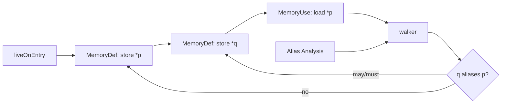

# MemorySSA, Alias Analysis & Memory Dependence

## Konu anlatımı
SSA scalar/register values için her definition'a yeni version vererek def-use ilişkisini açık hale getirir. Memory daha zordur: pointer'lar alias olabilir, calls görünmeyen state'i değiştirebilir ve load/store bağımlılıklarını bilmeden code motion veya dead-store elimination güvenli değildir.

LLVM MemorySSA memory operations üzerine sanal SSA kurar. `MemoryDef` memory state'i değiştirebilen/order constraint getiren access'i, `MemoryUse` salt okumayı, `MemoryPhi` control-flow birleşimindeki may-reach definitions'ı temsil eder. MemorySSA tek başına alias problemini çözmez; walker alias-analysis stack'ini kullanarak potential clobber zincirini disambiguate eder.

LLVM tasarımı precision ile compile time arasında bilinçli trade-off yapar: memory'yi kusursuz çok sayıda partition'a ayırmak yerine ucuz bir virtual version chain tutar ve gerektiğinde alias analysis'e danışır.

## Mental model
SSA value'lara version verir; MemorySSA memory state'e ucuz virtual version zinciri verir. Alias analysis “aynı location olabilir mi?”, MemorySSA/walker “bu use'u hangi definition clobber edebilir?” sorusunu çözer.

## İçeride ne oluyor?
1. IR memory-touching instructions için `MemoryAccess` oluşturur.
2. `MemoryDef` yeni memory version üretir.
3. `MemoryUse` mevcut version'ı tüketir.
4. Gerekli control-flow merge noktalarında `MemoryPhi` oluşur.
5. Walker defining-access zincirinde geriye yürür.
6. Alias analysis ilgisiz accesses'i eler.
7. LICM/GVN/DSE gibi passes güvenli transformations için sonucu kullanabilir.
8. IR mutation sonrası `MemorySSAUpdater`/ilgili API'lerle analysis tutarlı tutulmalıdır.

## Mülakat soruları
- Normal SSA memory'yi modellemekte neden yetersizdir?
- `MemoryDef`, `MemoryUse`, `MemoryPhi` nedir?
- Alias analysis ile MemorySSA görevleri nasıl ayrılır?
- No-alias kanıtı hangi optimizasyonları açabilir?
- Atomic/volatile operations neden yalnızca MemorySSA graph'ına bakılarak taşınamaz?
- Staff: precision/compile-time trade-off'unu nasıl değerlendirirsin?
- Principal: pass pipeline'da analysis invalidation ve update maliyetini nasıl yönetirsin?

## Beklenen cevap seviyesi
- **Mid:** SSA, aliasing, load/store dependence ve üç node tipi.
- **Senior:** clobber walk, dominance/phi, LICM/DSE, atomic/volatile sınırları.
- **Staff:** precision, compile-time, incremental updates ve pass interaction.
- **Principal:** analysis architecture, invalidation policy, optimization budget ve regression governance.

## Mini alıştırma
`store 1,*p; store 2,*q; x=load *p` için must-alias, no-alias ve may-alias durumlarını çiz. Load'un clobber'ının hangi durumda ikinci store'u atlayabileceğini açıkla.

## Proje fikri
`memoryssa-lab`: küçük C örneklerini LLVM IR'a çevir; `opt -passes='print<memoryssa>' -disable-output` ile graph'ı incele. Pointer aliasing'i değiştirip LICM/DSE davranışını karşılaştır.

## Failure modes / trade-off / production bağlantısı
Conservative alias analysis optimization fırsatlarını kaçırabilir; unsound no-alias sonucu silent miscompile yaratır. Aşırı precision compile time/memory maliyetini büyütür. IR mutation sonrası stale analysis correctness bug'ıdır. Toolchain ekipleri runtime benchmark, code size, compile time ve optimization regression'larını birlikte gate etmelidir.

## Kaynaklar
- LLVM — MemorySSA: https://llvm.org/docs/MemorySSA.html
- LLVM — Alias Analysis: https://llvm.org/docs/AliasAnalysis.html
- LLVM — New Pass Manager: https://llvm.org/docs/NewPassManager.html
