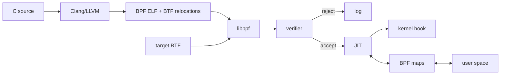

# eBPF Verifier, JIT, Maps, BTF & CO-RE

**Seviye:** Mid → Principal

## Konu anlatımı
eBPF kernel source değiştirmeden veya kernel module yüklemeden kernel hook'larında sandboxed program çalıştırma mekanizmasıdır. Production zinciri source → BPF bytecode → loader/relocation → verifier → JIT/execution → hook şeklindedir.

Verifier register türleri, scalar range'leri, pointer provenance, initialized stack state ve branch'leri izleyerek unsafe memory access'i reddeder. Bu yüzden source'un compile olması kernel acceptance garantisi değildir.

BPF maps kernel/user-space state köprüsüdür. BTF type metadata taşır. CO-RE, object'teki BTF relocation bilgisini target kernel BTF'siyle eşleyip field offset gibi değerleri load-time'da düzeltir. Accepted bytecode desteklenen mimarilerde JIT ile native code'a çevrilebilir.

## Mental model
Verifier = güvenlik kapısı; BTF/CO-RE = portability; maps = state bridge; JIT = fast execution.

## İçeride ne oluyor?
1. Clang/LLVM BPF ISA üretir.
2. ELF object program sections, maps, BTF ve relocation taşır.
3. libbpf target BTF ile CO-RE relocation uygular.
4. Kernel verifier abstract state üzerinden safety kanıtlar.
5. Accepted program JIT/execution yoluna ve sonra hook'a gider.
6. Maps state/telemetry paylaşır.

## Mülakat soruları
- Verifier neden compiler type checker'dan farklıdır?
- Map ne işe yarar?
- Pointer provenance/range tracking neden gerekir?
- BTF/CO-RE hangi portability problemini çözer?
- Staff: map cardinality ve hot-hook overhead nasıl yönetilir?
- Principal: fleet rollout, privilege ve kernel compatibility nasıl yönetilir?

## Beklenen cevap seviyesi
- **Mid:** bytecode, verifier, maps, hook, JIT.
- **Senior:** abstract interpretation, range/pointer tracking, relocation.
- **Staff:** map lifecycle, sampling, compatibility, rollout.
- **Principal:** privilege, supply-chain, platform ownership, blast radius.

## Mini alıştırma
Syscall-latency tracer için hook, timestamp map'i, cardinality sınırı ve histogram export'u tasarla; verifier rejection ve map-full davranışını açıkla.

## Proje fikri
libbpf CO-RE ile latency tracer yaz; iki kernel sürümünde verifier log, JIT, map memory ve event rate'i ölç; bounded map + sampling ekle.

## Failure modes / trade-off / production
Verifier rejection deployment'ı kırabilir. CO-RE layout portability sağlar ama semantic kernel değişikliklerini çözmez. High-cardinality maps memory baskısı, hot hooks CPU/latency overhead'i yaratır. Privileged BPF attack surface'i büyütebilir. Load/attach failures, map occupancy, dropped events ve per-hook overhead izlenmelidir.

## Kaynaklar
- https://docs.kernel.org/userspace-api/ebpf/index.html
- https://docs.kernel.org/bpf/verifier.html
- https://docs.kernel.org/bpf/libbpf/libbpf_overview.html
- https://docs.kernel.org/bpf/btf.html
- https://docs.kernel.org/bpf/llvm_reloc.html
