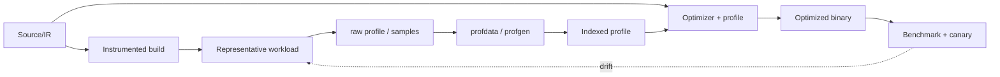

# Profile-Guided Optimization: Instrumentation, Sampling & Profile Drift

## Konu anlatımı
PGO gerçek execution'dan gelen hot/cold path, function ve call-target bilgisini sonraki compilation'a geri besler. Pipeline: **profile üret → representative workload → merge/index → profile-use build → bağımsız validation**. Instrumentation PGO compiler counter'larıyla daha kontrollü veri toplar ama training overhead'i getirir; sample PGO hardware/perf sampling ile production'a yaklaşabilir fakat bias ve attribution sorunları taşır.

## Mental model

## İçeride ne oluyor?
Instrumentation edge/block/function frequency ve value-profile sinyalleri toplayabilir. `llvm-profdata merge` raw profilleri indexed profile'a çevirir; `llvm-profgen` sample verisini compiler profile'ına dönüştürebilir. Optimizer hotness'i inlining, block layout, branch placement ve code-size kararlarında kullanır. Profile/source uyuşmazlığı ve workload drift kaliteyi düşürebilir. Training set ile evaluation set'i ayırmak benchmark leakage/overfitting riskini azaltır. MemProf ayrıca allocation hotness/lifetime sinyalini profile-guided optimizasyona taşıyabilir.

## Yüksek getirili mülakat soruları
1. PGO `-O2/-O3` üstüne ne ekler?
2. Instrumentation ve sample PGO trade-off'u nedir?
3. Representative workload neden compiler flag kadar önemlidir?
4. Hot function neden her zaman inline edilmemelidir?
5. Profile drift nasıl fark edilir?
6. Senior: code layout instruction-cache'i nasıl etkiler?
7. Staff: fleet profile'ını release pipeline'a güvenilir biçimde nasıl beslersin?

## Beklenen cevap derinliği
- **Junior:** train/profile-use ve hot/cold kavramı.
- **Mid:** instrumentation/sample, inlining/layout ve representative workload.
- **Senior:** drift, code-size/i-cache, sampling bias ve regression validation.
- **Staff:** provenance, fleet representativeness, release gating ve rollback.

## Kısa alıştırma
A endpoint'i request'lerin %95'i ama kısa; B %5 fakat CPU'nun %60'ını tüketiyor. Request-count tabanlı training'in neden yanlış sinyal verebileceğini ve CPU-weighted alternatifini açıkla.

## Proje fikri
`pgo-lab`: branch-heavy C/C++ benchmark'ını `-O2` ve instrumentation PGO ile derle. Training 90/10, test hem 90/10 hem 10/90 olsun; wall time, binary size ve `perf stat` ile drift etkisini karşılaştır.

## Failure modes / trade-off / production
Overfitting, stale/mismatched profile, instrumentation overhead, nondeterministic training ve code-size growth temel risklerdir. Ortalama throughput artarken cold path veya p99 gerileyebilir. Canary'de CPU/time, i-cache göstergeleri, binary size ve tail latency birlikte değerlendirilmelidir.

## Kaynaklar
- LLVM — How to build with PGO: https://llvm.org/docs/HowToBuildWithPGO.html
- LLVM — llvm-profdata: https://llvm.org/docs/CommandGuide/llvm-profdata.html
- LLVM — llvm-profgen: https://llvm.org/docs/CommandGuide/llvm-profgen.html
- Clang User Manual: https://clang.llvm.org/docs/UsersManual.html
- LLVM — MemProf: https://llvm.org/docs/MemProf.html
