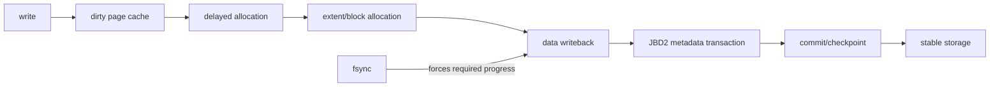

# ext4 Extents, Delayed Allocation, Journaling & `fsync()` Durability

**Seviye:** Junior → Staff  
**Alan:** Foundations / Filesystems

## Konu anlatımı
Bir dosyaya `write()` dönmesi, byte'ların kalıcı medyada güvenli olduğu anlamına gelmez. Buffered I/O'da veri önce page cache'te dirty hale gelebilir. ext4 ayrıca **delayed allocation** ile logical file offset'leri için fiziksel blok seçimini writeback zamanına kadar erteleyebilir. Amaç daha büyük contiguous allocation kararları verip fragmentation ve metadata overhead'ini azaltmaktır.

ext4 büyük/contiguous bölgeleri tek tek block pointer'ları yerine **extent** olarak temsil eder: kabaca `(logical_start, physical_start, length)`. Dosya büyüdükçe extent tree lookup ve update maliyetini ölçekler. Allocation policy inode/data locality, block groups ve multiblock allocation ile birlikte çalışır.

**JBD2 journal** esas olarak metadata crash consistency sağlar. Default `data=ordered` modunda ilgili data blocks metadata commit'inden önce ana filesystem'e yazılmaya zorlanır; `data=writeback` bu ordering garantisini gevşetir, `data=journal` ise data+metadata'yı journal üzerinden geçirir ve daha yüksek maliyetlidir. Journal filesystem'i tutarlı tutmak ile uygulamanın son byte'larını durable yapmak aynı garanti değildir.

`fsync(fd)` uygulamanın durability protokolünün parçasıdır. Özellikle `temp -> fsync(temp) -> rename(temp, target) -> fsync(parent_dir)` modeli, yalnız `rename()` çağırmaktan daha güçlü crash semantics hedefler; dosya içeriğinin ve directory entry değişikliğinin persistence sınırlarını ayrı düşünmek gerekir.

## Mental model

**Invariant:** namespace consistency, file-data durability ve metadata durability aynı şey değildir; crash boundary'sinde hangi state'in kalıcı olması gerektiğini açıkça tanımla.

## İçeride ne oluyor?
1. Buffered write page cache'i dirty eder; block placement hemen yapılmak zorunda değildir.
2. Delayed allocation writeback'e yakın zamanda fiziksel blokları seçerek daha iyi locality/contiguity fırsatı yaratır.
3. Extent tree logical range'i physical range'e map eder; sparse file/hole ile allocated range'i ayırmak gerekir.
4. JBD2 transaction commit record ile crash replay sınırı oluşturur.
5. `data=ordered` metadata journal commit'inden önce ilişkili dirty data'nın ana filesystem'e gitmesini ister; bu, her application-level update'in atomik olduğu anlamına gelmez.
6. `fsync()` latency'si dirty-data writeback, allocation, journal commit ve storage flush/FUA davranışlarından etkilenebilir.

## Yüksek getirili mülakat soruları
- `write()` başarılı döndüğünde hangi durability garantileri yoktur?
- Extent, block pointer modeline göre neden ölçeklenebilir?
- Delayed allocation throughput/fragmentation'ı nasıl iyileştirir; crash ve ENOSPC davranışını nasıl şaşırtabilir?
- Journaling neden database transaction ile aynı şey değildir?
- Senior: atomic config-file replace için neden file `fsync` yanında parent-directory `fsync` düşünürsün?
- Staff: p99 `fsync` latency spike'ını page cache, journal, block layer ve device telemetry ile nasıl ayırırsın?

## Seviyeye göre cevap derinliği
- **Junior:** page cache, inode, block, extent, writeback ve `fsync` kavramlarını ayırır.
- **Mid:** delayed allocation, fragmentation, journaling modes ve rename/durability sınırını açıklar.
- **Senior:** crash-consistency protocol, ENOSPC-late-allocation, ordering ve storage flush semantiğini tartışır.
- **Staff:** workload/fs choice, latency tails, observability, failure injection ve application durability contract'ını birlikte tasarlar.

## Kısa alıştırma
Bir program `write(temp) -> close(temp) -> rename(temp, live)` yapıyor. Power loss'ı her adım arasına yerleştirip olası state'leri yaz. Sonra protokolü `fsync(temp)` ve parent directory `fsync` ile güçlendir; hangi garanti için hangi syscall'ın gerekli olduğunu belirt.

## Proje fikri
`crash-safe-writer-lab`: aynı key/value snapshot'ını üç stratejiyle yaz: doğrudan overwrite, temp+rename, temp+fsync+rename+directory-fsync. Loopback ext4 image üzerinde fault/reboot testleri ve `filefrag`, `strace`, `fio`/latency ölçümleriyle extent sayısı, correctness ve p99 sync maliyetini karşılaştır.

## Failure modes / trade-off / production bağlantısı
Delayed allocation yüzünden ENOSPC write anından sonra görülebilir; fragmentation extent sayısını büyütebilir; journal/device stalls `fsync` tail latency'sini yükseltebilir; yanlış durability varsayımı eski veya eksik dosya gibi crash sonuçları üretebilir. Daha sık sync RPO'yu düşürür fakat throughput ve device wear/latency maliyetini artırır. Production'da dirty/writeback pressure, disk free space, delayed-allocation blocks, journal/IO latency, device errors ve application commit latency birlikte izlenmelidir.

## Kaynaklar
- Linux kernel — ext4 General Information: https://docs.kernel.org/admin-guide/ext4.html
- Linux kernel — ext4 Block and Inode Allocation Policy: https://docs.kernel.org/filesystems/ext4/allocators.html
- Linux kernel — ext4 Journal (JBD2): https://docs.kernel.org/filesystems/ext4/journal.html
- Linux man-pages — `fsync(2)`: https://man7.org/linux/man-pages/man2/fsync.2.html
