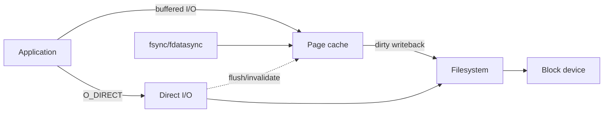

# Linux Buffered I/O, Direct I/O, Writeback & Cache Coherency

## Temel model
Linux'ta normal file I/O page cache üzerinden geçer. Cache hit storage erişimini önleyebilir; buffered write ise çoğu zaman cache folio'larını dirty yapar ve writeback bunları daha sonra storage'a taşır. Bu yüzden `write()` syscall'ının başarıyla dönmesi ile kalıcılık aynı şey değildir; `fsync`/`fdatasync` ayrı durability sınırlarıdır.

`O_DIRECT`, page cache'i bypass eden bir I/O yolu sağlar fakat otomatik durability garantisi değildir. Direct ve buffered I/O aynı file range üzerinde karışırsa cache coherency için flush/invalidation gerekir. Sonuç: direct I/O “her zaman daha hızlı” değil, farklı cache ownership ve latency trade-off'ları olan bir araçtır.

## İçeride ne oluyor?
- Buffered read cache hit/miss üretir; sequential workload readahead'den yararlanabilir.
- Buffered write dirty folio üretir; background writeback veya explicit sync storage'a iter.
- Direct I/O uygulama buffer'ı ile storage yolunu page cache dışında kurar; alignment ve granularity kısıtları olabilir.
- Linux iomap direct-I/O operasyonları cached state ile çakışmayı önlemek için ilgili range'de writeback/invalidation koordine eder.
- DAX, `O_DIRECT` ile aynı şey değildir; persistent-memory benzeri storage için ayrı bir mapping modelidir.
- Database engine'leri kendi buffer pool'ları nedeniyle OS page cache'i bypass ederek double caching'i azaltmak isteyebilir.

## Mülakat soruları
1. `write()` döndüğünde veri diskte midir?
2. Page cache performansı nasıl artırır, hangi durumda memory pressure yaratır?
3. `O_DIRECT`, `O_SYNC` ve `fsync` arasındaki fark nedir?
4. Direct ve buffered I/O aynı range'de neden pahalıdır?
5. Readahead hangi access pattern'de yararlıdır?
6. Database neden kendi buffer pool'u varken direct I/O seçebilir?
7. Staff seviyesinde I/O mode'u latency SLO, memory budget ve durability hedefleriyle nasıl seçersin?

## Beklenen cevap derinliği
- **Junior:** cache hit, dirty page, writeback ve fsync ayrımını bilir.
- **Mid:** buffered/direct path, readahead ve alignment trade-off'unu açıklar.
- **Senior:** double caching, coherency, tail latency ve durability'yi bağlar.
- **Staff:** workload ölçümü, rollout ve failure-domain bazlı I/O politikasını tasarlar.

## Mini alıştırma
1 GiB RAM bütçeli bir storage service için 700 MiB application buffer pool ile kontrolsüz page cache'in neden double caching yaratabileceğini çiz. Buffered/direct benchmark için p50/p99, throughput, cache hit, queue depth ve fsync latency metriklerini seç.

## Proje
`io-path-lab`: aynı büyük dosyada sequential/random buffered I/O ile `O_DIRECT` varyantını karşılaştır. Cold/warm cache, queue depth ve block size değiştir; throughput, p99 ve CPU'yu kaydet.

## Failure modes / trade-off / production
`write()` ile durability'yi karıştırmak veri kaybına; direct I/O'yu ölçmeden açmak cache/readahead kaybına; buffered+direct karışımı flush/invalidation maliyetine; büyük dirty working set writeback burst ve tail-latency sıçramasına yol açabilir. Production'da dirty memory, writeback, major faults, device latency/queue depth, fsync latency ve application p99 birlikte izlenir.

## Kaynaklar
- Linux Kernel — Page Cache: https://docs.kernel.org/mm/page_cache.html
- Linux Kernel — iomap Supported File Operations: https://docs.kernel.org/filesystems/iomap/operations.html
- Linux Kernel — Direct Access (DAX): https://docs.kernel.org/filesystems/dax.html
