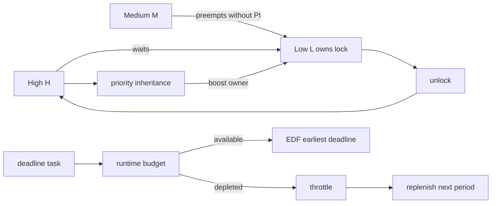

# Linux SCHED_DEADLINE, EDF/CBS & Priority Inversion

## Neden önemli?
Fair scheduling ile real-time scheduling farklı problemleri çözer. Fair scheduler CPU payı ve responsiveness'i dengeler; real-time sistem ise işin zaman bütçesi ve deadline sözleşmesini karşılamaya çalışır. Interview'da `nice`/fair scheduling bilgisinden deadline scheduling, bandwidth reservation ve lock-induced priority inversion'a geçebilmek Linux scheduler temelini tamamlar.

## Mental model
**SCHED_DEADLINE = reservation + urgency.** CBS “bu task ne kadar CPU bütçesi kullanabilir?” sorusunu; EDF “hazır deadline task'lerinden hangisi önce koşmalı?” sorusunu çözer. **Priority inheritance** ise scheduler priority'sini gerçek lock dependency'siyle geçici olarak hizalar.

## SCHED_DEADLINE
Linux deadline scheduling class EDF'yi Constant Bandwidth Server ile birleştirir. Task `runtime`, `deadline`, `period` parametreleriyle reservation ister. Task çalıştıkça remaining runtime azalır; bütçe tükenirse throttle edilir ve replenishment ile tekrar çalışabilir. EDF, scheduling deadline'ı en erken task'i seçer.

Admission control kritiktir. Reservation toplamı kapasiteyi aşarsa deadline guarantees sürdürülemez. Tek CPU ve `deadline == period` gibi basit durumda utilization sezgisi `sum(runtime/period)` üzerinden kurulabilir; multicore ve farklı relative deadline'larda schedulability daha karmaşıktır.

## Priority inversion
H yüksek, M orta, L düşük öncelikli olsun. L lock'u tutarken H aynı lock'ta bloklanırsa, M'nin L'yi preempt etmesi H'nin de dolaylı biçimde M'nin arkasında kalmasına neden olur. Priority inheritance ile lock owner L, H'nin beklediği süre boyunca geçici boost alabilir; critical section bittiğinde boost geri alınır.

Linux `rtmutex` priority inheritance destekler. PREEMPT_RT, kernel'in daha fazla locking/interrupt yolunu preemptible task context'e taşıyarak worst-case latency'yi azaltmayı hedefler. PI yine de non-preemptible bölgeleri, IRQ latency'yi, uzun critical section'ı veya CPU oversubscription'ı sihirli biçimde çözmez.

## İçeride ne oluyor?
1. Task deadline reservation parametrelerini scheduler'a verir.
2. Admission control bandwidth'i kontrol eder.
3. CBS remaining runtime ve scheduling deadline state'ini tutar.
4. CPU kullanımı runtime budget'i tüketir; depletion throttling üretir.
5. EDF en erken deadline'ı seçer.
6. Lock contention'da rtmutex waiter/owner dependency'sini izler.
7. Yüksek priority waiter owner'a geçici boost propagate edebilir.
8. Unlock sonrası inheritance kaldırılır.

## Mülakat soruları
- Fair scheduling ile real-time scheduling hedefleri nasıl ayrılır?
- EDF nedir; runtime/deadline/period neyi temsil eder?
- CBS neden EDF'ye eklenir?
- Priority inversion'ı H/M/L örneğiyle açıkla.
- Priority inheritance hangi problemi çözer, hangilerini çözmez?
- CPU affinity, IRQ load, lock contention ve deadline miss nasıl birlikte teşhis edilir?
- PREEMPT_RT veya dedicated core kararı hangi product/SLO koşullarında anlamlıdır?

## Beklenen cevap seviyesi
- **Mid:** EDF, reservation ve priority inversion kavramlarını doğru ayırır.
- **Senior:** CBS throttling, admission control, rtmutex PI ve bounded critical section konuşur.
- **Staff:** IRQ/preemption, CPU isolation, tracing ve multicore failure mode'larını bağlar.
- **Principal:** determinism, utilization, operational complexity ve product latency contract'ını birlikte tartar.

## Mini alıştırma
Tek CPU'da A=`20/50/100ms` runtime/deadline/period, B=`10/30/50ms` olsun. Reservation utilization toplamını hesapla ve aynı anda wake olduklarında EDF sırasını çiz. Sonra H/M/L lock timeline'ını PI öncesi ve sonrası karşılaştır.

## Proje fikri
`deadline-pi-lab`: disposable VM'de `rt-app` veya pthread workload ile OTHER/FIFO/DEADLINE davranışlarını karşılaştır. Wakeup latency ve deadline miss ölç. Ayrı deneyde PI-enabled mutex ile H/M/L contention ölçümü yap. Production host üzerinde policy değiştirme.

## Failure modes / trade-off / production
Yanlış RT priority starvation yaratabilir. Oversubscription deadline miss üretir. Uzun IRQ/non-preemptible bölgeler PI'nin kapsamı dışındadır. Nested locks ve convoy tail latency'yi büyütebilir. Frequency/power management timing'i etkileyebilir. Scheduler class, affinity, run-queue pressure, throttling/deadline misses, IRQ placement ve lock contention birlikte gözlenmelidir.

## Kaynaklar
- Linux Kernel — Deadline Task Scheduling: https://docs.kernel.org/scheduler/sched-deadline.html
- Linux Kernel — EEVDF Scheduler: https://docs.kernel.org/scheduler/sched-eevdf.html
- Linux Kernel — Lock types / rtmutex: https://docs.kernel.org/locking/locktypes.html
- Linux Kernel — Real-time theory: https://docs.kernel.org/core-api/real-time/theory.html
