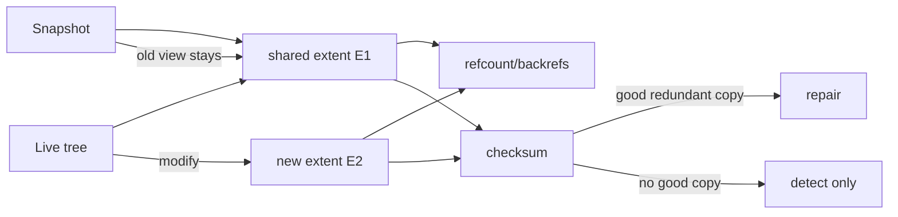

# Btrfs Copy-on-Write, Snapshots, Extent Refcounts & Checksums

## Neden önemli?
Filesystem durability yalnız journaling değildir. Copy-on-Write (CoW) tasarımlar data/metadata update, snapshot, reflink, corruption detection ve space reclamation için farklı bir mental model kurar. Btrfs bu modelin Linux'taki önemli production örneklerinden biridir.

## Mental model

CoW = **paylaş, değişince ayır**. Snapshot ilk anda bütün dosyaları kopyalamaz; eski root/tree/extent'leri paylaşır. Değişen bölgeler yeni allocation'a gider.

## Temel mekanizma
Btrfs extent tabanlı storage kullanır. Extent tree allocated byte range'leri ve bunların reference/back-reference bilgisini izler. Subvolume/snapshot tree'leri extent paylaşabilir. Shared bir extent değiştirildiğinde yeni extent ayrılır ve yeni metadata path/root bu yeni konuma işaret eder. Eski extent, hâlâ snapshot veya başka reflink tarafından referanslanıyorsa korunur.

Metadata da CoW olduğu için küçük random write yalnız data block maliyeti değildir: tree node değişiklikleri, extent bookkeeping ve checksum update'leri write amplification yaratabilir. Snapshot/reflink space efficiency'nin bedeli refcount/backref metadata ve fragmentation olabilir.

## Checksumming ve scrub
Btrfs data ve metadata'yı varsayılan olarak checksum'lar. Metadata block checksum'u node header'da, data checksum'ları ayrı checksum tree'de tutulur. Read sırasında mismatch silent corruption'ı görünür yapar. Redundant profile'da sağlam replica mevcutsa filesystem doğru kopyayı kullanarak repair edebilir; redundancy yoksa checksum yalnız detection sağlar.

`scrub` allocated blocks üzerinde online checksum verification yapar. Böylece nadiren okunan data'daki latent corruption application read'ini beklemeden bulunabilir. Scrub backup değildir ve kayıp tek kopyayı yeniden yaratamaz.

## Snapshot neden backup değildir?
Snapshot aynı filesystem/device failure domain'inde olabilir. Controller/device kaybı, destructive admin operation veya filesystem-wide corruption hem live data'yı hem snapshot'ı etkileyebilir. Backup ayrı failure domain, retention ve restore testleri gerektirir.

## İçeride ne oluyor?
1. File logical range bir data extent'e işaret eder.
2. Snapshot yeni bir full data copy yerine paylaşılmış tree/root görünümü oluşturur.
3. Shared extent'e write yeni extent allocation tetikler.
4. Değişen metadata path'i CoW ile yeni tree blocks'a yazılabilir.
5. Transaction commit yeni root pointer'larını görünür kılar.
6. Extent refcount/backrefs ownership'i takip eder; son reference kalkınca reclaim mümkündür.
7. Checksums write öncesi hesaplanır, read sonrası doğrulanır.
8. Scrub allocated blocks'ı tarar; redundancy varsa mismatch repair edilebilir.

## Mülakat soruları
1. CoW ile in-place overwrite farkı nedir?
2. Snapshot neden ilk anda full dataset kadar alan tüketmez?
3. Reflink ile normal file copy farkı nedir?
4. CoW neden random-write workload'da fragmentation/write amplification yaratabilir?
5. Checksum neden replication veya backup değildir?
6. Snapshot deletion neden her zaman anlık ucuz değildir?
7. Database WAL + CoW filesystem birlikte kullanılırken hangi benchmark ve durability sınırlarını incelersin?

## Seviyeye göre cevap derinliği
- **Junior:** overwrite yerine yeni block ve snapshot sharing.
- **Mid:** extent, reflink, checksum, scrub.
- **Senior:** metadata CoW, refcount/backref, fragmentation ve write amplification.
- **Staff:** retention/deletion cost, multi-device redundancy, ENOSPC/headroom ve observability.
- **Principal:** filesystem semantics'i database durability, backup/RPO, hardware failure model ve fleet policy'ye bağlar.

## Mini alıştırma
100 GiB subvolume snapshot'landıktan sonra live tree'de yalnız 64 MiB değişsin. Hangi extent'lerin paylaşılmaya devam ettiğini çiz. Ardından tek-device checksum mismatch ile mirrored profile mismatch'inin farkını açıkla.

## Proje fikri
Disposable VM/loopback Btrfs filesystem üzerinde snapshot ve reflink oluştur. Küçük random overwrite öncesi/sonrası filesystem usage ve extent layout'u karşılaştır; scrub çalıştır. Snapshot deletion'ın space reclamation davranışını gözle. Production volume üzerinde corruption deneyi yapma.

## Failure modes / production
Snapshot'ı backup sanmak; checksum'ı repair garantisi sanmak; metadata headroom'u ihmal etmek; snapshot sayısını limitsiz büyütmek; random-write database workload'unda CoW maliyetini benchmark etmemek tipik hatalardır. Production'da data/metadata usage, ENOSPC headroom, device errors, scrub errors, fragmentation, snapshot retention/deletion süresi ve p95/p99 workload latency izlenmelidir.

## Kaynaklar
- Linux Kernel — Btrfs: https://docs.kernel.org/filesystems/btrfs.html
- Btrfs — Btrees: https://btrfs.readthedocs.io/en/latest/dev/dev-btrees.html
- Btrfs — Design: https://btrfs.readthedocs.io/en/latest/dev/dev-btrfs-design.html
- Btrfs — Checksumming: https://btrfs.readthedocs.io/en/stable/Checksumming.html
