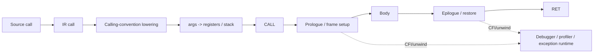

# Calling Conventions, Stack Frames, Prologue/Epilogue ve Unwind Metadata

## Neden var?
Compiler'ın machine instruction üretmesi tek başına yeterli değildir. Ayrı compilation unit'ler, shared libraries, runtimes ve FFI tarafları aynı binary sözleşmesine uymalıdır. **ABI** argument/return placement, register preservation, stack alignment, object/binary conventions ve unwind gibi ayrıntıları standardize eder.

**ISA** CPU'nun instruction/register modelidir. **ABI** binary parçalarının birlikte çalışma sözleşmesidir. **Calling convention** ABI'nin function-call kısmıdır. **Compiler backend** IR'yi ISA+ABI kısıtları altında machine code'a indirger.

## Mental model

## Calling convention
Calling convention şu sorulara cevap verir:
- İlk N argument hangi register'larda taşınır, kalanı stack'e nasıl gider?
- Return value nerede döner?
- Hangi register'lar caller-saved, hangileri callee-saved?
- Stack pointer hangi alignment'ı korumalı?
- Varargs, aggregates ve special calling conventions nasıl ele alınır?

LLVM IR'de call ve function calling convention'larının dynamic caller/callee arasında eşleşmesi gerekir. `ccc` target C convention'ını izler; `fastcc` gibi convention'lar external ABI compatibility yerine performans için farklı kurallar seçebilir.

## Stack frame ve frame lowering
Register allocation sonrası compiler hangi values'ın stack spill gerektirdiğini ve hangi callee-saved register'ların kullanıldığını bilir. Frame lowering bu bilgiden stack layout ve giriş/çıkış kodunu üretir.

Tipik prologue:
1. Gerekli callee-saved register'ları sakla.
2. Stack pointer'ı local/spill alanı kadar ayarla.
3. ABI alignment'ını koru.
4. Gerekirse frame pointer kur.

Tipik epilogue bunun tersini yapar. Fakat leaf function veya tamamen register'da kalan küçük optimized function hiç anlamlı frame ayırmayabilir.

## Caller-saved vs callee-saved
Caller-saved register call sırasında clobber edilebilir; caller call sonrasında değere ihtiyaç duyuyorsa önceden korur. Callee-saved register'ı kullanan callee eski değeri geri yüklemek zorundadır. Ayrım, her call'da bütün register'ların save/restore edilmesini önleyen performans sözleşmesidir.

## Unwind metadata
Exception, debugger veya profiler normal `return` instruction zincirini çalıştırmadan caller frame'lerini yeniden kurmak isteyebilir. DWARF CFI veya platform-specific compact unwind formatları belirli PC konumlarında caller'ın stack pointer/register state'inin nasıl recover edileceğini tarif eder.

Bu nedenle frame pointer kaldırılmış olması stack walking'in teorik olarak imkânsız olduğu anlamına gelmez; doğru unwind metadata kullanılabilir. Ancak async profiling, stripped binaries ve tooling desteği pratik trade-off yaratır.

## Compiler zincirindeki yeri
`source -> AST -> IR -> optimization -> instruction selection -> register allocation -> frame lowering -> assembly/object -> linker -> executable`

Calling convention lowering instruction selection çevresinde target ABI'ye physical locations bağlar; register allocation spill/callee-save ihtiyacını netleştirir; prologue/epilogue insertion final frame'i kurar; assembler/object writer unwind metadata'yı ilgili section'lara taşır; linker bunları final image'da birleştirir.

## Mülakat soruları
1. ISA ile ABI arasındaki fark nedir?
2. Caller-saved/callee-saved ayrımı neden var?
3. Her function stack frame oluşturur mu?
4. Stack alignment neden correctness konusu olabilir?
5. Frame pointer omission ne kazandırır?
6. Senior: tail-call optimization hangi frame/calling-convention kısıtlarına bağlıdır?
7. Senior: exception unwinding normal return'den nasıl farklıdır?
8. Staff: JIT/native FFI boundary'sinde ABI mismatch hangi failure mode'ları üretir?

## Beklenen cevap derinliği
- **Junior:** stack, return address, arguments ve prologue/epilogue temelini bilir.
- **Mid:** preservation classes, alignment, leaf function ve frame pointer trade-off'unu açıklar.
- **Senior:** register allocation→frame lowering→unwind metadata zincirini bağlar.
- **Staff:** FFI/JIT, symbolication, profiler, exceptions ve ABI compatibility risklerini production düzeyinde tartışır.

## Mini alıştırma
Altı integer argüman alan, local array kullanan ve başka function çağıran küçük C/C++ kodunu `clang -O0 -S` ve `clang -O2 -S` ile derle. Stack adjustment, saved registers, frame pointer ve call site farklarını işaretle. Sonra `readelf --debug-dump=frames` ile unwind bilgisini incele.

## Proje fikri
`abi-frame-lab`: aynı C API'yi iki dil veya küçük bir JIT stub üzerinden çağır; assembly ve unwind section raporu üret. ABI boundary testleri ekle ve stack traces'in optimized build'de de çözülebildiğini doğrula.

## Failure modes / trade-off / production
Calling-convention mismatch register corruption/crash; stack misalignment SIMD/callee failure; yanlış unwind metadata broken exception handling veya eksik profiler/crash stack üretir. Frame pointer observability'yi kolaylaştırabilir fakat bir register tüketir. Native/JIT production sistemlerinde ABI versioning, FFI conformance tests, symbol/unwind validation ve crash symbolication release kriterlerine dahil edilmelidir.

## Kaynaklar
- LLVM Language Reference — Calling Conventions: https://llvm.org/docs/LangRef.html#calling-conventions
- LLVM Target-Independent Code Generator: https://llvm.org/docs/CodeGenerator.html
- LLVM AArch64 prologue/epilogue source docs: https://llvm.org/docs/doxygen/AArch64PrologueEpilogue_8h_source.html
- System V AMD64 ABI project: https://gitlab.com/x86-psABIs/x86-64-ABI
