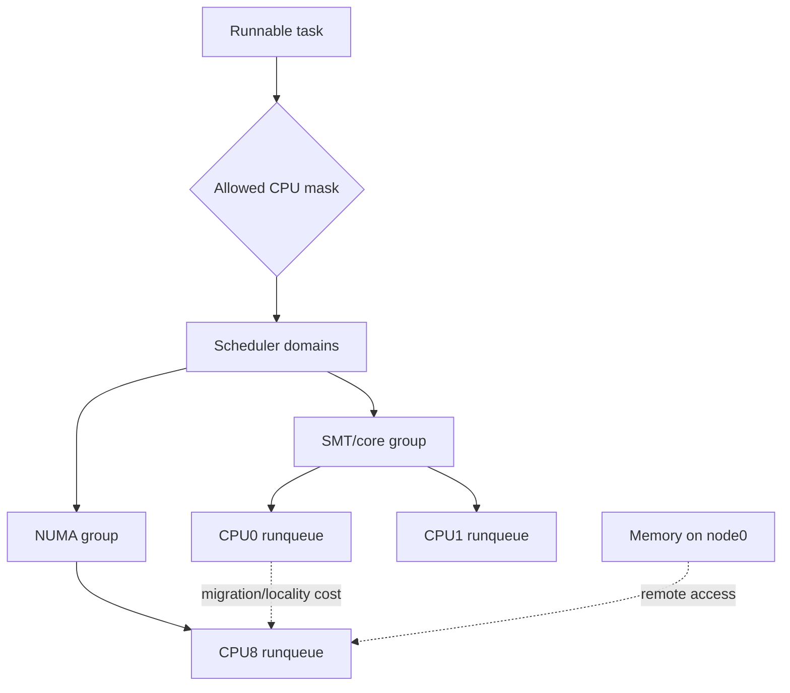

# Linux Scheduler Domains, CPU Affinity & NUMA Locality

## Konu anlatımı
Çok çekirdekli Linux scheduling yalnız “hangi runnable task sırada?” problemi değildir; **task hangi CPU'da çalışmalı?** sorusunu da çözer. Linux hardware topology'yi scheduler domain/group hiyerarşisiyle temsil eder. SMT sibling, core/package ve NUMA node seviyelerinde load balancing'in faydası ile migration/locality maliyeti farklıdır.

Load balancing boş CPU'yu kullanarak throughput'u artırabilir. Buna karşılık task migration cache/TLB locality kaybı yaratır; NUMA sisteminde task'ın memory footprint'inden uzak node'a taşınması remote-memory maliyeti doğurabilir. CPU affinity placement alanını sınırlar; cpuset/cgroup workload isolation sağlar. Pinning locality kazandırabilir ama imbalance ve stranded capacity yaratabilir.

## Mental model

Scheduler iki bütçeyi dengeler: **compute imbalance** ve **movement/locality cost**.

## İçeride ne oluyor?
- CPU'ların kendi runnable/runqueue state'i vardır.
- `sched_domain` hierarchy topology seviyelerinde hangi CPU grupları arasında balancing yapılacağını tanımlar.
- Periodic, newly-idle ve wakeup yolları placement/migration kararları verebilir.
- `sched_setaffinity` ile verilen mask scheduler'ın kullanabileceği CPU kümesini sınırlar.
- NUMA'da execution placement ile memory placement birlikte düşünülmelidir.
- cpuset CPU/memory placement ve load-balancing scope'unu kısıtlayabilir.
- CPU isolation scheduler balancing/noise'u azaltabilir; karşılığında global capacity sharing azalır.

## Mülakat soruları
1. Per-CPU runqueue varken load balancing neden gerekir?
2. Scheduler domain neyi modeller?
3. CPU affinity ne zaman latency'yi iyileştirir/kötüleştirir?
4. Migration'ın cache ve NUMA maliyeti nedir?
5. CPU quota ile cpuset neden aynı şey değildir?
6. Senior: cache-hot task'ı socket'lar arasında taşımak neden pahalıdır?
7. Staff: latency-sensitive servis için isolation kararını hangi metriklerle verirsin?
8. Principal: locality, fairness, isolation ve fleet utilization nasıl dengelenir?

## Beklenen cevap seviyesi
- **Mid:** runqueue, migration, affinity ve NUMA'yı ayırır.
- **Senior:** topology-aware balancing ile locality trade-off'unu açıklar.
- **Staff:** cpuset/cgroup, IRQ/workqueue noise, observability ve p99 etkisini bağlar.
- **Principal:** NUMA/heterogeneous topology ve capacity economics'i policy seviyesinde tartışır.

## Mini alıştırma
2 NUMA node × 8 CPU sistemde node-0'da 20 GiB hot memory kullanan 6-worker servisi unpinned, `0-5` pinned ve node-local cpuset biçimlerinde karşılaştır. p50/p99, migrations, LLC misses, remote NUMA access ve stranded capacity için hipotez yaz.

## Proje fikri
`sched-locality-lab`: CPU-bound ve memory-bound workload'ları unpinned/affined/cpuset-isolated modlarda benchmark et. `lscpu -e`, `/proc/schedstat`, `perf stat` ve NUMA araçlarıyla topology, migrations, context switches, cache misses ve p99 latency raporu üret.

## Failure modes / trade-off / production
Aşırı pinning idle CPU varken queueing yaratabilir. Cross-NUMA migration remote-memory penalty doğurur. Isolation housekeeping/IRQ yerleşimi düşünülmeden yapılırsa determinism hedefi bozulur. Production tuning host topology ve workload ölçümü olmadan başka sistemden kopyalanmamalıdır.

## Kaynaklar
- Linux Kernel — Scheduler Domains: https://docs.kernel.org/scheduler/sched-domains.html
- Linux Kernel — NUMA: https://docs.kernel.org/mm/numa.html
- Linux Kernel — CPU Isolation: https://docs.kernel.org/admin-guide/cpu-isolation.html
- Linux Kernel — CPUSETS: https://docs.kernel.org/admin-guide/cgroup-v1/cpusets.html
- Linux Kernel — Scheduler Statistics: https://docs.kernel.org/scheduler/sched-stats.html
