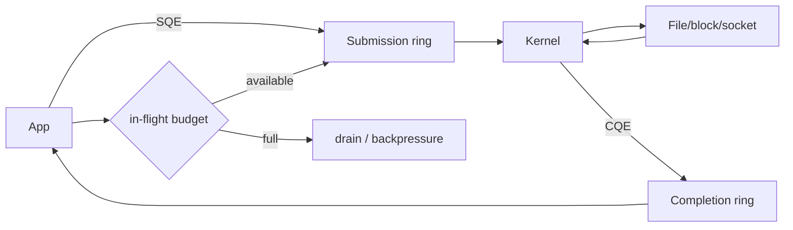

# Linux io_uring: Submission/Completion Rings & Backpressure

## Konu anlatımı
`io_uring`, Linux'ta I/O işlerini submission/completion modeliyle ifade eden bir arayüzdür. Userspace SQE üretir; kernel işi yürütür ve CQE ile sonucu döndürür. `epoll` readiness bildirirken `io_uring` operasyon/completion akışını modelleyebilir. Batching, registered resources, linked ve multishot operations koordinasyon maliyetini azaltabilir; fakat queue depth ve buffer ownership açıkça yönetilmelidir.

## Mental model

## İçeride ne oluyor?
- Ring state kurulur ve SQ/CQ userspace ile paylaşılır.
- SQE opcode, fd, buffer, offset ve correlation için `user_data` taşır.
- Kernel işi ilgili I/O subsystem yoluna gönderir.
- CQE `res` ile completion sonucunu taşır.
- Registered file/buffer tekrar eden lookup/pinning maliyetini azaltabilir ama lifecycle/memory accounting yükü ekler.
- Multishot tek submission'dan çok completion üretebilir.
- Ring kapasitesi ile güvenli application concurrency budget aynı değildir.

## Mülakat soruları
1. Readiness ile completion farkı nedir?
2. SQE/CQE nedir?
3. Queue depth neden sınırsız artırılmaz?
4. Registered buffer hangi trade-off'u getirir?
5. Cancellation ile completion yarışı nasıl modellenir?
6. Staff: storage proxy için backpressure nerelerde uygulanır?

## Beklenen cevap derinliği
- **Mid:** SQ/CQ ve completion modelini açıklar.
- **Senior:** batching, registration, cancellation ve tail latency'yi bağlar.
- **Staff:** ownership, overload control ve observability tasarlar.
- **Principal:** app/kernel/device queue bütçelerini workload ölçümleriyle birlikte optimize eder.

## Mini alıştırma
10.000 adet 16 KiB read için in-flight 64/256/2048 seçeneklerini throughput, memory ve p99 açısından karşılaştır. Outstanding ops, CQ backlog, IOPS, utilization ve latency ölçülerini seç.

## Proje fikri
Blocking thread pool ile `liburing` read benchmark'ı kur; queue depth 8/32/128/512 ve registered-buffer varyantlarını CPU/op, throughput ve p99 ile karşılaştır.

## Failure modes / trade-off / production
Unbounded submission queueing delay'i aşağı katmana iter. CQ starvation completion pressure yaratır. Completion öncesi buffer reuse corruption doğurabilir. Cancellation sonucu ile gerçek I/O completion yarışabilir. Registered memory reclaim esnekliğini azaltabilir. Kernel/filesystem/device/opcode desteği benchmark sonucunu değiştirir.

## Kaynaklar
- Linux io_uring UAPI: https://github.com/torvalds/linux/blob/master/include/uapi/linux/io_uring.h
- liburing: https://github.com/axboe/liburing
- Linux Kernel — io_uring zero-copy Rx: https://docs.kernel.org/networking/iou-zcrx.html
- Linux Kernel — FUSE over io_uring: https://docs.kernel.org/filesystems/fuse/fuse-io-uring.html
