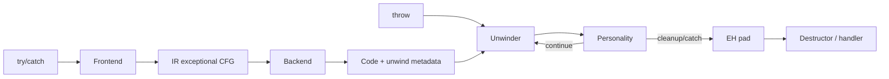

# Exceptions: Unwind Tables, Personality Functions & Landing Pads

## Konu anlatımı
Yaygın C++/LLVM “zero-cost” exception modelinde normal path'e her çağrıda checkpoint eklemek yerine compiler out-of-line unwind metadata üretir. Exception oluştuğunda runtime unwinder stack frame'lerini gezer; hedef dil/ABI'nin personality function'ı handler ve cleanup kararını verir. Compiler front-end, IR, backend, ABI ve runtime bu zincirde birlikte çalışır.

## Mental model

Unwind metadata **frame nasıl geri alınır?**, personality ise **bu frame exception için ne yapmalı?** sorusunu cevaplar.

## İçeride ne oluyor?
- Throw runtime'a exception object/type bilgisi verir.
- Unwinder frame metadata'sını kullanarak caller state'ini yeniden kurar.
- Personality language-specific action table'ı yorumlar.
- Handler yoksa arama üst frame'e devam eder.
- Cleanup frame'lerinde destructor/finally benzeri kod çalışır.
- LLVM Itanium-style EH'de `invoke` normal ve exceptional successor taşıyabilir.
- `.eh_frame`/CFI frame restoration bilgisini; LSDA benzeri tablolar call-site/action bilgisini taşır.
- Windows SEH/funclet gibi hedeflerde model farklılaşır.
- `noexcept`/nounwind optimizer ve runtime semantics için önemlidir.

## Mülakat soruları
1. “Zero-cost” neden gerçek anlamda sıfır maliyet değildir?
2. Compiler neden unwind metadata üretir?
3. Personality function ne yapar?
4. Destructor'lar unwind sırasında nasıl çalışır?
5. `call` ve `invoke` kavramsal olarak nasıl ayrılır?
6. `.eh_frame` ile language-specific action table neden farklıdır?
7. FFI sınırında exception propagation neden risklidir?

## Beklenen cevap derinliği
- **Junior:** throw → unwind → catch ve cleanup zincirini açıklar.
- **Mid:** metadata ile exceptional CFG'yi ayırır.
- **Senior:** CFI, personality, LSDA/EH pad ve ABI ilişkisini kurar.
- **Staff:** FFI, optimizer assumptions, binary size ve failure semantics'i production'a bağlar.

## Mini alıştırma
`main -> A -> B -> C` zincirinde `C` throw etsin; `B` local destructor, `A` matching catch içersin. Search ve cleanup/unwind adımlarını frame frame çiz. `B noexcept` olursa sonucu ayrıca incele.

## Proje fikri
Küçük C++ programını Clang ile derle; LLVM IR, `.eh_frame` ve exception-related section'ları `readelf`/`llvm-objdump` ile incele. `noexcept` ve exceptions-disabled varyantlarını binary size/disassembly açısından karşılaştır.

## Failure modes / trade-off / production
Exception-heavy hot path pahalıdır; metadata binary size ekler. Cleanup sırasında yeni exception terminate davranışına gidebilir. ABI'nın desteklemediği FFI exception propagation unsafe olabilir. Debug metadata ile unwind metadata aynı şey değildir; crash unwinding ayrıca doğrulanmalıdır.

## Kaynaklar
- LLVM — Exception Handling: https://llvm.org/docs/ExceptionHandling.html
- LLVM Language Reference: https://llvm.org/docs/LangRef.html
- Clang — LLVM IR Generation for EH and Cleanups: https://clang.llvm.org/docs/LLVMExceptionHandlingCodeGen.html
- Itanium C++ ABI — Exception Handling: https://itanium-cxx-abi.github.io/cxx-abi/abi-eh.html
