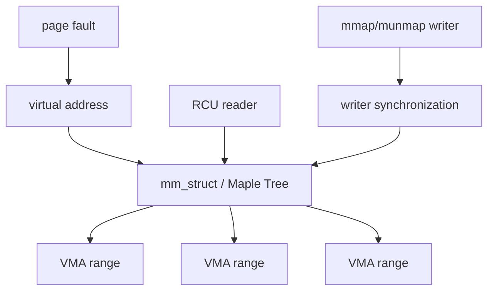

# Linux Maple Tree: VMA Range Indexing & RCU Reads

## Konu anlatımı
Linux'ta `vm_area_struct` (VMA), benzer permission/backing özelliklerine sahip contiguous virtual-address aralıklarını temsil eder. Güncel kernel'de her `mm_struct`, VMA'ları range-optimized bir B-Tree ailesi veri yapısı olan **Maple Tree** içinde indexler. Page fault, `mmap`, `munmap` ve `mprotect` yollarında hızlı range lookup/iteration gerekir; bu yüzden yüksek fanout, cache locality ve concurrent read davranışı önemlidir.

Page table ile VMA indexini ayır: page table virtual→physical translation taşırken VMA metadata indexi adresin geçerli olup olmadığını ve permission/backing policy'sini bulmaya yardım eder.

## Mental model

## Internals
- Maple Tree non-overlapping ranges, ordered iteration ve gap search için tasarlanmıştır.
- Regular tree yüksek branching factor; allocation-tree varyantı gap search yeteneği sunabilir.
- Lookup/iteration RCU read-side ile ölçeklenebilir; mutation synchronization ve object lifetime ayrı correctness problemleridir.
- `mprotect`/`munmap` gibi operasyonlar VMA split/merge veya range replacement doğurabilir.
- Node preallocation, kritik mutation path'lerinde allocation yapılamadığı durumları yönetmek için önemlidir.
- Hot path'te yalnız Big-O değil node fanout, cache misses ve lock contention da belirleyicidir.

## Mülakat soruları ve seviye beklentisi
1. VMA ile PTE farkı nedir?
2. Range metadata neden linked list yerine tree'de tutulur?
3. High fanout/cache locality ne kazandırır?
4. `mprotect` neden VMA split yaratabilir?
5. RCU hangi contention'ı azaltır, hangi lifetime problemini çözmez?
6. Staff/Principal: read-mostly range index için lock granularity, allocation ve NUMA/cache trade-off'larını nasıl değerlendirirsin?

**Mid:** VMA/PTE ayrımı ve range lookup. **Senior:** split/merge, RCU ve cache locality. **Staff:** lifetime/locking/allocation invariants. **Principal:** workload ve hardware locality üzerinden veri-yapısı seçimi.

## Kısa alıştırma
`[0x10000,0x18000) rw-` VMA'sının `[0x12000,0x14000)` kısmını read-only yaptığında oluşabilecek üç range'i çiz. Ardından page fault sırasında VMA lookup ile page-table walk adımlarını ayrı kutular halinde göster.

## Proje fikri
C ile `mmap`/`mprotect`/`munmap` çağrıları yapıp her adımda `/proc/self/maps` snapshot'ı alan `vma-map-lab` oluştur. Mapping split/merge davranışını kaydet ve `perf` ile fault path'ini gözlemle.

## Failure modes / production
VMA lookup ile page-table walk'u özdeşleştirmek; RCU'yu otomatik lifetime safety sanmak; fragmented mapping metadata maliyetini görmezden gelmek temel hatalardır. Production'da mapping count, minor/major faults, mmap-lock contention ve fragmentation birlikte incelenir.

## Kaynaklar
- Linux Kernel — Maple Tree: https://docs.kernel.org/core-api/maple_tree.html
- Linux Kernel — Process Addresses: https://docs.kernel.org/mm/process_addrs.html
- Linux source — Maple Tree: https://github.com/torvalds/linux/blob/master/lib/maple_tree.c
