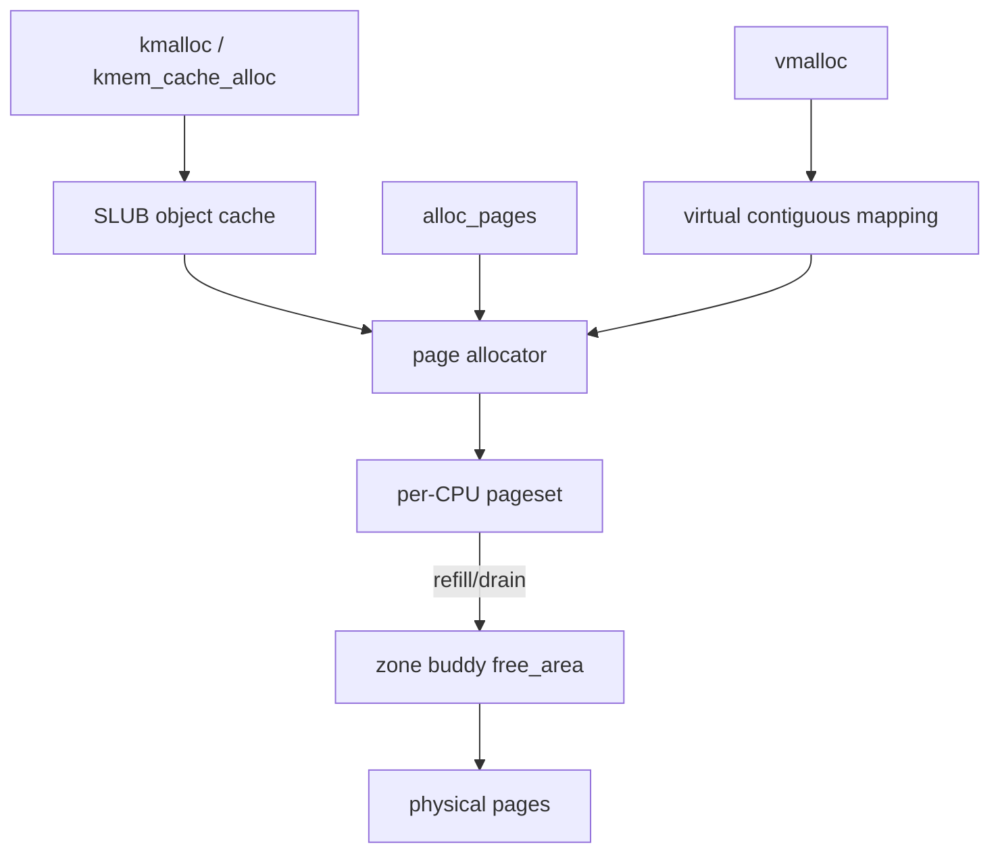

# Linux Buddy Allocator, Per-CPU Pagesets & SLUB

## Konu anlatımı
Linux memory allocation katmanlıdır. Physical page seviyesinde buddy allocator free page'leri power-of-two order'larda yönetir. Sık page allocation/free işlemleri için per-CPU pagesets (PCP) global zone contention'ını azaltır. Küçük kernel object'leri ise page başına tek allocation yapmak yerine SLUB/slab cache'lerinde object slot'ları olarak tutulur.

Ana mental model: **buddy page sağlar; SLUB page'in üstünde object sağlar**. `vmalloc` ise virtually contiguous ama fiziksel olarak contiguous olması gerekmeyen mapping ile farklı bir trade-off sunar.

## Mental model

## Internals
- Buddy free lists `2^order` page blokları tutar; allocation split, free ise uygun buddy boşsa merge yapabilir.
- Toplam free memory yüksekken bile external fragmentation high-order contiguous allocation'ı başarısız kılabilir.
- PCP, sık küçük page allocation/free'yi CPU-local tutar ve global lock/cache-line bouncing'i azaltır; global buddy ile batch refill/drain yapar.
- SLUB, benzer boyut/tip object'ler için slab page'lerini slot'lara böler; object reuse allocation maliyeti ve locality açısından yararlıdır.
- `kmalloc` ile `vmalloc` fiziksel contiguity açısından farklıdır; `vmalloc` ek page-table/TLB maliyeti karşılığında fiziksel contiguity şartını kaldırır.
- GFP flags allocation context/reclaim/sleep kısıtlarını ifade eder.
- NUMA'da node-local allocation tercih edilir; remote fallback latency ve bandwidth'i etkileyebilir.

## Mülakat soruları ve seviye beklentisi
1. Buddy neden power-of-two blok kullanır?
2. Internal vs external fragmentation nedir?
3. `kmalloc` ve `vmalloc` farkı nedir?
4. SLUB neden buddy'nin yerine geçmez?
5. PCP neden scalability sağlar?
6. Senior: free RAM varken high-order allocation neden fail olabilir?
7. Staff: fragmentation + reclaim/compaction + NUMA kaynaklı p99 spike nasıl teşhis edilir?

**Junior:** page/object allocator ayrımı. **Mid:** fragmentation, kmalloc/vmalloc, SLUB. **Senior:** PCP, GFP, high-order ve NUMA. **Staff:** telemetry, reclaim/compaction ve tail latency.

## Kısa alıştırma
16 page'lik tek bloktan 1, 1, 4 ve 2 page allocate edildiğinde buddy split'lerini çiz. Free işlemlerinden sonra “toplam free pages” ile “en büyük contiguous free block” değerlerini ayrı takip et.

## Proje fikri
`allocator-pressure-lab`: farklı allocation/free pattern'leri üret; `/proc/buddyinfo`, `/proc/slabinfo`, `vmstat` ve kmem tracepoint'leriyle order dağılımı, slab growth ve allocation latency'yi gözlemle.

## Failure modes / production
Free-memory yüzdesini allocation health sanmak, high-order fragmentation'ı gözden kaçırmak ve NUMA locality'yi yok saymak yaygın hatalardır. Production'da buddy order dağılımı, slab growth, reclaim/compaction stalls, OOM ve remote NUMA allocation birlikte incelenir.

## Kaynaklar
- Linux Kernel — Physical Memory: https://docs.kernel.org/mm/physical_memory.html
- Linux Kernel — Memory Allocation Guide: https://docs.kernel.org/core-api/memory-allocation.html
- Linux Kernel — kmem tracepoints: https://docs.kernel.org/trace/events-kmem.html
- Linux Kernel — SLUB: https://docs.kernel.org/mm/slub.html
