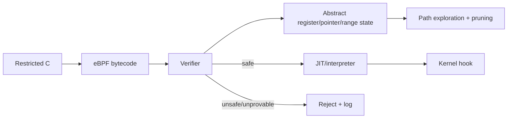

# eBPF Verifier, Abstract State & Safe Kernel Extensibility

## Neden önemli?
eBPF kernel hook'larında programmable davranış sağlar; bunun güvenli olabilmesi için bytecode load-time'da verifier'dan geçer. Verifier'ı runtime sandbox değil, abstract interpretation kullanan bir proof gate olarak düşünmek doğru mental modeldir.

## Mental model

## Temel mekanizma
- Register state scalar değer yanında pointer provenance/type ve value-range bilgisi taşıyabilir.
- Bounds check'ler verifier'a sonraki memory access için ispatlanabilir range bilgisi verir.
- Helper/kfunc argument ve lifetime contract'ları doğrulamanın parçasıdır.
- Branch'ler abstract state üretir; equivalence/subsumption tabanlı pruning state-space büyümesini azaltır.
- Loop/iterator güvenliği termination ve state-envelope reasoning gerektirir; verifier'ın bir programı kabul etmesi business correctness veya düşük latency garantisi değildir.
- Kabul sonrası bytecode interpreter veya architecture-specific JIT ile çalışabilir.

## Mülakat soruları
1. Verifier neden runtime sandbox değildir?
2. Pointer provenance neden numeric bounds'tan farklıdır?
3. Branch explosion verification maliyetini nasıl etkiler?
4. Bounds check packet parsing'i nasıl güvenli hale getirir?
5. Helper contract neden load-time rejection üretebilir?
6. Senior: state pruning soundness'i nasıl korumalıdır?
7. Staff: verifier-passed programın production failure mode'ları nelerdir?
8. Principal: BPF extensibility modelini kernel module/userspace isolation ile karşılaştır.

## Seviye beklentisi
**Mid:** verifier → JIT zinciri ve bounds/provenance fikri. **Senior:** state exploration, loops ve helper contracts. **Staff:** portability, map concurrency, hot-path cost ve rollback. **Principal:** kernel extensibility governance, blast radius ve safety boundary.

## Mini alıştırma
`data`/`data_end` packet pointer'larında Ethernet header erişimini bounds check olmadan ve check sonrasında modelle; verifier'ın hangi bilgiyi öğrendiğini yaz.

## Proje
Üç libbpf programı yükle: güvenli map counter, bounds-check eksik parser ve branch-heavy sürüm. Verifier log/load time/JIT durumunu karşılaştır.

## Failure modes / production
Kernel/BTF/helper farklılıkları deploy failure; complex control-flow verification latency; legal programlar map growth, contention ve hook latency yaratabilir. Load logs, JIT state, map memory, hook latency ve fallback birlikte izlenmelidir. `sched_ext` gibi güncel BPF tabanlı extensibility yüzeylerinde kernel'in hata/stall halinde fallback davranışı operational safety'nin parçasıdır.

## Kaynaklar
- https://docs.kernel.org/bpf/verifier.html
- https://docs.kernel.org/bpf/bpf_iterators.html
- https://docs.kernel.org/bpf/maps.html
- https://docs.kernel.org/scheduler/sched-ext.html
