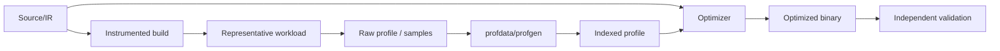

# Profile-Guided Optimization: Instrumentation, Sampling & Profile Drift

## Neden önemli?
PGO, runtime davranışından elde edilen hot/cold ve frequency bilgisini sonraki compilation'a geri besler. Compiler/runtime zincirinde statik tahmin ile gerçek workload arasındaki feedback loop'u anlamanın en iyi örneklerinden biridir.

## Mental model

## Temel mekanizma
- Instrumentation PGO compiler'ın eklediği counters ile profile üretir; training overhead'i vardır.
- Sample PGO `perf`/hardware sampling gibi dış gözlemlerden veri üretebilir; overhead daha düşük olabilir fakat attribution/sampling bias önemlidir.
- `llvm-profdata` instrumentation profillerini merge/index eder; `llvm-profgen` sample verisini profile'a dönüştürebilir.
- Hotness inlining, block/function layout, branch placement ve code-size kararlarını etkileyebilir.
- Representative workload profile kalitesinin temel girdisidir. Stale veya skewed profile optimization'ı yanlış yöne çekebilir.
- Evaluation workload training'den ayrılmalıdır; aksi halde benchmark overfitting görünmez kalabilir.
- MemProf gibi güncel mekanizmalar profile-guided yaklaşımı allocation hotness/lifetime ve data layout tarafına genişletir.

## Mülakat soruları
1. PGO `-O2/-O3` üzerine ne ekler?
2. Instrumentation ve sample PGO trade-off'u nedir?
3. Training representativeness neden önemlidir?
4. Hot code'u agresif inline etmek neden her zaman iyi değildir?
5. Profile drift nedir?
6. Senior: code layout i-cache davranışını nasıl değiştirir?
7. Senior: stale profile regression'ı nasıl yaratır?
8. Staff: fleet profile → release pipeline zincirini nasıl güvenli kurarsın?

## Seviye beklentisi
**Junior:** profile-generate/use feedback loop. **Mid:** instrumentation vs sampling ve optimizer etkileri. **Senior:** drift, i-cache/code size, sampling bias ve regression validation. **Staff:** profile provenance, fleet representativeness, reproducibility ve rollout/rollback.

## Mini alıştırma
Trafiğin %95'ini alan ucuz endpoint ile %5'ini alan fakat CPU'nun %60'ını kullanan pahalı endpoint için training ağırlıklarını tasarla; request-count-only profilin neden yanıltabileceğini açıkla.

## Proje
Branch-heavy C/C++ benchmark'ını `-O2` ve instrumentation PGO ile karşılaştır. Training 90/10, test hem 90/10 hem 10/90 olsun. Runtime, binary size ve `perf stat` farklarını ölçerek drift'i göster.

## Failure modes / production
Overfitting, stale/mismatched profile, instrumentation overhead, symbolization/attribution hataları ve code-size growth temel risklerdir. Ortalama throughput artarken p99/cold path gerileyebilir. Canary'de CPU, wall time, code size, cache davranışı ve tail latency birlikte değerlendirilmelidir.

## Kaynaklar
- https://llvm.org/docs/HowToBuildWithPGO.html
- https://llvm.org/docs/CommandGuide/llvm-profdata.html
- https://llvm.org/docs/CommandGuide/llvm-profgen.html
- https://clang.llvm.org/docs/UsersManual.html
- https://llvm.org/docs/MemProf.html
