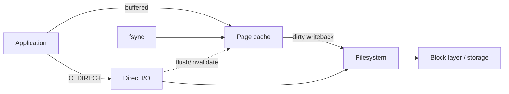

# Buffered I/O, Direct I/O, Writeback & Cache Coherency

**Seviye:** Junior → Staff  
**Alan:** Foundations / Linux / Filesystems

## Konu anlatımı
Linux'ta normal file I/O page cache üzerinden geçer. Read cache hit ise storage'a gitmeden dönebilir; write çoğu zaman cache folio'larını dirty yapar ve writeback daha sonra storage'a taşır. `fsync` dirty state'in kalıcılık sınırını zorlamak için kullanılır. `O_DIRECT` page cache'i bypass eder; ancak bu tek başına durability garantisi değildir.

Direct ve buffered I/O aynı file range üzerinde karıştırıldığında coherency kritik olur. iomap direct-read öncesi ilgili dirty cache'i flush eder; direct-write öncesi dirty cache'i flush edip cache invalidation ile koordine eder. Dolayısıyla `O_DIRECT = daha hızlı` genellemesi yanlıştır: cache hit/readahead kaybedilebilir ve alignment/I/O granularity yükü uygulamaya kayar.

## Mental model

## İçeride ne oluyor?
1. Buffered read page-cache hit/miss ve readahead davranışı üretir.
2. Buffered write dirty folio üretir; syscall completion persistence değildir.
3. Background writeback/memory pressure dirty state'i storage'a yollar; `fsync` explicit durability boundary sağlar.
4. Direct I/O page cache'i bypass eder ve alignment constraints getirebilir.
5. Direct/cached aynı range'de stale-data riskine karşı flush/invalidation koordine edilir.
6. DAX ayrı bir modeldir; memory-like storage mapping için page-cache kopyasını kaldırır.
7. Database buffer pool + OS page cache double caching yaratabileceğinden DB engines direct I/O tercih edebilir.

## Yüksek getirili mülakat soruları
- `write()` başarıyla döndüğünde veri diskte midir?
- Page cache'in performans ve memory-pressure etkisi nedir?
- `O_DIRECT`, `O_SYNC` ve `fsync` nasıl ayrılır?
- Direct ve buffered I/O aynı range'de neden pahalıdır?
- **Mid:** readahead/writeback hangi workload'larda faydalıdır?
- **Senior:** database neden OS page cache'i bypass eder?
- **Staff:** latency SLO, memory budget ve durability hedefleriyle I/O mode nasıl seçilir?

## Beklenen cevap derinliği
- **Junior:** cache hit, dirty page, writeback ve fsync ayrımını bilir.
- **Mid:** direct/buffered path, readahead ve alignment trade-off'unu açıklar.
- **Senior:** double caching, coherency, tail latency ve durability'yi bağlar.
- **Staff:** workload ölçümü, rollout ve failure-domain bazlı I/O politikasını tasarlar.

## Mini alıştırma
1 GiB RAM bütçeli storage service için 700 MiB application buffer pool + kontrolsüz page cache'in double-caching etkisini çiz. Buffered/direct benchmark için p50/p99, cache hit, throughput ve fsync latency metriklerini seç.

## Proje fikri
`io-path-lab`: sequential/random buffered I/O ile `O_DIRECT` varyantını cold/warm cache, queue depth ve block size altında karşılaştır; throughput, p99 ve CPU ölç.

## Failure modes / trade-off / production
`write()` ile durability'yi karıştırmak veri kaybına; direct I/O'yu ölçmeden açmak cache/readahead kaybına; buffered+direct karışımı flush/invalidation maliyetine; büyük dirty working set writeback burst ve tail-latency sıçramasına yol açabilir. Production'da dirty memory, writeback, major faults, device latency/queue depth, fsync latency ve application p99 birlikte izlenir.

## Kaynaklar
- Linux Kernel — Page Cache: https://docs.kernel.org/mm/page_cache.html
- Linux Kernel — iomap Supported File Operations: https://docs.kernel.org/filesystems/iomap/operations.html
- Linux Kernel — Direct Access (DAX): https://docs.kernel.org/filesystems/dax.html
