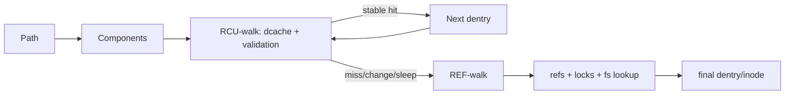

# Pathname Lookup, Dentry Cache, RCU-walk & REF-walk

**Seviye:** Junior → Staff  
**Alan:** Linux / Filesystem Internals

## Neden önemli?
`open("/srv/app/config.json")` bir string→inode map değildir. Linux VFS path'i component'lere böler, dentry cache üzerinden yürür, mount/symlink sınırlarını işler ve final component'in syscall semantiğine göre lookup/open/create kararı verir. Metadata-heavy servislerde bu yol CPU ve latency açısından kritik olabilir.

## Mental model

## Temel kavramlar
- **Dentry:** pathname component'i ile filesystem object arasındaki VFS cache/namespace nesnesi.
- **Inode:** filesystem object metadata ve operations kimliği; bir inode birden çok isim/dentry ile ilişkilendirilebilir.
- **Negative dentry:** bir ismin bulunmadığını cache'leyerek tekrarlanan başarısız lookup maliyetini azaltabilir.
- **`struct path`:** mount + dentry ile lookup'ın mevcut konumunu temsil eder.

## RCU-walk
Linux common case'te cached/stabil pathname üzerinde mümkün olduğunca memory write yapmadan yürümek ister. RCU temel nesnelerin lookup sırasında freed edilmemesine yardım eder; dentry/mount sequence state ise concurrent değişiklikleri doğrulamak için kullanılır. Kritik invariant: RCU-walk, eşzamanlı REF-walk'ın güvenli biçimde verebileceği sonuçtan sapmamalıdır. Validation bozulursa hızlı yol bırakılır.

## REF-walk ve fallback
REF-walk counted references ve gerektiğinde locks kullanabilir. Cache miss, sleep gerektiren permission/revalidation, belirli symlink/automount durumları veya concurrent state değişimi RCU yolundan çıkmayı gerektirebilir. Pattern genel sistem tasarımında da değerlidir: **optimistic fast path → validate → conservative slow path**.

## Final component neden ayrı?
Path'in son parçası operasyonun semantiğine bağlıdır. `stat`, normal `open`, `O_CREAT`, unlink ve rename aynı final-component davranışına sahip değildir. Bu yüzden path walking ile operation semantics'i tek bir lookup gibi düşünmek hatalıdır.

## Mülakat soruları
1. Dentry ile inode farkı nedir?
2. Negative dentry ne kazandırır?
3. RCU-walk neden refcount/lock yazmalarını azaltmak ister?
4. Hangi durumlar REF-walk fallback'i doğurur?
5. Concurrent rename sırasında stale karar nasıl fark edilir?
6. Metadata-heavy workload'da lookup hotspot'unu nasıl teşhis edersin?

## Beklenen cevap seviyesi
- **Junior:** path component, dentry, inode ayrımını yapar.
- **Mid:** cache hit/miss, symlink/mount ve final component'i açıklar.
- **Senior:** RCU lifetime, sequence validation ve fallback invariant'ını bağlar.
- **Staff:** contention, remote revalidation, observability ve path-layout trade-off'larını üretime taşır.

## Alıştırma
`/a/b/c` için `a,b` dcache hit, `c` miss senaryosunu çiz. RCU-walk'ın nerede ilerleyebileceğini ve neden slow path/filesystem lookup gerekebileceğini açıkla.

## Proje
`pathwalk-lab`: derin/sığ directory tree üzerinde hot/cold cache `stat/open` throughput'u ölç; `perf`/strace ile CPU/syscall maliyetini karşılaştır.

## Failure modes / production
Derin path, rename churn, metadata storm ve remote revalidation tail latency yaratabilir. Sadece dcache hit rate izlemek CPU contention ve remote round-trip'i kaçırır. Syscall latency, metadata IOPS, CPU profile, dentry/inode pressure ve remote filesystem latency birlikte değerlendirilmelidir.

## Kaynaklar
- Linux Kernel — Pathname lookup: https://docs.kernel.org/filesystems/path-lookup.html
- Linux Kernel — VFS: https://docs.kernel.org/filesystems/vfs.html
