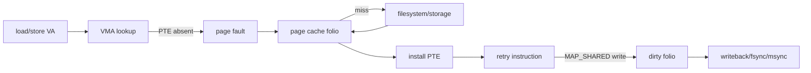

# File-backed mmap, Page Faults, Dirty Folios & Writeback

## Neden önemli?
`mmap()` bir dosyanın tüm byte'larını syscall anında RAM'e kopyalamaz; process virtual-address range'i ile file offset range arasında mapping kurar. İlk erişim page fault üretebilir. Kernel ilgili file-backed page-cache folio'sunu bulur veya storage'dan getirir, page table entry kurar ve instruction tekrar yürür. Normal read/write yanında file-backed `mmap` de Linux page cache üzerinden gider.

## Mental model

Mental model `mmap = disk byte'larına doğrudan pointer` değil, **VMA + page fault + page cache + page tables + writeback** zinciridir.

## İçeride ne oluyor?
- VMA address range, permissions ve file/offset ilişkisini taşır; page table yalnız materialize edilmiş pages için translation kurabilir.
- Page fault her zaman disk I/O değildir: folio page cache'te olabilir ve yalnız PTE eksik olabilir.
- `MAP_SHARED` write file-backed cache'i dirty yapabilir; writeback daha sonra storage'a taşır.
- `MAP_PRIVATE` write copy-on-write ile private state üretir; file'ın persistent içeriğini değiştirmek için kullanılmaz.
- Random access büyük mapping'lerde fault/cache churn yaratabilir; locality readahead ve cache effectiveness'i belirler.
- Mapping altındaki file truncate edilirse erişim failure üretebilir; lifetime ve file-size değişimi correctness konusudur.
- Durability ayrı bir sözleşmedir: shared mapping'e store yapılması tek başına kalıcı storage garantisi değildir.

## Mülakat soruları
1. `mmap()` neden dosyanın tamamını hemen RAM'e yüklemez?
2. Page fault neden her zaman disk read değildir?
3. `MAP_SHARED` ve `MAP_PRIVATE` nasıl ayrılır?
4. `read()` ile file-backed `mmap()` page cache açısından nasıl ilişkilidir?
5. Senior: başka process file'ı truncate ederse ne tür failure düşünürsün?
6. Staff: büyük read-mostly index için `mmap` mı explicit buffered I/O mu; hangi ölçümlerle karar verirsin?

## Beklenen cevap seviyesi
- **Junior:** virtual mapping, page fault, shared/private ayrımı.
- **Mid:** page cache, PTE installation, dirty/writeback ve COW.
- **Senior:** truncation, SIGBUS, locality/cache churn ve durability.
- **Staff:** workload, memory pressure, tail latency ve observability üzerinden I/O model seçimi.

## Mini alıştırma
1 GiB file `MAP_SHARED` map edilmiş olsun; process yalnız 4 KiB'lik 100 random region okuyor. `mmap()` anında, ilk erişimlerde ve warm cache durumunda maliyetleri çiz.

## Proje
`mmap-lab`: aynı büyük dosyada `pread` ve `mmap` ile sequential/random access benchmark et. Cold/warm cache, working-set ve stride değiştir; throughput, p99, major/minor faults ve RSS ölç.

## Failure modes / trade-off / production
File truncation/mapping lifetime hataları, random-fault storm, memory pressure altında cache thrash ve shared dirty state'in durability'sini yanlış varsaymak başlıca risklerdir. Production'da page faults, reclaim, page-cache pressure, storage latency, RSS ve application p99 birlikte okunur.

## Kaynaklar
- Linux Kernel — Page Cache: https://docs.kernel.org/mm/page_cache.html
- Linux Kernel — Memory Management APIs / File Mapping and Page Cache: https://docs.kernel.org/core-api/mm-api.html
- Linux Kernel — iomap Supported File Operations: https://docs.kernel.org/filesystems/iomap/operations.html
- Linux man-pages — mmap(2): https://man7.org/linux/man-pages/man2/mmap.2.html
