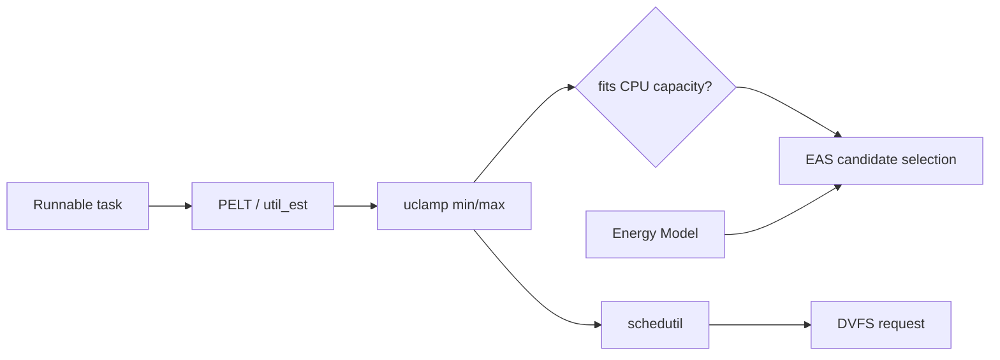

# Linux CPU Capacity, uclamp, PELT & Energy-Aware Scheduling

## Konu anlatımı
Linux scheduling yalnız runnable task sırasını değil, özellikle heterojen CPU sistemlerinde task'ın hangi CPU'ya ve hangi performans noktasına yerleşeceğini de etkiler. PELT task/CPU utilization'ını zamana yayılmış bir sinyal olarak takip eder; capacity-aware scheduling task talebini normalize CPU capacity ile karşılaştırır.

`uclamp`, userspace'in scheduler'a `UCLAMP_MIN` ve `UCLAMP_MAX` ile minimum/maximum performance hint'i vermesini sağlar. Bu CPU zamanı quota'sı değildir. `schedutil` governor scheduler utilization sinyalinden DVFS frequency request üretirken uclamp bu sinyali etkileyebilir. Energy-Aware Scheduling (EAS) ise heterojen CPU topolojilerinde Energy Model kullanarak wakeup placement adaylarının enerji/performance etkisini tahmin eder.

## Mental model

**Invariant:** `uclamp` performance hint/constraint'tir; `cpu.max` gibi hard CPU-time budget değildir.

## İçeride ne oluyor?
1. PELT yakın geçmişi daha fazla ağırlıklandıran utilization sinyali üretir.
2. `UTIL_EST`, periodic wakeup workload'larında ramp-up gecikmesini azaltmaya yardım eder.
3. Capacity-aware scheduling kabaca task utilization'ın CPU capacity'ye sığıp sığmadığını değerlendirir.
4. `UCLAMP_MIN` effective utilization tabanını yükseltip latency-sensitive task'ın daha yüksek performance point'e çıkmasına yardım edebilir.
5. `UCLAMP_MAX` effective utilization tavanını düşürüp background work'ün daha yüksek-capacity/power-hungry CPU kullanımını sınırlamaya yardım edebilir.
6. `schedutil` utilization bilgisinden frequency request üretir.
7. EAS Energy Model'deki performance-domain maliyetleriyle uygun CPU adaylarını enerji açısından karşılaştırır; esas kullanım alanı asimetrik CPU topolojileridir.
8. cpuset/root-domain, thermal pressure ve frequency invariance placement kararını etkileyebilir.

## Mülakat soruları
- Utilization ile CPU capacity arasındaki fark nedir?
- PELT neden anlık CPU kullanımından farklıdır?
- `UCLAMP_MIN` priority midir?
- `UCLAMP_MAX` ile `cpu.max` farkı nedir?
- Senior: periodic task'ta DVFS ramp-up, `UTIL_EST` ve uclamp ilişkisi nedir?
- Senior: big.LITTLE'da background işi küçük çekirdekte tutmanın trade-off'u nedir?
- Staff: latency, energy, thermal ve throughput hedeflerini nasıl birlikte optimize edersin?

## Beklenen cevap seviyesi
- **Mid:** utilization, capacity, PELT, DVFS ve uclamp'ı ayırır.
- **Senior:** wakeup placement, `UTIL_EST`, schedutil ve thermal etkileri bağlar.
- **Staff:** workload class policy'sini SLO, energy ve thermal telemetry ile tasarlar; hint ile hard isolation'ı karıştırmaz.

## Kısa alıştırma
LITTLE capacity=400, big capacity=1024 ve task utilization=300 için clamp yok, `uclamp.min=700` ve `uclamp.max=350` durumlarını karşılaştır. Sonucun kesin placement garantisi olmamasına yol açan iki platform faktörü yaz.

## Proje fikri
`uclamp-scheduler-lab`: izole test ortamında CPU-bound ve periodic-latency workload'ları üret. `sched_setattr()` veya cgroup uclamp ile latency, context switches, CPU frequency/residency ve migration davranışını ölç. Heterojen donanım varsa big/LITTLE placement'ı ayrıca incele.

## Failure modes / trade-off / production
Gereksiz yüksek `UCLAMP_MIN` enerji ve thermal pressure'ı artırabilir; sonunda throttling latency'yi kötüleştirebilir. Fazla düşük `UCLAMP_MAX` backlog yaratabilir. PELT utilization'ı basit CPU yüzde kullanımı değildir. EAS heterojen olmayan platformlarda beklenen faydayı sağlamaz. Production'da runqueue delay, CPU frequency/residency, migrations, thermal throttling, energy, PSI ve application p95/p99 birlikte izlenmelidir.

## Kaynaklar
- Linux Kernel — Utilization Clamping: https://docs.kernel.org/scheduler/sched-util-clamp.html
- Linux Kernel — Capacity Aware Scheduling: https://docs.kernel.org/scheduler/sched-capacity.html
- Linux Kernel — Energy Aware Scheduling: https://docs.kernel.org/scheduler/sched-energy.html
- Linux Kernel — schedutil / PELT / UTIL_EST: https://www.kernel.org/doc/html/latest/scheduler/schedutil.html
