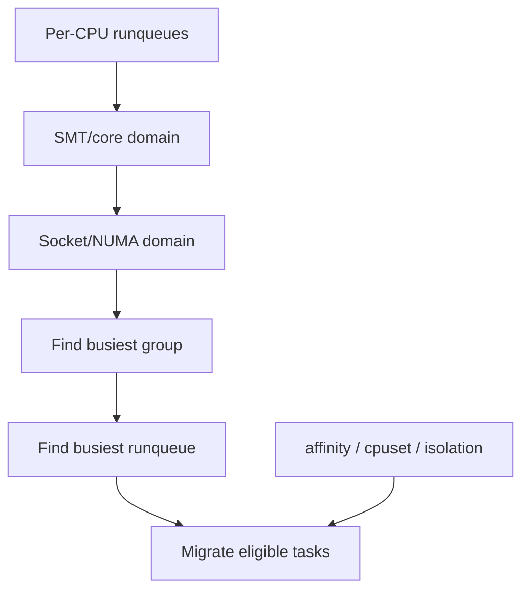

# Linux Scheduler Domains, Load Balancing & CPU Isolation

## Konu anlatımı
Linux per-CPU runqueue kullanır; fakat lokal scheduling tek başına sistem çapında denge sağlamaz. `sched_domain` hiyerarşisi SMT/core/socket/NUMA gibi topology katmanlarını balancing scope'larına dönüştürür. Domain içindeki CPU group'ları karşılaştırılır; balancer busiest group ve busiest runqueue üzerinden uygun task migration'ları arar.

Migration ücretsiz değildir: cache locality, NUMA locality ve shared-resource contention değişebilir. Bu yüzden affinity, cpuset ve CPU isolation yalnız “pinning” araçları değil, scheduler'ın balancing arama uzayını ve production latency/throughput trade-off'unu şekillendiren primitives'tir.

## Mental model

## İçeride ne oluyor?
- Her CPU'nun base `sched_domain`'i vardır; parent'lar daha geniş CPU span'ları kapsar.
- `sched_group` balancing karşılaştırmasının birimidir.
- Periodic balancing scheduler tick sonrası scheduler softirq üzerinden domain hiyerarşisini dolaşabilir.
- Wakeup placement ve idle balancing daha erken reaksiyon yolları sağlar.
- Affinity/cpuset destination setini sınırlar.
- Scheduler-domain isolation CPU'yu otomatik load balancing'den çıkarabilir.
- Büyük sistemlerde balancing kapsamını daraltmak search cost'u azaltır fakat spare capacity paylaşımını da azaltabilir.

## Mülakat soruları
1. Per-CPU runqueue varken neden load balancing gerekir?
2. Scheduler domain ile runqueue arasındaki fark nedir?
3. Migration neden cache/NUMA maliyeti yaratır?
4. Wakeup, idle ve periodic balancing nasıl ayrılır?
5. Senior: affinity ile fairness/utilization arasında hangi trade-off vardır?
6. Staff: CPU isolation ne zaman p99'u iyileştirip throughput'u düşürür?
7. Principal: çok-socket/NUMA hostlarda workload classes için balancing policy nasıl tasarlanır?

## Beklenen cevap seviyesi
- **Mid:** runqueue, migration, affinity ve balancing ihtiyacı.
- **Senior:** topology, cache/NUMA locality ve balancing yolları.
- **Staff:** cpuset/isolation, SLO ve utilization.
- **Principal:** fleet-level placement, tenant isolation ve capacity economics.

## Mini alıştırma
CPU0/1 aynı SMT core, CPU2/3 başka core olsun. CPU0'da dört runnable task, diğerlerinde sıfır var. Cache affinity, SMT contention ve affinity mask'in hangi migration'ı değiştireceğini tartış.

## Proje fikri
`sched-domain-lab`: CPU-bound ve periodic latency workload'larını `taskset`/cpuset/isolation varyantlarıyla çalıştır; `perf sched`, migrations, context switches, runqueue delay, LLC misses ve p99 ölç.

## Failure modes / trade-off / production
Aşırı migration cache thrash; aşırı pinning stranded capacity; yanlış isolation housekeeping interference; NUMA-agnostic placement remote-memory latency yaratabilir. Runqueue delay, migrations, CPU utilization, LLC misses, NUMA locality, PSI ve application p95/p99 birlikte izlenmelidir.

## Kaynaklar
- Linux Kernel — Scheduler Domains: https://kernel.org/doc/html/latest/scheduler/sched-domains.html
- Linux Kernel — CPU Isolation: https://docs.kernel.org/admin-guide/cpu-isolation.html
- Linux Kernel — CPUSETS: https://docs.kernel.org/admin-guide/cgroup-v1/cpusets.html
