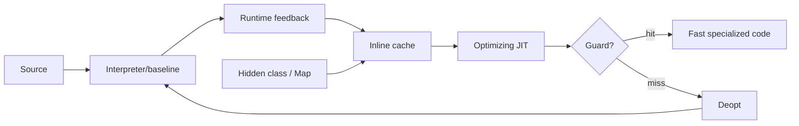

# Inline Caches, Hidden Classes, Speculative JIT & Deoptimization

## Konu anlatımı
Dinamik dil VM'lerinde `obj.x` gibi erişimlerin receiver shape'i compile time'da kesin olmayabilir. Generic lookup doğru ama pahalıdır. Runtime feedback aynı site'ın gördüğü object shape/call target'larını kaydeder; inline cache (IC) sık görülen durum için hızlı dispatch sağlar. V8'de object shape `Map`/HiddenClass ile temsil edilir.

Optimizing JIT bu feedback'i guard'larla korunan varsayımlara dönüştürür. Guard geçerse specialized machine code çalışır; varsayım bozulursa deoptimization metadata'sı optimized machine state'i interpreter/daha genel execution state'ine yeniden kurar. Böylece speculation performans kazandırırken correctness korunur.

## Mental model

## İçeride ne oluyor?
- Aynı property-addition düzenine sahip object'ler aynı HiddenClass/Map'i paylaşabilir.
- IC site tek shape görürse monomorphic, birkaç shape görürse polymorphic, çok çeşit görürse megamorphic olabilir.
- Optimizer map/type/target feedback ile direct field access veya inlining yapabilir.
- Assumption invalidation optimized code'u deopt'a zorlayabilir.
- Deopt metadata machine registers/stack/SSA değerlerinden daha genel frame state'i yeniden kurmaya yeterli olmalıdır.
- Tiering startup latency ile peak throughput'u dengeler; baseline hızlı compile olur, optimizing tier hot code'a yatırım yapar.
- V8'in 24 Haziran 2025 tarihli WebAssembly çalışması speculative indirect-call inlining ve deoptimization'ı Chrome M137'ye taşıdı.

## Mülakat soruları
1. Inline cache hangi problemi çözer?
2. Hidden class source-language class'tan nasıl ayrılır?
3. Monomorphic ve megamorphic site ne demektir?
4. Speculative optimization correctness'i nasıl korur?
5. Mid: deopt sırasında hangi state yeniden kurulmalıdır?
6. Senior: shape churn neden optimizer'ı kötü etkiler?
7. Staff: startup, compile CPU, code size ve peak throughput arasında tiering policy nasıl seçilir?

## Beklenen cevap seviyesi
- **Junior:** interpreter/JIT ve generic/specialized lookup.
- **Mid:** HiddenClass, IC, guard ve site polymorphism.
- **Senior:** deopt state reconstruction, invalidation ve shape churn.
- **Staff:** tiering economics, profiling feedback, code-cache ve compile budget.

## Mini alıştırma
`readX(o) { return o.x }` önce aynı shape'te 1000 object, sonra farklı property order'ları görsün. IC state'in ve optimizer varsayımlarının nasıl değişebileceğini çiz.

## Proje fikri
`tiny-inline-cache-vm`: bytecode interpreter'a generic `LOAD_PROP` ekle; sonra `(shape_id, field_offset)` monomorphic cache'i, hit/miss telemetry'si ve guard miss fallback'i uygula. İleri aşamada hot function için specialized pseudo-code + deopt yolu ekle.

## Failure modes / trade-off / production
Shape explosion IC hit rate'ini düşürür; erken optimization startup/CPU maliyeti yaratır; deopt storm p99'u bozabilir; monomorphic microbenchmark production polymorphism'ini saklayabilir. Tier-up/deopt counts, deopt reasons, IC state distribution, compile CPU, code-cache memory ve end-to-end latency birlikte izlenmelidir.

## Kaynaklar
- V8 — Maps (Hidden Classes): https://v8.dev/docs/hidden-classes
- V8 — Fast properties / inline caches: https://v8.dev/blog/fast-properties
- V8 — Maglev / deoptimization: https://v8.dev/blog/maglev
- V8 — Speculative WebAssembly optimizations with deopts: https://v8.dev/blog/wasm-speculative-optimizations
