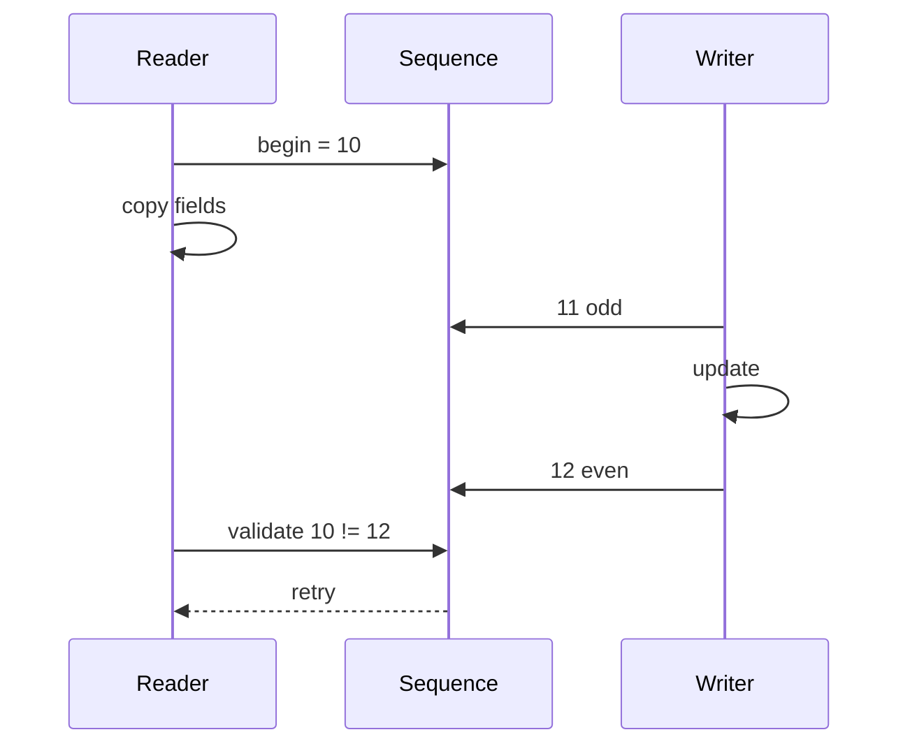

# Sequence Counters, Seqlock & Read-Mostly Consistency

## Konu anlatımı
Linux `seqcount_t`, read-mostly küçük snapshot'larda okuyucunun kilit almadan tutarlı veri görmesini sağlayan optimistic consistency mekanizmasıdır. Writer update başında sequence değerini odd, sonunda even yapar. Reader başlangıç sequence değerini alır, veriyi local snapshot'a kopyalar ve sonunda sequence'i yeniden doğrular. Değer değişmişse veya update ile çakışmışsa snapshot kullanılmaz ve read tekrarlanır.

`seqcount_t` writer serialization sağlamaz; write side ayrıca serialize edilmeli ve reader'a göre non-preemptible olmalıdır. `seqlock_t` bu modeli embedded spinlock ile tamamlar. Mekanizma pointer lifetime/reclamation çözmez: writer reader'ın takip ettiği nesneyi free edebiliyorsa RCU veya başka lifetime mekanizması gerekir.

## Mental model

## İçeride ne oluyor?
- Even sequence stable state, odd sequence active write sezgisidir.
- Reader optimistic çalışır; invalid snapshot'ı publish/use etmez.
- Raw seqcount multiple writer serialization sağlamaz.
- Uzun veya preempted writer reader retry/spin maliyetini büyütebilir; RT bağlamında livelock riski kritik olabilir.
- `seqlock_t` writer spinlock'u ile serialization/non-preemptibility sağlar.
- `seqcount_latch_t` iki kopyalı multiversion yaklaşımıyla özel interruptible-writer senaryolarını destekler.
- Consistency ve memory reclamation farklı problemlerdir; RCU removal ile reclamation'ı ayırır.

## Mülakat soruları
1. Seqlock ile rwlock arasındaki fark nedir?
2. Reader sequence'i neden iki kez kontrol eder?
3. Odd sequence neyi temsil eder?
4. `seqcount_t` neden writer lock değildir?
5. Writer preemption neden tail latency/livelock riski yaratabilir?
6. Pointer içeren yapı için neden seqcount tek başına yeterli değildir?
7. Mutex, seqcount, RCU ve immutable copy-on-write arasında nasıl seçim yaparsın?

## Beklenen cevap seviyesi
- **Mid:** optimistic snapshot + retry modelini doğru kurar.
- **Senior:** writer serialization, preemption ve retry starvation'ı açıklar.
- **Staff:** consistency ile object lifetime/reclamation'ı ayırır.
- **Principal:** read/write oranı, snapshot boyutu, RT/SLO ve memory maliyetine göre primitive seçer.

## Mini alıştırma
`{seconds,nanos}` clock snapshot'ında writer ilk alanı değiştirdikten sonra preempt olsun. Reader'ın torn snapshot görebileceği interleaving'i çiz; seqcount validation'ın bunu nasıl reddettiğini göster.

## Proje fikri
Userspace'te atomik version counter kullanan küçük optimistic snapshot prototipi oluştur. Mutex sürümüyle read throughput, retry count ve p99 latency karşılaştır. Kernel seqcount'un memory-ordering/preemption semantiğini userspace prototipinin otomatik sağlamadığını açıkça belgeleyin.

## Failure modes / trade-off / production
Write storm retry storm yaratabilir. Uzun writer critical section p99'u bozabilir. Pointer lifetime hatası use-after-free üretebilir. Validation dışında okunan protected field correctness'i kırar. Retry rate, writer duration, CPU spinning ve latency birlikte ölçülmelidir.

## Kaynaklar
- Linux Kernel — Sequence counters and sequential locks: https://docs.kernel.org/locking/seqlock.html
- Linux Kernel — What is RCU?: https://docs.kernel.org/RCU/whatisRCU.html
- Linux Kernel — PREEMPT_RT differences: https://docs.kernel.org/core-api/real-time/differences.html
