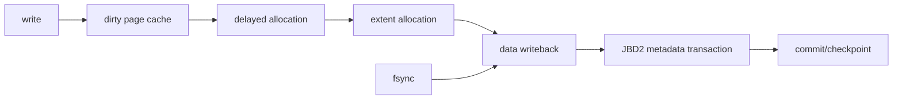

# ext4 Extents, Delayed Allocation, Journaling & `fsync()` Durability

## Neden önemli?
`write()` success ile durable storage aynı garanti değildir. Buffered I/O page cache'i dirty eder; ext4 delayed allocation fiziksel block placement'ı writeback'e erteleyebilir. Bu, locality ve fragmentation açısından kazanç sağlarken crash/ENOSPC davranışını anlamayı zorunlu kılar.

## Mental model


**Invariant:** namespace consistency, file-data durability ve metadata durability farklı katmanlardır.

## Extents ve allocation
Extent kabaca `(logical_start, physical_start, length)` ile contiguous bir file range'i temsil eder. Çok sayıda tekil block pointer yerine range tutmak metadata overhead'ini azaltabilir. ext4 block groups, inode/data locality ve multiblock allocator ile placement kararı verir. Delayed allocation ise kesin physical block seçimini dirty data writeback'ine yaklaştırarak daha büyük contiguous range'leri görme fırsatı yaratır.

Trade-off: allocation geciktiği için `write()` anında görünmeyen ENOSPC daha sonra ortaya çıkabilir; dirty state'in bellekte kalma süresi ve writeback burst'leri latency tail'lerini etkiler.

## JBD2 ve crash consistency
ext4 JBD2 journal ile özellikle metadata update'lerinin crash sonrası yarım kalmasını önlemeyi hedefler. Commit record replay sınırı sağlar. Default `data=ordered` modunda ilgili data blocks metadata journal commit'inden önce ana filesystem'e yazılır. `data=writeback` data ordering'i gevşetir; `data=journal` data+metadata'yı journal üzerinden geçirerek daha güçlü ordering karşılığında daha fazla I/O getirir.

Journaling bir database transaction değildir: application'ın birden çok syscall'dan oluşan logical update'ini kendiliğinden atomik/durable yapmaz.

## `fsync()` ve safe replace
Crash-safe file replacement için sık kullanılan düşünce modeli:

```text
create temp
write temp
fsync(temp)
rename(temp, target)
fsync(parent_directory)
```

File `fsync` content/required metadata persistence'ını; directory `fsync` namespace değişikliğinin persistence'ını hedefler. Uygulama crash contract'ını filesystem ve storage stack semantiğiyle birlikte tanımlamalıdır.

## Mülakat soruları
- `write()` döndüğünde hangi durability garantileri yoktur?
- Extent neden scalable bir representation'dır?
- Delayed allocation fragmentation'ı nasıl azaltabilir, ENOSPC'ı neden geciktirebilir?
- `data=ordered`, `data=writeback`, `data=journal` farkı nedir?
- Senior: temp+rename neden tek başına yeterli durability protocol olmayabilir?
- Staff: p99 `fsync` spike'ında VM writeback, JBD2, block layer ve device katmanlarını nasıl ayırırsın?

## Seviyeye göre cevap derinliği
- **Junior:** page cache, inode/block, extent, writeback, fsync.
- **Mid:** delayed allocation, journaling modes, rename/durability.
- **Senior:** crash protocol, late ENOSPC, ordering, flush semantics.
- **Staff:** workload/filesystem choice, observability, failure injection ve RPO/latency trade-off.

## Alıştırma
`write(temp) -> close -> rename` akışında her adım arasına power loss koy. Sonra `fsync(temp)` ve directory `fsync` ekleyerek olası disk state'lerini yeniden çıkar.

## Proje
Loopback ext4 image üzerinde overwrite, temp+rename ve temp+fsync+rename+dir-fsync stratejilerini fault/reboot testleriyle karşılaştır. `strace`, `filefrag` ve latency ölçümleriyle correctness, extent count ve sync cost raporla.

## Failure modes / production
Late ENOSPC, fragmentation, writeback storms, journal/device stalls ve yanlış rename-durability varsayımı başlıca risklerdir. İzlenecek sinyaller: free space, dirty/writeback pressure, delayed-allocation blocks, journal/IO latency, device errors ve application commit latency.

## Kaynaklar
- Linux kernel — ext4 General Information: https://docs.kernel.org/admin-guide/ext4.html
- Linux kernel — Block and Inode Allocation Policy: https://docs.kernel.org/filesystems/ext4/allocators.html
- Linux kernel — ext4 Journal (JBD2): https://docs.kernel.org/filesystems/ext4/journal.html
- Linux man-pages — `fsync(2)`: https://man7.org/linux/man-pages/man2/fsync.2.html
