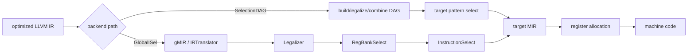

# Instruction Selection, Legalization, SelectionDAG & GlobalISel

## Neden önemli?
Optimized IR doğrudan CPU instruction'ı değildir. Compiler backend, IR semantiğini hedef ISA'nın gerçek opcode, type, register-bank ve operand constraints'ine indirmelidir. **Instruction selection (ISel)** target-specific machine operations'ı seçer; **legalization** ise target'ın desteklemediği type/operation'ları desteklenen biçimlere dönüştürür.

## Mental model


**Invariant:** seçilen sequence IR semantics'ini korumalı ve target'ın legality/ABI constraints'ine uymalıdır.

## Legalization
IR operation/type'ın ISA'da birebir karşılığı olmayabilir. 32-bit target'ta geniş integer operation parçalanabilir; unsupported operation library call veya daha basit operation sequence'ına expand edilebilir. Legalization, selector'ın yalnız target'ın gerçekleştirebileceği representation üzerinde çalışmasını sağlar.

## SelectionDAG
LLVM'nin klasik codegen yolunda SelectionDAG data/control dependencies'i DAG üzerinde temsil eder. Type/operation legalization, DAG combine ve target pattern selection aşamaları bulunur. TableGen target description'larından birçok selector pattern'i üretilebilir. Addressing-mode folding ve fused operation selection code size/performance için önemlidir.

## GlobalISel
GlobalISel LLVM IR'yi `IRTranslator` ile generic Machine IR'a taşır. Core pipeline kabaca:

```text
LLVM IR -> IRTranslator -> Legalizer -> RegBankSelect -> InstructionSelect -> target MIR
```

GlobalISel whole-function Machine IR tabanlı reusable pipeline sunar. LLVM dokümantasyonu bunu SelectionDAG/FastISel'in granularity, modularity ve compile-time sorunlarını ele almak üzere tasarlanmış alternatif framework olarak tanımlar.

## ISel != register allocation
ISel, hangi target instruction sequence'ının kullanılacağını belirler. Register allocation virtual register'ları sınırlı physical register'lara map eder ve gerekirse spill/reload ekler. Scheduling ve peephole gibi sonraki passes da final code quality'yi değiştirebilir.

## Mülakat soruları
- ISel ve register allocation farkı nedir?
- Legalization neden gerekir?
- SelectionDAG neden dependency graph kullanır?
- Addressing-mode folding neden değerlidir?
- Senior: semantically-correct selector nasıl kötü codegen üretebilir?
- Principal: yeni backend'de correctness, compile time, code quality ve maintainability'yi nasıl ölçersin?

## Seviyeye göre cevap derinliği
- **Mid:** IR→ISel→MIR→RA→machine-code zinciri ve legalization.
- **Senior:** patterns, combines, addressing modes, legality ve target features.
- **Staff:** MIR/assembly regression triage, feature gating ve benchmark methodology.
- **Principal:** selector architecture, declarative/custom lowering, fallback, target coverage ve maintenance economics.

## Alıştırma
`y = a*b + c` için FMA destekleyen ve desteklemeyen iki target'ın mapping'ini çiz. Floating-point contraction semantics'ini not et. Ardından native `i64` multiply olmayan 32-bit target'ta legalization'ın olası expansion'ını düşün.

## Proje
5–10 küçük C/C++ function'ı farklı optimization/target seçenekleriyle derle; LLVM IR, MIR ve assembly snapshot'larını karşılaştır. Hangi değişimin legalization/ISel, hangisinin register allocation veya sonraki pass kaynaklı olduğunu annotate eden küçük bir regression harness oluştur.

## Failure modes / production
Yanlış legality miscompile, eksik pattern gereksiz instructions, pahalı matching compile-time regression, yanlış CPU feature gating illegal-instruction crash üretebilir. Compiler upgrade'lerini differential/fuzz tests, build time, binary size ve representative CPU benchmarks ile canary et.

## Kaynaklar
- LLVM — Target-Independent Code Generator: https://llvm.org/docs/CodeGenerator.html
- LLVM — Global Instruction Selection: https://llvm.org/docs/GlobalISel/index.html
- LLVM — InstructionSelect: https://llvm.org/docs/GlobalISel/InstructionSelect.html
- LLVM — Writing an LLVM Backend: https://llvm.org/docs/WritingAnLLVMBackend.html
