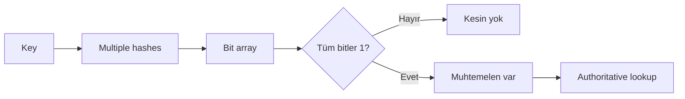

# Bloom Filters, False Positives & Probabilistic Membership

## Neden önemli?
Bloom filter, pahalı authoritative lookup öncesinde `kesin yok / muhtemelen var` ayrımı yapan memory-efficient probabilistic membership yapısıdır. HashSet exact membership verirken Bloom filter çok daha az bellek karşılığında kontrollü false positive kabul eder.

## Mental model

## Temel matematik
`m` bit, `n` inserted item, `k` hash için yaklaşık false-positive probability:

`p ≈ (1 - e^(-kn/m))^k`

Sabit `m,n` için yaklaşık optimum hash sayısı `k ≈ (m/n) ln 2`'dir. Capacity aşımı bit-array saturation'ını ve FPR'yi artırır.

## Correctness boundary
Normal Bloom filter false negative üretmez. Ancak deletion, stale snapshot, concurrency/lifecycle bug veya yanlış rebuild bu garantiyi bozabilir. Standard filter'da bir biti silmek başka key'lerin membership kanıtını da yok edebilir; deletion gerekiyorsa counting Bloom filter gibi varyantlar düşünülür.

## Production kullanım
LSM/SSTable read path'inde disk read azaltma, cache miss avoidance, anti-replay ve privacy-oriented aggregation tipik örneklerdir. TLS 1.3 RFC 8446, 0-RTT replay store için false-positive üreten Bloom filter kullanımını kabul eder; apparent replay'de 0-RTT reddedilebilir fakat bağlantı yanlış biçimde abort edilmemelidir.

## Mülakat soruları
1. False positive neden vardır, false negative neden normalde yoktur?
2. `m/n/k` nasıl seçilir?
3. HashSet ve Bloom filter trade-off'u nedir?
4. Deletion neden zordur?
5. Storage engine read path'inde nereye konur?
6. Saturation nasıl ölçülür?
7. Staff seviyesinde tenant memory budget/FPR nasıl yönetilir?
8. Security authorization için probabilistic positive neden yeterli değildir?

## Alıştırma ve proje
1M key için 10 bit/key ve `k≈7` ile teorik FPR hesapla; empirical test ile karşılaştır. Ardından filter'ı yerel KV store önüne koyup avoided lookup ve observed FPR ölçen `bloom-lab` geliştir.

## Failure modes / trade-off
Capacity underestimate, weak/adversarial hashing, stale filter lifecycle, yanlış deletion ve filter sonucunu authoritative truth sanmak temel hatalardır. Production telemetry: fill ratio, inserted estimate, observed FPR, bytes/key, avoided reads, rebuild duration ve positive-then-store-miss.

## Kaynaklar
- RFC 8446 — TLS 1.3: https://www.rfc-editor.org/rfc/rfc8446.html
- RFC 8932 — DNS Privacy Service Operators: https://www.rfc-editor.org/rfc/rfc8932.html
- Burton H. Bloom (1970): https://doi.org/10.1145/362686.362692
