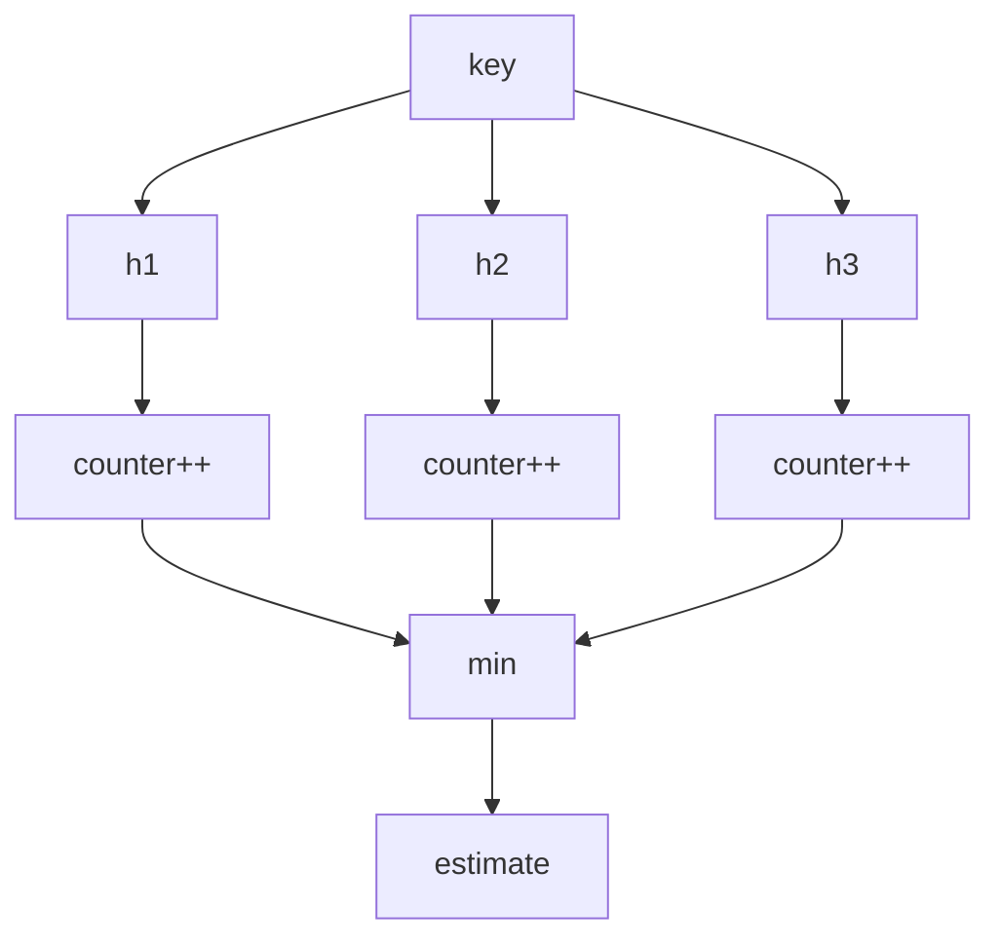

# Count-Min Sketch, Heavy Hitters & Error Budgets

## Konu anlatımı
Count-Min Sketch (CMS), yüksek-cardinality stream'lerde fixed-size yaklaşık frequency tutar. `d` bağımsız hash function ve her biri `w` counter içeren tablo kullanır. Update key'in her row'daki counter'ını artırır; query bu counter'ların minimumudur. Insert-only modelde collision yalnız pozitif bias ürettiği için estimate gerçek count'un altına düşmez.

Standart parametre sezgisi `w = ceil(e/ε)`, `d = ceil(ln(1/δ))`: olasılık en az `1-δ` iken additive overestimate yaklaşık `ε * ||a||₁` ile sınırlanır. CMS verilen key'in count'unu tahmin eder; tek başına heavy-hitter kimliklerini enumerate etmez. Top-k için candidate structure gerekir.

## Mental model

**Invariant:** insert-only CMS'de collision count'u yalnız yukarı iter; minimum farklı row'lardaki collision gürültüsünün en küçüğünü seçer.

## İçeride ne oluyor?
- Memory `O(w*d)`, update/query `O(d)`.
- Width collision/error magnitude'ı, depth failure probability'yi kontrol eder.
- Hash seeds ve dimensions sketch identity'nin parçasıdır.
- Counter overflow/saturation production correctness konusudur.
- Distributed merge yalnız aynı shape/hash semantics ve uyumlu epoch için element-wise toplamayla güvenlidir.
- Top-k discovery için heap/Space-Saving benzeri candidate layer gerekir.

## Mülakat soruları
1. CMS exact hash map'ten neden daha az memory kullanır?
2. Query neden minimum alır?
3. Insert-only modelde neden underestimate beklenmez?
4. Width/depth neyi kontrol eder?
5. CMS tek başına top-k key'leri neden bulamaz?
6. Senior: distributed sketches nasıl güvenli merge edilir?
7. Staff: CMS, Space-Saving ve exact aggregation arasında nasıl seçim yapılır?

## Beklenen cevap seviyesi
- **Junior:** collision, fixed memory ve min-query'yi açıklar.
- **Mid:** ε/δ error budget ile dimensions seçer.
- **Senior:** mergeability, overflow, hash quality ve candidate discovery'yi tartışır.
- **Staff:** accuracy-memory-CPU-network bütçesini workload/SLO ve exact validation path ile bağlar.

## Mini alıştırma
`ε=0.001`, `δ=10^-6` için `w` ve `d` hesapla; 64-bit counter ile memory tahmini yap. 100 shard merge'i için config/epoch metadata'sını tanımla.

## Proje fikri
`cms-heavy-hitter-lab`: Zipf dağılımlı 10M event üzerinde exact map ve CMS'i karşılaştır; memory, throughput, additive error ve top-k candidate precision/recall ölç.

## Failure modes / trade-off / production
Estimate'i exact sanmak, top-k enumeration beklemek, farklı seed/dimension/epoch sketch'lerini merge etmek, overflow, adversarial hash distribution ve deletion workload'unda klasik insert-only invariant'ı kullanmak tipik hatalardır. Config/version, total mass, saturation, merge reject, sampled exact-error, candidate recall ve bytes/event izlenir.

## Kaynaklar
- Cormode & Muthukrishnan — Count-Min Sketch: https://dimacs.rutgers.edu/~graham/pubs/papers/cm-full.pdf
- Count-Min Sketch reference: https://sites.google.com/site/countminsketch/
