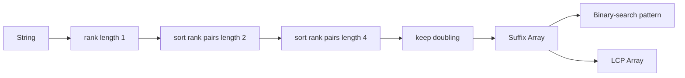

# Suffix Array, LCP & Substring Search

## Neden önemli?
Suffix array, bir string'in bütün suffix başlangıç index'lerini lexicographic sırada tutan kompakt bir text index yapısıdır. Static corpus'ta substring/prefix araması, repeated-substring analizi ve daha gelişmiş compressed index fikirleri için güçlü bir temeldir.

## Mental model
**Suffix array = string'in bütün başlangıç noktalarının alfabetik index'i.**

`banana`:
```text
index  suffix
5      a
3      ana
1      anana
0      banana
4      na
2      nana

SA = [5, 3, 1, 0, 4, 2]
```



## Prefix-doubling construction
Uzunluğu `k` olan prefix rank'leri biliniyorsa `2k` uzunluğundaki suffix-prefix sırası `(rank[i], rank[i+k])` çiftiyle temsil edilebilir. Çiftler sıralanır, eşit çiftler aynı yeni rank'i alır ve `k` iki katına çıkar.

Comparison sort ile basit uygulama yaklaşık `O(n log² n)` olabilir. Rank'ler integer olduğundan radix/counting yaklaşımıyla her tur lineer sıralama yapılıp `O(n log n)` construction elde edilebilir. Daha ileri linear-time algoritmalar vardır; interview için önce invariant ve implementation correctness daha değerlidir.

## Pattern lookup
Suffix'ler lexicographic sıralı olduğu için pattern'in eşleşebileceği suffix interval'i binary search ile bulunabilir. Alt sınır ilk `suffix >= pattern`, üst sınır ise pattern prefix interval'inin sonudur. Naif comparator pattern'in `m` karakterini tarayabildiği için query maliyetini yalnız `O(log n)` diye söylemek eksiktir; karakter karşılaştırma maliyeti de hesaba katılmalıdır.

## LCP array
LCP, suffix array'de komşu suffix çiftlerinin longest-common-prefix uzunluğunu tutar. Kasai yaklaşımı suffix'in SA rank'ini ters index'ler; bir suffix için bulunan ortak prefix'ten bir sonraki suffix'e geçerken en az bir karakterlik bilgi yeniden kullanılabilir ve toplam çalışma `O(n)` olur.

Longest repeated substring için SA'da birbirine yakın iki occurrence gerekir; dolayısıyla maksimum komşu LCP değeri tekrar eden en uzun substring'in uzunluğunu verir.

## Mülakat soruları
1. Suffix array tam olarak ne saklar?
2. `banana` için SA'yı çıkar.
3. Pattern lookup neden binary search'e dönüşür?
4. Prefix-doubling rank pair invariant'ı nedir?
5. Basit construction neden `O(n log² n)` olabilir?
6. LCP array neyi saklar ve ne işe yarar?
7. Longest repeated substring SA+LCP ile nasıl bulunur?
8. Suffix array, suffix tree ve suffix automaton arasında static/online workload'a göre nasıl seçim yaparsın?

## Seviyeye göre cevap
- **Junior:** suffix, lexicographic order ve SA representation.
- **Mid:** prefix-doubling ve binary-search lookup.
- **Senior:** LCP/Kasai, complexity ve memory locality.
- **Staff:** encoding, immutable-vs-online update, construction economics ve production index trade-off'ları.

## Mini alıştırma
`mississippi` için ilk iki doubling turunun rank çiftlerini çıkar. Hazır SA üzerinde `issi` pattern'inin interval'ini iki binary search ile bul. Bonus: maksimum komşu LCP'nin longest repeated substring'i verdiğini savun.

## Proje
`tiny-text-index`: prefix-doubling SA, Kasai LCP ve `find(pattern)` implement et. Byte semantics'i açıkça tanımla. Naif substring scan'e karşı differential correctness test yaz; build time, bytes/character ve query p50/p99 ölç.

## Failure modes / trade-off / production
Suffix string'lerini kopyalamak `O(n²)` memory davranışına yaklaşabilir. Comparator'ın uzun ortak prefix'leri tekrar tekrar taraması construction'ı pahalılaştırabilir. UTF-8 byte/code-point ve normalization semantiği tanımlanmazsa correctness bug'ı çıkar. Suffix array immutable corpus'ta kompakt/cache-friendly olabilir; yoğun online update'te rebuild maliyeti nedeniyle tree/automaton veya başka index yapıları daha uygundur. Genomics ve büyük text indexing gerçek production örnekleridir; MUMmer4 büyük genom hizalamada suffix array kullanır.

## Kaynaklar
- Manber & Myers — Suffix Arrays: A New Method for On-Line String Searches: https://www.cs.cmu.edu/~guyb/realworld/papersS04/ManberMyers.pdf
- MUMmer4 — large-genome alignment with suffix arrays: https://www.cs.cmu.edu/~gmarcais/publication/mummer4/
- Kasai et al. — Linear-Time Longest-Common-Prefix Computation: https://doi.org/10.1007/3-540-48194-X_17
