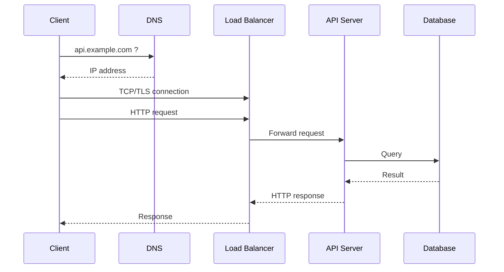

# 01 — TCP, DNS, HTTP ve Request Yolculuğu

Bir backend mülakatında “request neden yavaş?” sorusuna iyi cevap verebilmek için ağ katmanını ezberden değil, uçtan uca request akışı üzerinden anlamak gerekir.

Bu bölümde tarayıcı veya servis bir URL'ye istek attığında neler olduğunu katman katman inceleyeceğiz.

---

## 1. Büyük resim

Bir kullanıcı şunu açsın:

```text
https://api.example.com/users/42
```

Kavramsal yolculuk:



Gerçekte arada router, NAT, CDN, proxy, service mesh ve başka katmanlar olabilir.

---

## 2. DNS ne yapar?

İnsanlar domain kullanır; network iletişimi IP adresleri üzerinden yürür. DNS, domain adını uygun kayıtlara çözer.

```text
api.example.com
      ↓ DNS
203.0.113.x
```

Tipik DNS kayıt türleri:

- `A` → IPv4 adresi
- `AAAA` → IPv6 adresi
- `CNAME` → başka hostname'e alias
- `MX` → mail routing
- `TXT` → çeşitli metadata/policy kayıtları

### DNS neden latency yaratabilir?

- cache miss,
- recursive resolver gecikmesi,
- uzak authoritative server,
- packet loss/retry,
- düşük TTL nedeniyle daha fazla lookup.

İyi sistemlerde DNS caching kritik olabilir.

---

## 3. IP ve routing

IP, paketin network üzerinde kaynaktan hedefe taşınmasını sağlar. Router'lar routing table kullanarak paketin bir sonraki hop'unu seçer.

```text
Client
  ↓
Home router
  ↓
ISP
  ↓
Internet routers
  ↓
Cloud edge
  ↓
Server
```

IP “connection” garantisi sağlamaz. Reliability gibi özellikler üst katman protokolleri tarafından sağlanabilir.

---

## 4. TCP neden var?

TCP byte-stream tabanlı, connection-oriented bir transport protokolüdür. Temel olarak şu özellikleri sağlamayı amaçlar:

- ordered delivery,
- retransmission,
- flow control,
- congestion control,
- connection state.

### 3-way handshake

```text
Client                Server
  | ---- SYN ----------> |
  | <--- SYN + ACK ----- |
  | ---- ACK ----------> |
```

Bu bağlantı kurulumu latency ekler. Bu yüzden connection reuse/keep-alive önemlidir.

---

## 5. TCP ile UDP farkı

| TCP | UDP |
|---|---|
| Connection-oriented | Connectionless |
| Ordered byte stream | Datagram |
| Retransmission mekanizması | Uygulamaya bırakılır |
| Congestion/flow control | TCP gibi built-in değil |
| Web/API gibi workload'larda yaygın | DNS, real-time media, QUIC tabanı gibi yerlerde yaygın |

“UDP hızlıdır” tek başına iyi cevap değildir. Hangi guarantees'in gerekli olduğunu açıklamak gerekir.

---

## 6. TLS neden var?

HTTPS = HTTP'nin TLS üzerinde taşınmasıdır.

TLS üç temel hedef sağlar:

- confidentiality,
- integrity,
- peer authentication.

Kavramsal olarak:

```text
HTTP request
    ↓
TLS encrypted channel
    ↓
TCP / QUIC
    ↓
IP
```

TLS handshake de connection setup maliyetine katkı sağlar. Session resumption ve connection reuse bu maliyeti azaltabilir.

---

## 7. HTTP/1.1, HTTP/2, HTTP/3

### HTTP/1.1

Uzun süre web'in temel protokolü oldu. Keep-alive ile connection reuse mümkündür.

### HTTP/2

Tek connection üzerinde birden fazla stream multiplex edilebilir. Header compression ve binary framing gibi özellikleri vardır.

### HTTP/3

QUIC üzerinde çalışır. QUIC UDP üzerinde transport özelliklerini uygular ve connection migration gibi avantajlar sunar.

Önemli mülakat noktası:

> “HTTP/2 her durumda HTTP/1.1'den hızlıdır” gibi mutlak cevap verme. Workload, proxy desteği, packet loss ve implementation ayrıntıları önemlidir.

---

## 8. Load balancer ne yapar?

Bir client'ın tek backend instance bilmesi yerine trafik load balancer'a gelir.

```text
Clients
   ↓
Load Balancer
  ├── API-1
  ├── API-2
  └── API-3
```

Görevleri şunları içerebilir:

- traffic distribution,
- health checking,
- TLS termination,
- routing,
- connection management,
- failover.

### L4 vs L7

- **Layer 4**: TCP/UDP bilgisine göre yönlendirme.
- **Layer 7**: HTTP host/path/header gibi application-level bilgiye göre yönlendirme.

---

## 9. Reverse proxy, API gateway ve load balancer farkı

Bu kavramlar gerçek ürünlerde örtüşebilir.

### Reverse proxy
Client adına backend'lere istek iletir.

### Load balancer
Trafiği birden fazla backend'e dağıtır.

### API gateway
Routing yanında auth, quota, rate limiting, transformations ve policy enforcement gibi application-level özellikler ekleyebilir.

Habitat gibi storage gateway'lerinde benzer pattern görülür: client doğrudan bütün storage backend'lerini bilmez; ortak bir katman routing, auth ve policy uygular.

---

## 10. Connection pooling

Her DB veya service request için sıfırdan TCP/TLS connection kurmak pahalıdır.

Bu nedenle connection pool kullanılır:

```text
App
 ↓
Connection Pool
 ├─ conn1
 ├─ conn2
 ├─ conn3
 └─ conn4
 ↓
Database
```

Ama pool sınırsız olmamalıdır.

Çok büyük pool:

- DB'yi overload edebilir,
- memory/file descriptor tüketebilir,
- queueing latency yaratabilir.

Çok küçük pool:

- uygulama tarafında request'ler connection bekler.

Senior cevap pool size'ı tek sayı ezberlemek yerine workload ve downstream capacity ile ilişkilendirmelidir.

---

## 11. Tail latency neden yükselir?

Bir request'in toplam süresini şu şekilde düşünebilirsin:

```text
DNS
+ connection setup
+ TLS
+ queue
+ application CPU
+ downstream calls
+ database
+ retries
+ serialization
= total latency
```

Bir sistemin average latency'si 50 ms olsa bile p99 2 saniye olabilir.

Bir request 10 downstream servis çağırıyorsa tek bir yavaş dependency tail latency'yi büyütebilir.

---

## 12. Timeout ve retry ağı neden bozabilir?

Bir dependency yavaşladığında client retry yapar:

```text
Original traffic: 10k req/s
        ↓ dependency slow
Clients retry x3
        ↓
30k+ effective attempts
```

Bu bir **retry storm** yaratabilir.

Bu nedenle production sistemlerinde:

- timeout,
- bounded retry,
- exponential backoff,
- jitter,
- circuit breaker,
- load shedding

birlikte düşünülür.

---

# Mülakat soru bankası

## Junior

**1. DNS nedir?**

Domain adını network adresleri/kayıtlarıyla eşleyen dağıtık naming sistemi olarak anlat.

**2. TCP ve UDP farkı nedir?**

Guarantees üzerinden konuş; “biri hızlı biri yavaş” seviyesinde kalma.

**3. HTTP ve HTTPS farkı nedir?**

HTTPS'in TLS üzerinden güvenli iletişim sağladığını anlat.

**4. IP adresi ile domain farkı nedir?**

Naming ve addressing ayrımını kur.

## Mid

**5. Bir URL yazınca ne olur?**

DNS → route/connect → TCP/QUIC → TLS → HTTP → LB → app → DB akışını kur.

**6. Keep-alive neden işe yarar?**

Connection setup maliyetini amortize eder.

**7. Load balancer ne yapar?**

Distribution + health + routing + failover konuş.

## Senior

**8. API'nin p50'si 40 ms, p99'u 2.5 s. Nereden başlarsın?**

Beklenen:

```text
trace
→ queueing
→ connection pool
→ downstream p99
→ retries/timeouts
→ DNS/TLS/network
→ DB locks/query latency
```

**9. Connection pool neden outage yaratabilir?**

Pool exhaustion, queue build-up ve downstream overload zincirini anlat.

**10. Retry policy nasıl tasarlanır?**

Idempotency, retryable errors, backoff, jitter, budget ve timeout deadline konuş.

## Staff / Principal

**11. Multi-region API routing nasıl tasarlanır?**

DNS/Anycast/global LB, health, data locality, consistency, failover ve split-brain etkilerini tartış.

**12. Network partition sırasında neyi fail-open/ne fail-closed yaparsın?**

Business semantics ve security riskine göre karar ver.

## EM / CTO

**13. Global low-latency mimari ne zaman ekonomik değildir?**

Traffic geography, SLO, egress, replication cost, operational complexity ve team maturity üzerinden cevap ver.

---

# 30 dakikalık uygulama

Yerel bir HTTP servis kur ve şu ölçümleri yap:

1. Tek connection ile 1000 request.
2. Her request için yeni connection.
3. 1, 10, 100 concurrent client.
4. Artificial 50 ms network delay ekle.
5. Timeout ve retry davranışını gözlemle.

Kaydet:

- p50,
- p95,
- p99,
- error rate,
- active connections.

## Bununla ne yapabiliriz?

`mini-reverse-proxy` projesi yazılabilir.

Özellikler:

- 3 backend'e round-robin routing,
- health checks,
- per-backend timeout,
- retry sadece idempotent request'lerde,
- request ID,
- latency metrics,
- basit circuit breaker.

Bu proje networking + backend + SRE mülakatlarında güçlü bir konuşma zemini sağlar.

---

# Habitat bağlantısı

Habitat benzeri bir platformda network katmanı sadece “request taşımak” değildir.

```text
Client
  ↓
connection / auth
  ↓
Habitat
  ↓
routing
  ↓
storage backend
```

Bu katmanda:

- connection pool exhaustion,
- regional network partition,
- DNS/routing problemi,
- downstream timeout,
- retry storm,
- hot backend

platform çapında blast radius yaratabilir.

Bu yüzden Staff-level soru şudur:

> Bir network/dependency arızasının bütün storage platformunu çökertmesini nasıl engellersin?

---

# Kaynaklar

- RFC 9293 — Transmission Control Protocol: https://www.rfc-editor.org/rfc/rfc9293
- RFC 1034 — Domain Names Concepts and Facilities: https://www.rfc-editor.org/rfc/rfc1034
- RFC 9110 — HTTP Semantics: https://www.rfc-editor.org/rfc/rfc9110
- RFC 9113 — HTTP/2: https://www.rfc-editor.org/rfc/rfc9113
- RFC 9114 — HTTP/3: https://www.rfc-editor.org/rfc/rfc9114
- RFC 9000 — QUIC: https://www.rfc-editor.org/rfc/rfc9000
- MDN HTTP overview: https://developer.mozilla.org/en-US/docs/Web/HTTP/Overview

> Ağ protokollerini ezberlemek yerine bir request'in hangi aşamada neden bekleyebileceğini anlamaya odaklan.
