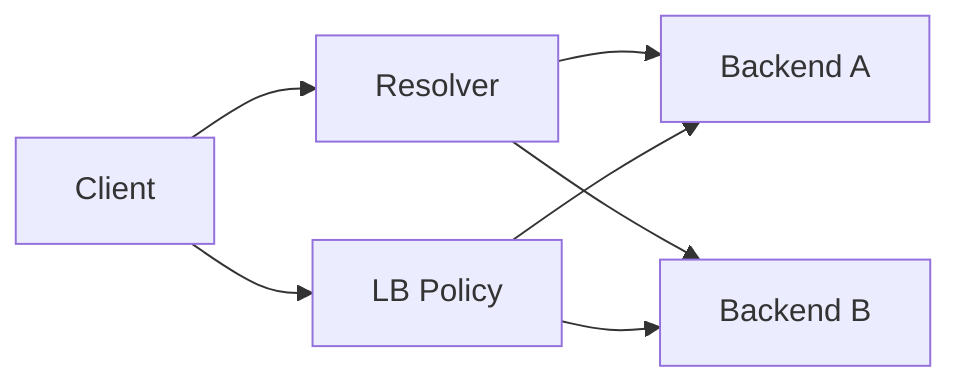

# gRPC Client-side Load Balancing

## Mental model
Resolver aday backend'leri bulur; load-balancing policy her RPC'nin hangi subchannel'a gideceğini seçer. Discovery, balancing ve health aynı problem değildir.

`pick_first` erişilebilir ilk adresi kullanırken `round_robin` hazır backend'ler arasında döner. Load-aware politikalar CPU, memory veya queue depth gibi backend metriklerini kullanabilir.

## Mülakat derinliği
Senior seviyede client-side vs proxy balancing, HTTP/2 connection davranışı, health ve tail latency konuşulmalıdır. Staff seviyesinde stale metrics, policy rollout, locality, heterogeneous clients ve failure domains eklenir.

## Production trade-off'ları
Stale endpoint, long-lived stream imbalance, metric-feedback oscillation, thundering herd ve cross-region routing maliyeti. Habitat-benzeri storage platformunda aynı model adapter/backend seçimine uygulanabilir.

## Kaynaklar
- https://grpc.io/docs/guides/custom-load-balancing/
- https://grpc.io/docs/guides/service-config/
- https://grpc.io/docs/guides/custom-backend-metrics/
