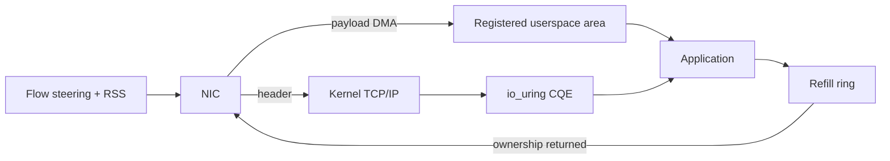

# Linux io_uring Zero-Copy Rx, Buffer Ownership & NIC Queue Steering

## Konu anlatımı
`io_uring` zero-copy Rx (ZC Rx), network payload'ını NIC'ten önceden kayıtlı userspace memory'ye DMA ederek kernel→userspace payload copy maliyetini kaldırmayı hedefler. Kernel TCP/IP stack header/protocol processing yapmaya devam eder; bu nedenle DPDK tarzı kernel bypass değildir.

Gerçek kazanç NIC ve memory-path tasarımına bağlıdır. Header/data split header'ı kernel memory'ye, payload'ı userspace area'ya ayırır. Flow steering zero-copy flow'ları ayrılmış RX queue'larına taşır; RSS kalan trafiği bu queue'lardan uzak tutar. Application CQE ile payload location/length öğrenir, veriyi tüketir ve buffer'ı refill ring üzerinden kernel'e geri verir.

## Mental model

**Invariant:** zero-copy copy maliyetini azaltır; ownership, queue steering ve backpressure problemlerini ortadan kaldırmaz.

## İçeride ne oluyor?
- Ring `IORING_SETUP_SINGLE_ISSUER` ile kurulur ve interface/RX queue kaydedilir.
- ZC Rx NIC tarafında header/data split gerektirir.
- Flow steering hedef flow'u ZC queue'ya; RSS diğer flow'ları başka queue'lara yönlendirir.
- Registered area fixed-size chunk'lara bölünür; daha büyük `rx_buf_len` contiguous memory ve hardware/kernel desteğine bağlıdır.
- CQE offset/length taşır; tüketilen buffer area token ile refill ring'e döner.
- Erken recycle corruption/use-after-recycle; geç recycle starvation/backpressure üretir.

## Mülakat soruları
1. ZC Rx hangi copy'yi kaldırır, TCP processing'i bypass eder mi?
2. DPDK ile farkı nedir?
3. Header/data split neden gerekir?
4. Flow steering ve RSS neden birlikte düşünülür?
5. Buffer recycle lifecycle'ındaki iki temel failure mode nedir?
6. Senior: CPU azalırken p99 artarsa hangi queue/buffer sinyallerine bakarsın?
7. Staff: capability detection ve fallback'i nasıl tasarlarsın?
8. Principal: throughput/core economics, NIC portability ve operability ile adoption kararını nasıl verirsin?

## Beklenen cevap seviyesi
- **Mid:** DMA, copy path, CQE ve recycle modelini açıklar.
- **Senior:** queue steering, affinity, starvation, fallback ve telemetry'yi yönetir.
- **Staff:** workload segmentation, capability matrix ve SLO benchmark tasarlar.
- **Principal:** hardware bağımlılığı, core economics ve platform abstraction trade-off'unu verir.

## Mini alıştırma
Klasik `recv()` ve ZC Rx receive path'lerini çiz. 100 Gbit/s altında CPU, memory bandwidth, RX queue depth ve refill availability için hipotez kur; consumer yavaşladığında backpressure'ın nerede birikeceğini işaretle.

## Proje fikri
`zcrx-benchmark-lab`: klasik socket receive ve ZC Rx'i karşılaştır. bytes/core, cycles/byte, p50/p99 latency, RX drops, refill occupancy ve CPU utilization ölç. Capability yoksa normal path'e fallback et.

## Failure modes / trade-off / production bağlantısı
NIC capability'yi varsaymak, flow steering'i yanlış kurmak, refill ring'i aç bırakmak, buffer'ı erken recycle etmek, NUMA/CPU affinity'yi yok saymak ve yalnız throughput ölçmek tipik hatalardır. Production'da packets/bytes per core, CQ depth, refill availability, RX drop/error, queue imbalance, memory footprint ve p99 latency birlikte izlenir.

## Kaynaklar
- Linux kernel — io_uring zero copy Rx: https://kernel.org/doc/html/latest/networking/iou-zcrx.html
- Linux kernel — Networking: https://www.kernel.org/doc/html/latest/networking/
- Linux kernel — Interface statistics: https://www.kernel.org/doc/html/latest/networking/statistics.html
