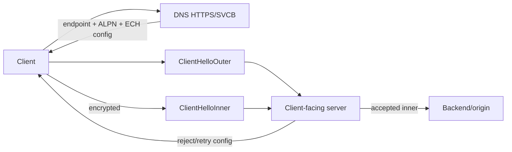

# DNS SVCB/HTTPS Records, ECH Discovery & Privacy Boundaries

## Konu anlatımı
Klasik A/AAAA çözümlemesi client'a çoğunlukla IP adresi verir. RFC 9460 SVCB ve HTTPS RR'ları endpoint ile `alpn`, `port`, address hints ve extensible service parameters'ı DNS katmanında birlikte yayınlar. HTTPS RR HTTP origin'leri için SVCB varyantıdır. AliasMode delegation/apex aliasing; ServiceMode priority, target ve service parameters modelini sağlar.

RFC 9849 TLS Encrypted Client Hello (ECH), gerçek SNI ve ALPN gibi hassas ClientHello alanlarını `ClientHelloInner` içinde şifreler; `ClientHelloOuter` public-facing handshake yüzüdür. ECH configuration DNS advertisement'ı SVCB/HTTPS mekanizmasına bağlanır. Böylece TLS privacy; DNS resolver privacy, RR cache/freshness, client-facing anonymity set ve fallback/retry davranışıyla birlikte tasarlanmalıdır.

## Mental model

**Invariant:** ECH plaintext SNI leakage'ını azaltır; DNS query, IP address, traffic analysis ve küçük anonymity set gibi metadata kanallarını otomatik gizlemez.

## İçeride ne oluyor?
- ServiceMode priority, target ve service parameters taşır; AliasMode delegation için kullanılır.
- HTTPS RR ALPN/endpoint bilgisini connection öncesi sağlayabilir.
- ECH gerçek handshake parametrelerini Inner'da public-key ile korur; Outer routing/compatibility yüzüdür.
- ECH rejection sonrası client güncel configuration ile retry edebilir; rejected connection application-data success değildir.
- Privacy anonymity-set tasarımına bağlıdır.
- Plaintext DNS target hostname'i açığa çıkarabilir; encrypted DNS ayrı bir privacy boundary'dir.

## Yüksek getirili mülakat soruları
1. HTTPS RR, A/AAAA'dan ne fazla sağlar?
2. AliasMode ve ServiceMode farkı nedir?
3. ECH neden yalnız SNI encryption değildir?
4. Outer ve Inner ClientHello rollerini açıkla.
5. ECH varken plaintext DNS neden leak'tir?
6. Senior: stale ECH config/retry nasıl gözlemlenir?
7. Staff: multi-CDN priority/TTL/fallback nasıl tasarlanır?
8. Principal: privacy, availability, compatibility ve observability nasıl dengelenir?

## Seviyeye göre cevap derinliği
- **Mid:** DNS RR, ALPN, SNI ve Inner/Outer modelini açıklar.
- **Senior:** TTL/cache, rejection, retry, encrypted DNS ve diagnostics.
- **Staff:** multi-CDN discovery, rollout, telemetry ve anonymity set.
- **Principal:** privacy architecture, failure domains, policy ve migration standardı.

## Kısa alıştırma
İki endpoint'li HTTPS RR taslağı çiz; biri HTTP/3, biri fallback. Stale ECH config için DNS→reject→retry akışını ve her aşamadaki görünür metadata'yı işaretle.

## Proje fikri
`svcb-ech-lab`: HTTPS RR parse eden client; ALPN/priority selection, TTL cache ve ECH-config rotation simülasyonu. Resolution latency, selected endpoint, ECH accept/reject, retry ve fallback rate ölç.

## Failure modes / trade-off / production bağlantısı
HTTPS RR'ı A/AAAA replacement diye basitleştirmek, mandatory-key semantics'i yanlış uygulamak, TTL/config rotation uyumunu düşünmemek, ECH rejection'ı sessiz plaintext downgrade'a çevirmek ve DNS privacy'yi yok saymak tipik hatalardır. Production'da RR resolution success/latency, RR age, endpoint/ALPN distribution, ECH accept/reject/retry, fallback ve handshake latency izlenir.

## Kaynaklar
- RFC 9460: https://www.rfc-editor.org/rfc/rfc9460.html
- RFC 9849 — Mart 2026: https://www.rfc-editor.org/rfc/rfc9849.html
- OpenSSL ECH support — 11 Mart 2026: https://openssl-library.org/post/2026-03-11-ech/
