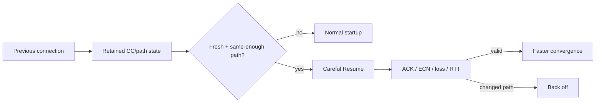

# Careful Resume, Retained Congestion State & Path Validity

## Konu anlatımı
RFC 9959 (Mayıs 2026) yeni transport connection'ların aynı endpoint çifti arasındaki önceki connection'dan öğrenilmiş congestion-control state'ini dikkatli biçimde yeniden kullanarak kapasiteye daha hızlı yaklaşmasını tanımlar. Amaç eski congestion window'u körlemesine kopyalamak değil; geçmiş path gözlemini hızla doğrulanabilen bir başlangıç hint'i olarak kullanmaktır.

## Mental model

## Internals ve trade-off
- Retained state'in yaşı ve path identity güveni kritik girdilerdir.
- Aynı destination aynı path demek değildir; mobility, VPN, NAT, routing ve load balancing path'i değiştirebilir.
- Resume sonrası ACK, loss, ECN ve RTT yeni koşulların doğrulanmasına yardım eder.
- Agresif stale state queue, loss ve unfairness yaratabilir; bounds ve hızlı fallback gerekir.
- Kısa transferler startup maliyetinden daha fazla etkilenir; uzun flow'larda kazanç görece küçülebilir.

## Mülakat soruları
1. Congestion-control startup neden gereklidir?
2. Retained state hangi durumda güvenli/faydalıdır?
3. Endpoint identity neden path identity değildir?
4. Mobility sırasında state invalidation nasıl yapılır?
5. Principal seviyesinde latency kazanımı ile fairness/privacy/operational complexity nasıl dengelenir?

## Seviyeye göre cevap
- **Mid:** cwnd, RTT, loss ve retained-state sezgisini açıklar.
- **Senior:** stale-state detection, TTL, path change ve fallback tasarlar.
- **Staff:** connection pooling, routing ve per-path keying ilişkisini kurar.
- **Principal:** fleet-wide latency, fairness, privacy ve congestion externality'lerini birlikte değerlendirir.

## Kısa alıştırma
100 ms RTT path'te kısa transfer için normal startup ve retained-state başlangıcını RTT bazında çiz. Bottleneck 10x düşerse hangi sinyallerin fallback tetikleyeceğini belirt.

## Proje fikri
`cc-resume-simulator`: stable path, capacity drop ve RTT jump senaryolarında normal startup ile retained-state resume'u completion time, queue, loss ve fairness üzerinden karşılaştır.

## Failure modes / production
Retained state'i truth sanmak, yalnız destination IP ile keylemek, TTL koymamak, mobility/VPN değişimini kaçırmak ve yalnız median latency'yi optimize etmek tipik hatalardır. Resumed ratio, state age, RTT delta, ECN/loss, retransmission, completion-time p95/p99 ve fallback rate izlenmelidir.

## Kaynaklar
- RFC 9959 — Careful Resume: https://www.rfc-editor.org/rfc/rfc9959.html
- RFC 5681 — TCP Congestion Control: https://www.rfc-editor.org/rfc/rfc5681.html
- RFC 9002 — QUIC Loss Detection and Congestion Control: https://www.rfc-editor.org/rfc/rfc9002.html
