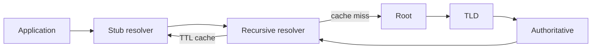

# DNS Resolution, Caching, Negative Answers & DNSSEC

## Konu anlatımı
DNS, yalnız hostname→IP eşlemesi değil; delegasyon, recursive resolution, caching ve açık failure semantics içeren dağıtık bir namespace/veritabanıdır. Stub resolver çoğunlukla recursive resolver'a gider. Cache miss'te recursive resolver root → TLD → authoritative zincirini iteratif takip eder ve sonucu TTL boyunca cache'ler.

Pozitif cevap kadar negatif cevap da protokolün parçasıdır. `NXDOMAIN` ismin bulunmadığını; `NOERROR/NODATA` ise ismin var olup sorulan RR type'ın bulunmadığını ifade edebilir. Negative caching aynı başarısız sorguların authoritative sisteme sürekli gitmesini azaltır. DNSSEC confidentiality sağlamaz; DNS verisinin origin authentication ve integrity doğrulamasını hedefler.

## İçeride ne oluyor?
- A/AAAA address, CNAME alias, NS delegation, SOA zone metadata taşır.
- TTL freshness ile query load arasında trade-off'tur.
- Negative caching SOA bilgisi üzerinden başarısız lookup tekrarını azaltır.
- DNSSEC DNSKEY/DS ve signed RRset zinciriyle trust chain kurar; encryption değildir.
- UDP yaygın olsa da truncation/büyük cevaplar ve encrypted DNS transport seçenekleri tek-transport varsayımını bozar.

## Mülakat soruları
1. Stub, recursive ve authoritative resolver rollerini ayır.
2. TTL çok düşük/yüksek olursa ne olur?
3. NXDOMAIN ile NODATA farkı nedir?
4. CNAME ve NS hangi problemi çözer?
5. Senior: TTL expiry kaynaklı query burst nasıl azaltılır?
6. Staff: DNS tabanlı multi-region failover'ın failure mode'ları nelerdir?
7. Staff: DNSSEC neyi korur, neyi korumaz?

## Beklenen cevap seviyesi
- **Junior:** A/AAAA, resolver, authoritative ve TTL.
- **Mid:** delegation, CNAME/NS/SOA, cache ve negative answers.
- **Senior:** failure semantics, retry amplification, DNSSEC ve debugging.
- **Staff:** resolver diversity, failover, propagation window ve blast radius.

## Mini alıştırma
300 saniye TTL'li `api.example.com` değişikliğinde ilk 10 dakikanın old/new-answer pencerelerini çiz. Authoritative server 2 dakika unreachable olduğunda warm-cache ve cold-cache client'ları karşılaştır.

## Proje fikri
`dns-walk-lab`: root'tan NS delegation takip eden iterative resolver gözlem aracı yaz; hop başına response code, authoritative flag, TTL, CNAME chain ve latency raporla.

## Failure modes / production
TTL'yi deploy propagation garantisi sanmak, NXDOMAIN'i timeout gibi retry etmek, recursive resolver dependency'sini görmezden gelmek ve DNSSEC'i encryption sanmak tipik hatalardır. Resolver latency, cache-hit ratio, SERVFAIL/NXDOMAIN rate, authoritative availability ve propagation gözlemleri birlikte izlenir.

## Kaynaklar
- RFC 1034: https://www.rfc-editor.org/rfc/rfc1034
- RFC 1035: https://www.rfc-editor.org/rfc/rfc1035
- RFC 2308 — Negative Caching: https://www.rfc-editor.org/rfc/rfc2308
- RFC 4033 — DNSSEC Introduction: https://www.rfc-editor.org/rfc/rfc4033
