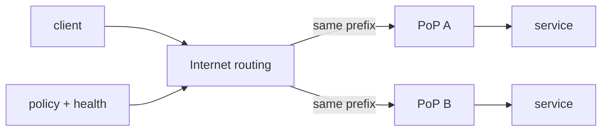

# BGP Policy, Route Selection & Anycast

**Seviye:** Mid → Principal  
**Alan:** Networking / System Design

## Neden önemli?
BGP, Internet üzerindeki AS'ler arasında reachability bilgisini policy ile taşır. System design mülakatlarında multi-region/PoP, anycast, DDoS dayanıklılığı ve global traffic engineering konuşulurken routing katmanının neyi garanti edip etmediğini bilmek gerekir.

## Mental model

Control plane prefix/path bilgisini ve policy sonucunu üretir; forwarding plane seçilmiş next-hop'a paket yollar. BGP fiziksel shortest path değil policy-driven reachability sistemidir.

## Temel mekanikler
- eBGP farklı AS'ler, iBGP aynı AS içindeki BGP konuşmalarıdır.
- AS_PATH loop prevention ve policy için kritik attribute'dur.
- LOCAL_PREF AS içindeki outbound tercihinde güçlü bir sinyaldir.
- MED komşuya giriş tercihi sinyali verir; kapsamı ve karşı taraf policy'si nedeniyle mutlak garanti değildir.
- Import/export filters yanlış route leak'in blast radius'unu sınırlar.
- Convergence anlık değildir; withdrawal sonrası transient packet loss/reordering mümkündür.

## Anycast
Aynı prefix birden fazla lokasyondan ilan edilir. Internet routing sistemi client'ı routing policy/topology açısından tercih edilen origin'e götürür. "En yakın" veya "en düşük RTT" garantisi yoktur. Stateful servislerde route değişimi session'ın başka PoP'a gitmesine yol açabileceği için state locality, retry ve drain tasarımı önemlidir.

Health-driven withdrawal yaparken iki uç risk vardır: unhealthy site'ı reklamaya devam etmek kullanıcı hatası üretir; aşırı hassas withdrawal ise flap ve backup-site overload yaratır. Dependency-aware health, hysteresis ve capacity headroom gerekir.

## Güvenlik
RPKI Route Origin Validation, bir prefix'i ilan eden origin AS'in yetkisini doğrulamaya yardım eder. Bu tüm AS_PATH semantiğini doğrulayan tam path security değildir. Max-prefix, prefix filters, peer policy, change review ve route observability birlikte kullanılmalıdır.

## Mülakat soruları
1. BGP neden shortest-path routing değildir?
2. AS_PATH ne işe yarar?
3. LOCAL_PREF ve MED'i karşılaştır.
4. Anycast ile DNS/global load balancing farkı nedir?
5. PoP health bozulduğunda route withdrawal trade-off'ları nelerdir?
6. Stateful TCP/QUIC servisini anycast arkasında nasıl korursun?
7. Route leak/hijack riskini nasıl azaltırsın?

## Beklenen cevap derinliği
- **Mid:** AS/prefix/eBGP/iBGP ve path attributes.
- **Senior:** convergence, anycast health, traffic engineering ve session etkileri.
- **Staff:** multi-PoP failure domains, graceful drain, capacity ve route telemetry.
- **Principal:** routing governance, RPKI/ROV, policy safety ve organizational blast radius.

## Mini alıştırma
Üç PoP aynı prefix'i ilan ediyor. B'nin application dependency'si bozuluyor. `keep advertising`, `withdraw`, `de-preference` kararlarını convergence, user impact ve remaining capacity açısından karşılaştır.

## Proje
FRRouting/containerlab ile üç AS ve iki anycast origin kur. LOCAL_PREF, AS_PATH prepend ve withdrawal deneylerinde best path, convergence time ve loss ölç.

## Failure modes / trade-off
- Anycast'i latency-optimal global LB sanmak.
- Router alive ise application healthy varsaymak.
- Aggressive withdrawal ile flap üretmek.
- Failover PoP capacity'sini test etmemek.
- RPKI'yi tam path güvenliği sanmak.

Production'da BGP update/withdrawal, prefix visibility, path changes, RTT/loss, PoP saturation ve application health aynı timeline'da korele edilmelidir.

## Kaynaklar
- RFC 4271 — BGP-4: https://www.rfc-editor.org/rfc/rfc4271
- RFC 7454 — BGP Operations and Security: https://www.rfc-editor.org/rfc/rfc7454
- RFC 4786 — Operation of Anycast Services: https://www.rfc-editor.org/rfc/rfc4786
- RFC 6811 — BGP Prefix Origin Validation: https://www.rfc-editor.org/rfc/rfc6811
- IETF IDR BGP YANG Model (2026 work): https://datatracker.ietf.org/doc/draft-ietf-idr-bgp-model/
