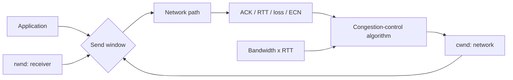

# TCP Congestion Control, cwnd, BDP & CUBIC

**Seviye:** Junior → Staff  
**Alan:** Networking

## Konu anlatımı
TCP reliability ile congestion control farklı problemlerdir. Reliability kayıp veriyi yeniden iletir; congestion control sender'ın ağa aynı anda ne kadar veri sokacağını sınırlar. Sender'ın congestion window'u (`cwnd`) network-capacity sinyalidir; receiver advertised window (`rwnd`) alıcının flow-control sınırıdır. Outstanding data kabaca `min(cwnd, rwnd)` ile sınırlanır.

Yeni veya idle bağlantı path kapasitesini bilmez. Slow start hızlı probe eder; congestion avoidance daha kontrollü büyür. Loss ve ECN congestion sinyali olabilir. High-bandwidth/high-RTT path'lerde klasik Reno büyümesi yavaş kalabildiği için CUBIC pencere büyümesini zamana bağlı cubic fonksiyonla şekillendirir; CUBIC IETF Standards Track RFC 9438'de tanımlıdır.

## Mental model
Network path'i pipe olarak düşün. **BDP = bandwidth × RTT** pipe'ı doldurmak için uçuşta tutulabilecek yaklaşık veri miktarıdır. `cwnd` sender'ın pipe'a bırakabileceği dinamik byte bütçesi; `rwnd` receiver'ın kabul edebileceği buffer bütçesidir.

## İçeride ne oluyor?
1. Sender ACK beklerken uçuşta tuttuğu veriyi `cwnd` ile sınırlar.
2. Receiver `rwnd` ile flow control uygular.
3. Slow start bilinmeyen kapasiteyi probe eder; congestion avoidance daha kontrollü artar.
4. Duplicate ACK/SACK ve timeout farklı recovery yolları doğurabilir.
5. Queue loss'tan önce büyüyebilir; bufferbloat yüksek throughput ile kötü tail latency'yi birlikte üretebilir.
6. BDP yüksekse küçük `cwnd` link'i dolduramaz.
7. CUBIC cubic window-growth fonksiyonuyla fast/long-distance path'lerde ölçeklenmeyi hedefler.

## Mülakat soruları
1. Flow control ile congestion control farkı nedir?
2. `cwnd` ve `rwnd` hangi uç tarafından belirlenir?
3. BDP neden WAN throughput'u için önemlidir?
4. Loss neden her zaman application bug değildir?
5. Throughput düşük, CPU boş, RTT ve retransmission yüksekse nasıl teşhis edersin?
6. Bufferbloat nasıl iyi throughput ve kötü p99'u aynı anda üretir?
7. CUBIC, pacing, ECN ve queue management arasında hangi trade-off'lar vardır?
8. Paralel connection sayısını artırmak ne zaman faydalı, ne zaman zararlıdır?

## Beklenen cevap seviyesi
- **Junior:** ACK/retransmission, `cwnd`/`rwnd`, slow-start ayrımı.
- **Mid:** BDP, congestion avoidance ve loss recovery.
- **Senior/Staff:** queueing, RTT fairness, CUBIC, pacing/ECN, multi-flow davranışı ve application concurrency.

## Mini alıştırma
1 Gbit/s ve 80 ms RTT için BDP'yi byte cinsinden hesapla. `cwnd=1 MiB` ise idealize edilmiş durumda link'in neden tam dolamayacağını açıkla. Ardından `ss -ti`, RTT, retransmission ve throughput ile hangi hipotezleri test edeceğini yaz.

## Proje fikri
`tcp-cc-lab`: Linux network namespace ve `tc netem` ile farklı RTT/loss profilleri oluştur. Bulk-transfer workload'unda congestion-control algoritmalarını tek ve paralel flow modunda karşılaştır; throughput, RTT, retransmission ve p99 completion time ölç.

## Failure modes / trade-off / production
Her throughput problemini bandwidth eksikliği sanmak yanlıştır: receive window, congestion window, loss, RTT, queueing ve application pacing sınır olabilir. Paralel connection shared bottleneck'te queue/loss'u büyütebilir. Büyük buffer loss'u azaltırken latency'yi şişirebilir. Cross-region API, replication, CDN origin fetch ve object transfer'lerinde transport sinyalleri application latency ile birlikte okunmalıdır.

## Kaynaklar
- IETF RFC 9293 — TCP: https://www.rfc-editor.org/rfc/rfc9293.html
- IETF RFC 5681 — TCP Congestion Control: https://www.rfc-editor.org/rfc/rfc5681.html
- IETF RFC 9438 — CUBIC: https://www.rfc-editor.org/rfc/rfc9438.html
