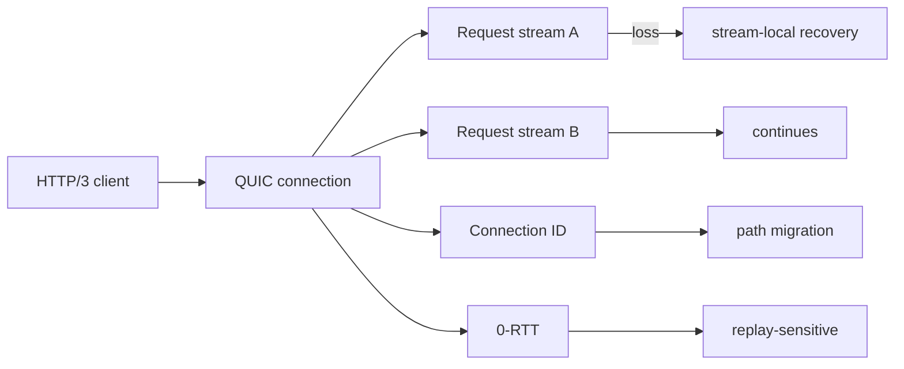

# QUIC & HTTP/3 — Streams, 0-RTT, QPACK ve Connection Migration

## Neden önemli?
HTTP/2 application-level multiplexing sağlar fakat bütün stream'ler tek TCP byte stream'in loss recovery davranışını paylaşır. QUIC reliability ve ordering'i stream düzeyinde modelleyerek bir stream'deki kaybın diğer bağımsız stream'lerin delivery'sini zorunlu olarak durdurmasını engeller. HTTP/3, HTTP semantics'i QUIC üzerine taşır.

## Mental model
TCP+HTTP/2 tek raydaki bağımsız vagonlar gibidir; raydaki eksik parça delivery'yi ortak etkileyebilir. QUIC stream'leri aynı connection congestion budget'ını paylaşsa da stream-level ordering/reassembly bağımsızlığı sağlar. Connection ID de connection'ı yalnız IP:port tuple'ına bağlamaz.

## Internals
- QUIC UDP üzerinde ACK, loss detection, retransmission, congestion control ve flow control uygular.
- Her stream kendi offset/order alanına sahiptir.
- HTTP/3 request/response exchange'i bir bidirectional QUIC stream'ine map edilir.
- HTTP/3 header compression için QPACK kullanır; dynamic table update'leri ayrı unidirectional stream'lerle taşınır.
- Connection migration yeni path için validation gerektirir; RTT/congestion state yeni path'te yeniden değerlendirilir.
- 0-RTT resumption latency'yi düşürür fakat replay riski nedeniyle non-idempotent side effect'lerde application policy gerektirir.
- UDP reachability/middlebox sorunları nedeniyle HTTP/2 fallback production tasarımının parçasıdır.

## Mülakat soruları
1. HTTP/2 neden TCP head-of-line blocking'i tamamen çözmez?
2. UDP üzerinde QUIC nasıl reliable olabilir?
3. Stream-level recovery hangi latency davranışını değiştirir?
4. QPACK neden HPACK'in birebir kopyası değildir?
5. 0-RTT neden replay-sensitive mutation'larda risklidir?
6. Connection migration sırasında path validation ve congestion state neden önemlidir?
7. HTTP/3 rollout'unu latency, CPU, UDP success ve fallback oranıyla nasıl değerlendirirsin?

## Seviye beklentisi
- **Junior:** TCP/UDP, multiplexing, handshake.
- **Mid:** stream offsets, reliability, QPACK, connection IDs.
- **Senior:** 0-RTT replay, migration, congestion ve fallback.
- **Staff/Principal:** heterogeneous network rollout, observability, protocol economics ve graceful degradation.

## Alıştırma
Üç paralel request'ten birinin packet'ı kaybolduğunda HTTP/2-over-TCP ve HTTP/3-over-QUIC timeline'larını karşılaştır. Ardından Wi-Fi→cellular migration ekle.

## Proje
HTTP/2 ve HTTP/3 endpoint'lerini kontrollü packet loss altında benchmark et; p50/p99, handshake, fallback ve CPU/request ölç. Replay-sensitive mutation için 0-RTT policy yaz.

## Failure modes / production
UDP blocking, QPACK dependency blocking, replay, migration sonrası yanlış congestion varsayımı ve eksik fallback başlıca risklerdir. Protocol negotiation, handshake latency, loss/retransmission, RTT, migration success, QPACK blocked streams ve CPU/request izlenmelidir.

## Kaynaklar
- RFC 9000 — QUIC: https://www.rfc-editor.org/rfc/rfc9000
- RFC 9114 — HTTP/3: https://www.rfc-editor.org/rfc/rfc9114
- RFC 9204 — QPACK: https://www.rfc-editor.org/rfc/rfc9204
