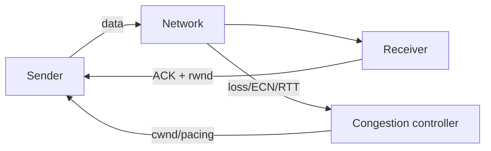

# TCP Flow Control vs Congestion Control

## Mental model
TCP iki farklı darboğazı korur: receiver kapasitesi `rwnd`, network kapasitesi `cwnd`. Yaklaşık send budget = `min(rwnd, cwnd)`.

## Konu anlatımı
Flow control alıcının buffer/application tüketim hızını aşmayı önler. Congestion control ise shared network path'i aşırı yüklememeyi hedefler. RFC 9293 Window alanını receiver'ın kabul etmeye hazır olduğu byte miktarı olarak tanımlar; RFC 5681 slow start, congestion avoidance, fast retransmit/recovery temelini verir. Büyük bandwidth-delay-product bağlantılarında RFC 7323 window scaling önemlidir.

## İçeride ne oluyor?
- Receiver advertised window buffer durumuna göre değişir ve zero-window olabilir.
- Sender congestion controller ağ sinyallerinden usable flight size/pacing üretir.
- RTT ve bandwidth birlikte BDP'yi belirler.
- Büyük buffer throughput'a yardım edebilir ama queueing delay/bufferbloat yaratabilir.
- Transport backpressure application queue/admission control'un yerini tutmaz.

## Mülakat soruları
1. `rwnd` ile `cwnd` farkı nedir?
2. Effective flight limit'i nasıl düşünürsün?
3. Zero-window ile packet loss neden farklıdır?
4. Window scaling neden gerekir?
5. Büyük buffer hangi trade-off'u getirir?
6. Senior: loss düşük ama p99 yüksekse nasıl debug edersin?
7. Principal: transport ve RPC overload control nasıl bağlanır?

## Beklenen cevap seviyesi
Junior receiver/network ayrımını; Mid window, RTT ve flight size'ı; Senior BDP, pacing, ECN/bufferbloat ve observability'yi; Staff/Principal transport sinyallerini timeout, queue budget, shedding ve kapasite mimarisiyle bağlamayı açıklamalıdır.

## Mini alıştırma
100 ms RTT ve 1 Gbit/s path için BDP hesapla. 64 KiB receive window'un throughput tavanını yaklaşık hesapla ve window scaling'in etkisini açıkla.

## Proje fikri
Linux netem + iperf3 ile RTT/bandwidth değiştir; receiver'ı bilerek yavaşlat. Throughput, RTT, retransmission ve socket buffer metrikleriyle flow-control-bound ile congestion-bound koşulları ayır.

## Failure modes / trade-off / production
Yanlış teşhis yanlış tuning doğurur. Kör buffer büyütme tail latency'yi artırabilir. Production'da RTT, loss/retransmission, ECN, socket queues/windows, throughput ve application queue age birlikte izlenmelidir.

## Kaynaklar
- RFC 9293 — https://www.rfc-editor.org/rfc/rfc9293.html
- RFC 5681 — https://www.rfc-editor.org/rfc/rfc5681.html
- RFC 7323 — https://www.rfc-editor.org/rfc/rfc7323.html
