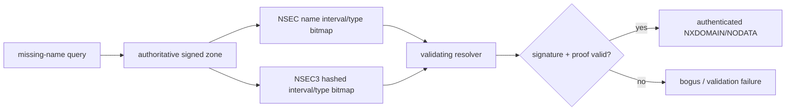

# DNSSEC NSEC/NSEC3 & Authenticated Denial of Existence

## Konu anlatımı
DNSSEC yalnız mevcut RRset'leri değil, name veya RR type'ın gerçekten yok olduğu iddiasını da doğrulanabilir kılmalıdır. Aksi halde saldırgan signed positive cevabı bastırıp sahte NXDOMAIN döndürebilir.

NSEC canonical name ordering'de bir sonraki owner name'i ve mevcut RR type bitmap'ini signed record olarak taşır; name interval veya missing type böylece kanıtlanır. Bunun trade-off'u zone enumeration kolaylığıdır.

NSEC3 owner name'leri hash'leyip denial chain'i hash order'da kurar ve Opt-Out desteği ekler. Enumeration'ı zorlaştırır ama confidentiality sağlamaz; validation complexity ve hashing cost getirir. Wildcard içeren NXDOMAIN proof'larında closest-encloser ve next-closer reasoning önemlidir.

RFC 9824 (Eylül 2025) online signing için Compact Denial of Existence yaklaşımını standartlaştırır: minimally-covering NSEC/NSEC3 ile daha küçük negative responses ve daha az signing işi hedeflenir.

## Mental model
DNSSEC'te **yokluk da kanıt ister**. NSEC name-space interval'ını, NSEC3 hash-space interval'ını signed proof'a dönüştürür.

## İçeride ne oluyor?
1. Resolver chain of trust/DNSKEY/DS bağlamını doğrular.
2. Positive RRset yoksa authoritative server signed denial records döndürür.
3. NSEC interval + type bitmap ile name/type nonexistence kanıtlar.
4. NSEC3 aynı modeli hashed owner-name space'e taşır.
5. Wildcard sentezinin mümkün olmadığı da gerektiğinde kanıtlanır.
6. Validator denial RR'nin RRSIG'ini ve proof coverage'ını doğrular.
7. Secure zone'da invalid/expired/missing proof `bogus` olabilir; sıradan NXDOMAIN değildir.
8. Negative proofs cache'lenebilir; aggressive use upstream load'u azaltabilir.

## Yüksek getirili mülakat soruları
- DNSSEC neden negative answers'ı authenticate eder?
- NSEC name ve type nonexistence'i nasıl kanıtlar?
- NSEC'in zone enumeration trade-off'u nedir?
- NSEC3 hashing neden confidentiality değildir?
- Wildcard NXDOMAIN proof'u neden karmaşıktır?
- Validation failure ile normal NXDOMAIN telemetry'si neden ayrılmalıdır?
- DNSSEC rollover ve resolver compatibility nasıl staged rollout edilir?

## Seviyeye göre cevap derinliği
- **Mid:** signed negative proof, NSEC interval/type bitmap.
- **Senior:** NSEC3 hashing, Opt-Out, wildcard/closest-encloser ve enumeration trade-off.
- **Staff:** validator behavior, caching, observability ve rollover failure modes.
- **Principal:** provider/resolver interoperability, key lifecycle, staged rollout ve availability/security policy.

## Kısa alıştırma
`a.example` ve `d.example` mevcut, `b.example` yok. NSEC interval proof'unu çiz. Sonra `a.example` mevcut fakat `AAAA` yoksa type bitmap'in rolünü ve `*.example` wildcard'ı eklenince gereken ek reasoning'i açıkla.

## Proje fikri
**dnssec-denial-lab:** disposable BIND/Knot test zone'unda NSEC ve NSEC3 varyantlarını `dig +dnssec` ile incele. NXDOMAIN/NODATA proof'larını ve deliberately broken test signature'da validating resolver'ın bogus davranışını karşılaştır.

## Failure modes / trade-off / production
Expired signatures, broken chain-of-trust, yanlış NSEC3/Opt-Out ayarı ve wildcard proof hataları resolution outage yaratabilir. NSEC enumeration kolaylığı; NSEC3 complexity/CPU getirir. DNSSEC confidentiality veya DoS koruması değildir. SERVFAIL/validation-bogus rate, DNSKEY/DS rollover, signature expiry horizon, NXDOMAIN/NODATA rate, response size ve authoritative QPS birlikte izlenmelidir.

## Kaynaklar
- RFC 4033 — DNS Security Introduction and Requirements: https://www.rfc-editor.org/rfc/rfc4033.html
- RFC 5155 — DNSSEC Hashed Authenticated Denial of Existence: https://www.rfc-editor.org/rfc/rfc5155.html
- RFC 7129 — Authenticated Denial of Existence in the DNS: https://www.rfc-editor.org/rfc/rfc7129.html
- RFC 9276 — Guidance for NSEC3 Parameter Settings: https://www.rfc-editor.org/rfc/rfc9276.html
- RFC 9824 — Compact Denial of Existence in DNSSEC: https://www.rfc-editor.org/rfc/rfc9824.html
