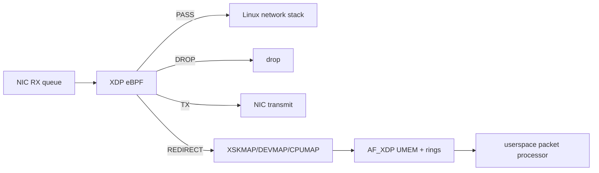

# XDP, eBPF Packet Processing & AF_XDP

## Konu anlatımı
XDP (eXpress Data Path), Linux receive path'inin erken noktasında eBPF programı çalıştırarak paketi klasik network stack'e girmeden önce PASS, DROP, TX veya REDIRECT kararına yönlendirebilir. eBPF programları privileged kernel context'te çalıştığından load aşamasında verifier güvenlik kontrollerinden geçer.

XDP kernel içindeki hook/programming modelidir; AF_XDP ise XDP_REDIRECT ile frame'leri UMEM ve descriptor ring'leri üzerinden userspace packet processor'a taşıyan yüksek performanslı socket ailesidir. Driver-native XDP ile generic/SKB mode; AF_XDP copy ile zero-copy arasında portability/performance trade-off'u vardır.

## Mental model

## İçeride ne oluyor?
1. Program XDP attach point'e yüklenir; verifier kabul etmeden çalışmaz.
2. Packet parser `data`/`data_end` sınırlarıyla memory safety korur.
3. BPF maps policy, state ve telemetry'yi kernel/userspace arasında paylaşır.
4. Redirect map'leri frame'i başka interface/CPU/XSK consumer'a yönlendirebilir.
5. AF_XDP UMEM sabit frame'lere bölünür; RX/TX ve fill/completion ring'leri ownership aktarır.
6. Native driver/zero-copy desteği yoksa generic veya copy fallback performansı değiştirebilir.

## Mülakat soruları
- XDP neden normal socket/iptables yolundan daha erken karar verebilir?
- Verifier hangi riskleri azaltır?
- PASS, DROP, TX ve REDIRECT farkları nelerdir?
- BPF map neden normal process memory değildir?
- AF_XDP UMEM ve ring'leri ne işe yarar?
- Zero-copy neden her zaman otomatik hızlanma değildir?
- Fleet çapı XDP rollout'unda rollback ve observability nasıl tasarlanır?

## Beklenen cevap seviyesi
- **Junior:** erken ingress hook ve temel action'lar.
- **Mid:** verifier, maps, redirect, UMEM/rings.
- **Senior:** native/generic, copy/zero-copy, queue affinity/backpressure.
- **Staff/Principal:** kernel/driver compatibility, safe rollout, map lifecycle ve blast radius.

## Mini alıştırma
Ethernet + IPv4 + UDP parser çiz; her header access öncesi `data_end` check'ini işaretle. PASS/DROP counters için per-CPU map tasarla.

## Proje fikri
`xdp-rate-lab`: namespace/veth üzerinde UDP allow/drop XDP programı; map tabanlı policy ve `BPF_PROG_RUN` unit tests. Destekli ortamda AF_XDP redirect benchmark ekle.

## Failure modes / trade-off
Yanlış parser drop storm; map ABI drift agent uyumsuzluğu; generic fallback throughput düşüşü; ring/UMEM starvation packet drop yaratabilir. Fast path complexity arttıkça debugging ve rollout maliyeti büyür.

## Production bağlantısı
Attach/load failure, verifier errors, XDP action counters, per-queue drops, redirect failures, ring occupancy, copy/zero-copy mode, CPU ve packets/sec birlikte izlenmelidir.

## Kaynaklar
- Linux kernel — eBPF Userspace API: https://docs.kernel.org/userspace-api/ebpf/index.html
- Linux kernel — AF_XDP: https://docs.kernel.org/networking/af_xdp.html
- Linux kernel — BPF maps: https://docs.kernel.org/bpf/maps.html
- Linux kernel — BPF_PROG_RUN: https://docs.kernel.org/bpf/bpf_prog_run.html
