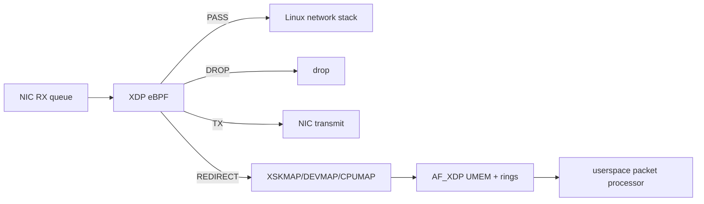

# XDP, eBPF Packet Processing & AF_XDP

**Seviye:** Junior → Principal

## Konu anlatımı
XDP (eXpress Data Path), Linux receive path'inin erken noktasında eBPF programı çalıştırarak paketi klasik network stack maliyetlerinin önemli kısmına girmeden `PASS`, `DROP`, `TX` veya `REDIRECT` kararlarına yönlendirebilir. Program kernel context'inde çalıştığı için load aşamasında verifier tarafından kontrol edilir.

XDP ile AF_XDP aynı şey değildir: XDP kernel içindeki hook/programming modelidir; AF_XDP ise `XDP_REDIRECT` ile frame'leri UMEM ve RX/TX ring'leri üzerinden userspace packet processor'a taşıyabilen yüksek performanslı socket ailesidir. Driver-native XDP ile generic/SKB mode arasında performans/uyumluluk; AF_XDP'de copy ile zero-copy arasında driver/hardware desteği trade-off'u vardır.

## Mental model

## İçeride ne oluyor?
1. XDP programı attach edilir; verifier kabul etmeden çalışmaz.
2. Parser `data`/`data_end` sınırlarıyla packet access güvenliğini korur.
3. BPF maps policy/state/telemetry taşır.
4. `REDIRECT`, XSKMAP/DEVMAP/CPUMAP gibi hedeflere yönlendirebilir.
5. AF_XDP UMEM frame'leri ile RX/TX ve fill/completion ring'leri buffer ownership aktarımını yönetir.
6. Native/zero-copy daha düşük copy/stack maliyeti sağlayabilir; unsupported ortam fallback eder ve gerçek kazanç ölçülmelidir.

## Yüksek getirili mülakat soruları
1. XDP neden normal userspace socket veya iptables yolundan daha erken karar verebilir?
2. Verifier hangi risk sınıfını azaltır?
3. PASS/DROP/TX/REDIRECT farkı nedir?
4. AF_XDP'de UMEM ve ring'ler ne yapar?
5. Senior: zero-copy neden otomatik olarak daha hızlı değildir?
6. Staff/Principal: XDP DDoS/filter rollout'unda correctness, telemetry ve rollback'i nasıl tasarlarsın?

## Seviyeye göre cevap
**Junior:** erken ingress hook ve action'ları açıklar. **Mid:** verifier, maps, redirect ve AF_XDP modelini ayırır. **Senior:** native/generic, copy/zero-copy, queue affinity ve backpressure'ı tartışır. **Staff/Principal:** safe rollout, map lifecycle, fleet/kernel compatibility ve blast radius'u yönetir.

## Kısa alıştırma
UDP filter için Ethernet → IPv4 → UDP parsing zincirini çiz; her header access öncesi `data_end` kontrolünü ve per-CPU PASS/DROP counters tasarımını göster.

## Proje fikri
`xdp-rate-lab`: namespace/veth üzerinde basit XDP UDP allow/drop programı, map tabanlı policy ve `BPF_PROG_RUN` testleri kur; desteklenen ortamda AF_XDP redirect path'ini ölç.

## Failure modes / trade-off / production
Parser bug'ı drop storm; map ABI değişimi userspace-agent incompatibility; generic fallback performans kaybı; AF_XDP ring/UMEM starvation drop yaratabilir. Attach/load failures, verifier errors, action counters, queue drops, redirect failures, ring occupancy, copy/zero-copy mode ve CPU/pps birlikte izlenmelidir.

## Kaynaklar
- Linux kernel — eBPF Userspace API: https://docs.kernel.org/userspace-api/ebpf/index.html
- Linux kernel — AF_XDP: https://docs.kernel.org/networking/af_xdp.html
- Linux kernel — BPF maps: https://docs.kernel.org/bpf/maps.html
- Linux kernel — BPF_PROG_RUN: https://docs.kernel.org/bpf/bpf_prog_run.html
