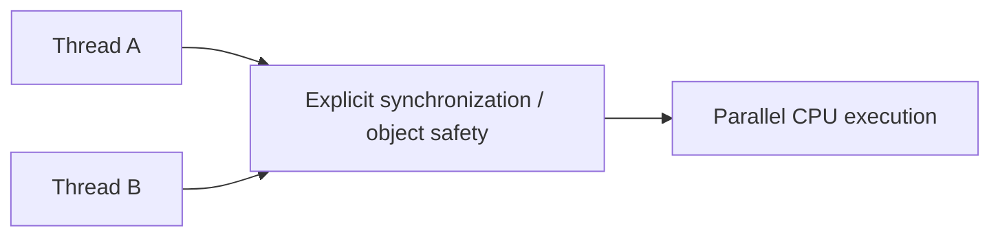

# Python Free-Threading, GIL Boundaries & Extension Safety

## Neden önemli?
Python 3.14 ile PEP 779 Phase II kapsamında free-threaded CPython resmi destekli fakat opsiyonel bir build'dir. CPU-bound thread'ler GIL olmadan birden fazla core üzerinde paralel ilerleyebilir; ancak GIL'in kalkması uygulama-level thread safety sağlamaz.

## Mental model

Runtime serialization azalınca ownership, lock granularity ve extension safety daha görünür hale gelir.

## Temel sınırlar
- `sysconfig.get_config_var("Py_GIL_DISABLED")` build capability'yi; `sys._is_gil_enabled()` runtime durumunu gözlemlemek için kullanılabilir.
- Free-threading desteğini bildirmeyen C extension GIL'i runtime'da yeniden etkinleştirebilir.
- Extension'lar allocator domain, borrowed-reference ve concurrent container mutation varsayımlarını audit etmelidir.
- Free-threaded binary/wheel hattı ayrı olabilir (`t` suffix); dependency compatibility deployment kararının parçasıdır.
- Parallel speedup workload shape, contention ve memory bandwidth ile sınırlıdır.

## Mülakat derinliği
Mid aday concurrency/parallelism/GIL ayrımını; Senior race, contention ve extension migration'ını; Staff/Principal ise compatibility matrix, rollout, benchmark ve rollback standardını tartışmalıdır.

## Failure modes ve production
GIL'i correctness primitive sanmak, unsupported extension'ı kaçırmak, yalnız microbenchmark kullanmak ve stress/race testi yapmamak başlıca risklerdir. Throughput, CPU/core utilization, lock wait, RSS, crash rate ve extension warning'leri izlenmelidir.

## Alıştırma / proje
Classic ve free-threaded 3.14 altında 1/2/4/8 thread CPU-bound benchmark kur; throughput, p95 ve checksum karşılaştır. Ardından dependency'lerde C extension inventory çıkaran bir CI audit aracı geliştir.

## Kaynaklar
- Python 3.14.7 release (5 Ağustos 2026): https://www.python.org/downloads/release/python-3147/
- PEP 779: https://peps.python.org/pep-0779/
- Python C API thread states/GIL: https://docs.python.org/3.14/c-api/threads.html
- Free-threading extension guide: https://docs.python.org/3.14/howto/free-threading-extensions.html
