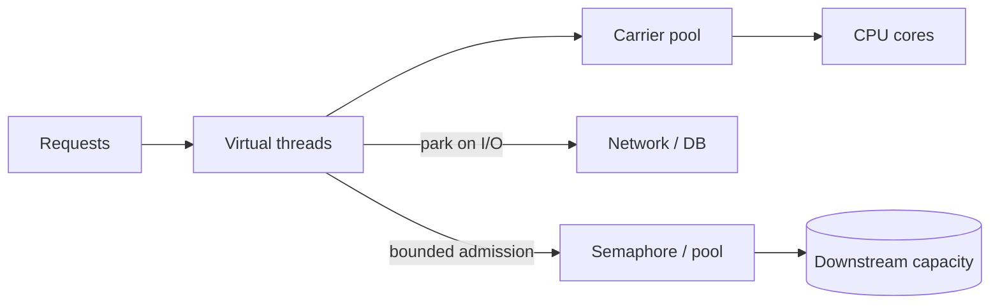

# Java Virtual Threads, Backpressure & Resource Boundaries

## Konu anlatımı
Virtual thread, Java `Thread` API'sini koruyan fakat ömrü boyunca tek OS thread'ine bağlı olmayan hafif thread'dir. JDK scheduler çok sayıda virtual thread'i daha az carrier/platform thread üzerinde M:N çalıştırır. JEP 444 ile JDK 21'de kalıcı özellik oldu. Ana kazanç CPU işini hızlandırmak değil, I/O bekleyen yüksek concurrency'de thread-per-request kodunu ölçeklemektir.

Temel production ilkesi: **ucuz thread, ucuz downstream değildir**. On binlerce virtual thread DB connection, partner API concurrency, heap veya file descriptor limitini büyütmez. Bu nedenle semaphore, connection pool, rate limiter ve bounded admission explicit resource boundary olarak kalır.

## Mental model

## İçeride ne oluyor?
Virtual thread çalışırken carrier'a mount edilir; desteklenen blocking I/O sırasında park/unmount olabilir. CPU-bound işte core sayısından fazla runnable thread throughput'u artırmaz. Virtual thread task başına yaratılır; klasik worker-pool mantığıyla pool'lamak hedef değildir. DB connection pool hâlâ gerçek fiziksel concurrency boundary'sidir.

## Mülakat soruları
1. Virtual ve platform thread farkı nedir?
2. Neden CPU-bound kod otomatik hızlanmaz?
3. Neden virtual thread pool genellikle yanlış abstraction'dır?
4. 50 DB connection ve 50k virtual thread varsa backpressure nerede olmalıdır?
5. Blocking API neden tekrar ölçeklenebilir olabilir?
6. Senior/Staff: reactive stack ile virtual-thread stack migration'ını nasıl değerlendirirsin?

## Beklenen cevap seviyesi
- **Junior:** blocking I/O ve concurrency/parallelism ayrımı.
- **Mid:** mount/park/carrier modeli.
- **Senior:** pool/semaphore, overload, ThreadLocal ve profiling.
- **Staff:** framework migration, capacity model, observability ve rollback.

## Mini alıştırma
10 ms CPU + 90 ms DB beklemesi olan endpoint için Little's Law ile 1k req/s concurrency'yi hesapla. DB 80 concurrent query kaldırıyorsa admission limiter ve overload davranışını tasarla.

## Proje fikri
`loom-load-lab`: fixed platform-thread pool ve virtual-thread-per-request uygulamalarını 1k/10k/50k concurrent client altında karşılaştır; throughput, p99, heap ve DB pool wait ölç.

## Failure modes / trade-off / production
Virtual thread'i sonsuz kapasite sanmak, downstream admission control koymamak, CPU-bound workload'a uygulamak ve devasa ThreadLocal state taşımak tipik risklerdir. Active virtual thread, carrier saturation, DB wait, semaphore queue age, heap/GC ve downstream 429/error izlenir.

## Kaynaklar
- OpenJDK JEP 444 — Virtual Threads: https://openjdk.org/jeps/444
- OpenJDK JEP 491 — Synchronize Virtual Threads without Pinning: https://openjdk.org/jeps/491
- Java 25 StructuredTaskScope preview API: https://docs.oracle.com/en/java/javase/25/docs/api/java.base/java/util/concurrent/StructuredTaskScope.html
