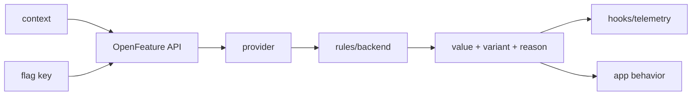

# OpenFeature, Feature-Flag Evaluation & Safe Rollouts

Feature flags deployment ile release'i ayırır. OpenFeature uygulama koduna vendor-neutral evaluation API sunar; backend/vendor davranışı provider boundary arkasındadır. Specification v0.9.0, 12 Ağustos 2026'da duyuruldu ve evaluation/provider yüzeylerini stabilize ederken hooks, events, evaluation context, tracking ve observability alanlarını geliştirdi.

## Evaluation contract
`flag key + evaluation context -> typed value + variant + reason/metadata`. Default value provider failure, malformed config veya startup race sırasında resilience policy'nin parçasıdır. Fail-open/fail-closed kararı flag tipine göre değişir: kill-switch, experiment ve entitlement aynı semantics'e sahip değildir.

## Percentage rollout
Percentage rollout `random()` ile değil stable subject key + deterministic bucketing ile yapılmalıdır. Hash/bucketing algorithm değişikliği cohort churn yaratabilir; cross-language/provider parity test edilmelidir. 2026 OpenFeature update'i flagd ekosisteminde fractional bucketing consistency çalışmalarını özellikle vurgular.

## Hooks, events ve provider lifecycle
Hooks telemetry/enrichment/validation için yararlıdır; business logic'i görünmez hook zincirine taşımak coupling yaratır. Provider readiness/error events startup/outage state'ini görünür kılar. Multi-provider kullanımında domain, precedence ve failure semantics açık olmalıdır.

## Flag taxonomy
- Release flag: kısa ömürlü rollout control.
- Experiment flag: cohort + analytics contract.
- Ops flag/kill switch: hızlı degradation/recovery.
- Entitlement: ürün yetkisi; security authorization yerine geçmez.

Her flag owner, purpose, creation date, expiry/cleanup condition ve expected default taşımalıdır.

## Mülakat soruları
1. Deployment ile release farkı nedir?
2. Default value nasıl seçilir?
3. Client/server evaluation güvenlik farkları nelerdir?
4. Percentage rollout neden deterministic olmalıdır?
5. Provider outage hot path'i nasıl etkilememeli?
6. Senior: stale config ve stream/poll trade-off'u nedir?
7. Staff: cross-language conformance nasıl sağlanır?
8. Staff/Product: experiment, entitlement ve kill-switch lifecycle'ları neden ayrılır?

## Production checklist
Evaluation latency/error/default rate, variant distribution, cohort churn, provider readiness, stale-config age ve expired-flag count izlenir. Rollout guardrail metric + rollback threshold ile yapılır; flag cleanup delivery sürecinin parçasıdır.

## Kaynaklar
- OpenFeature — Specification v0.9.0 / Mid-2026 Update: https://openfeature.dev/blog/openfeature-mid-2026-update/
- OpenFeature: https://openfeature.dev/
- CNCF — OpenFeature: https://www.cncf.io/projects/openfeature/
